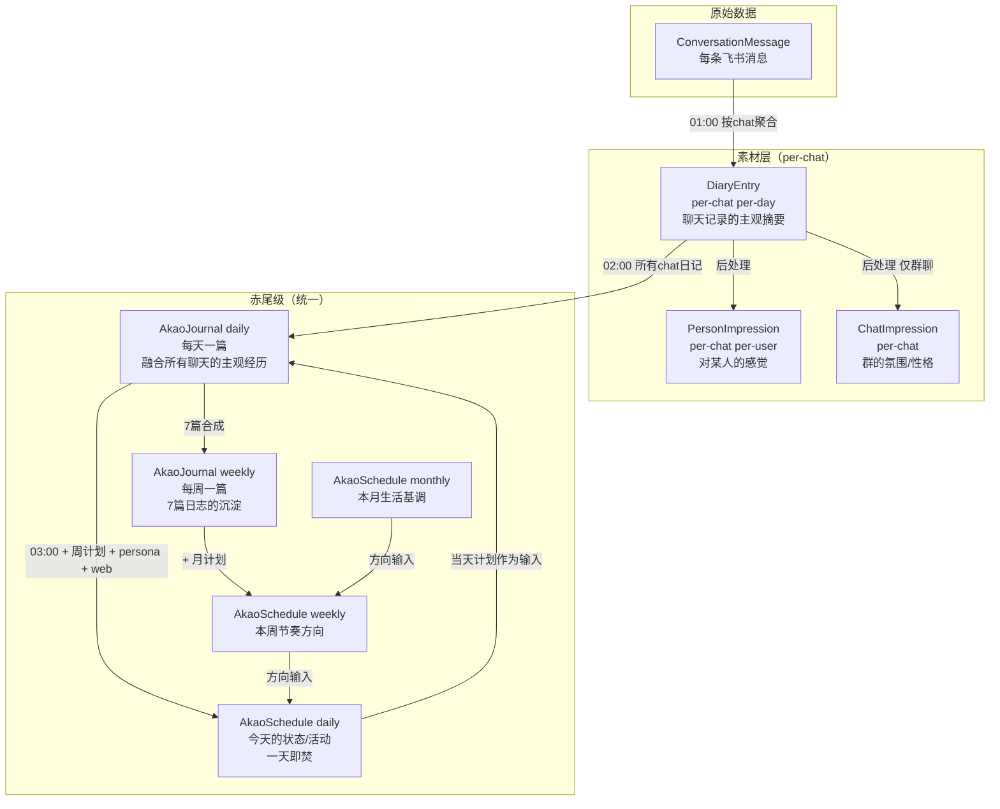
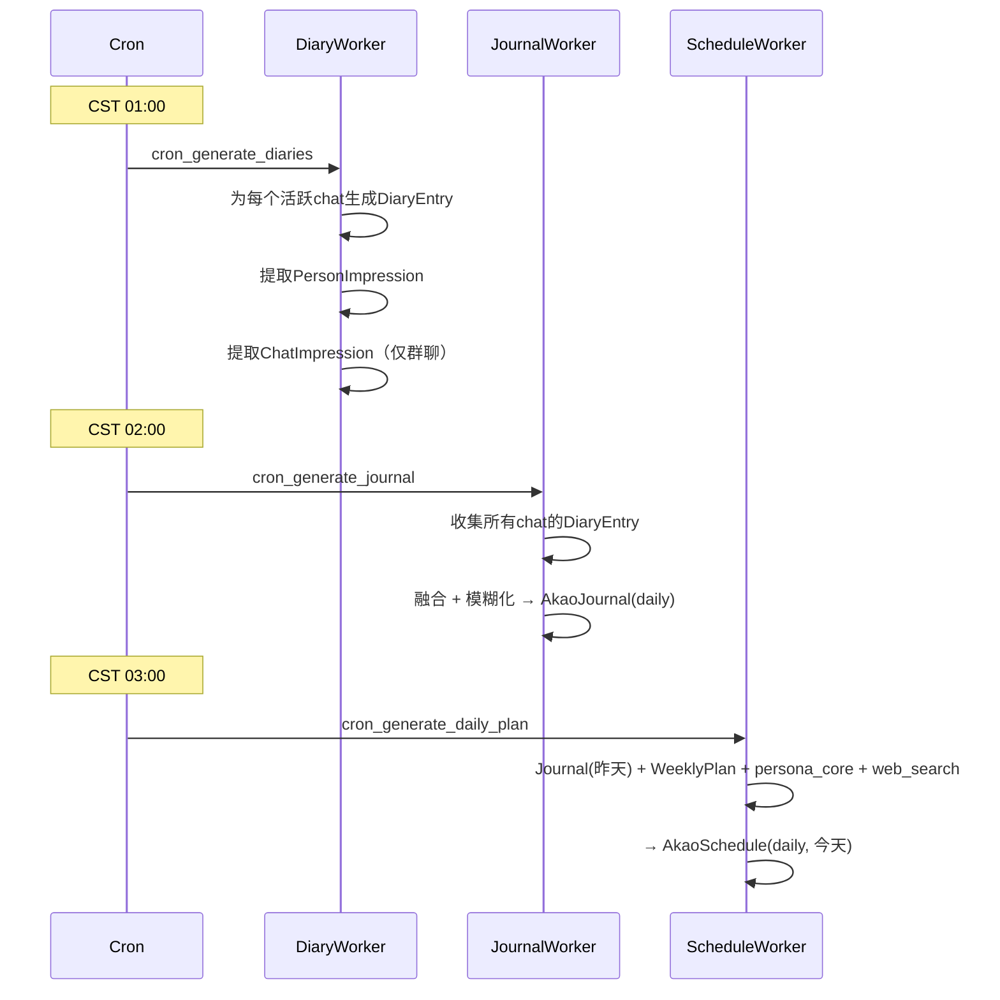
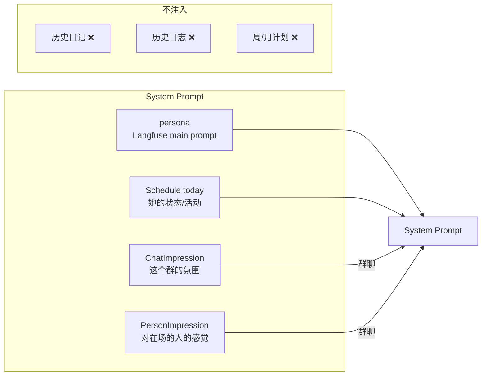
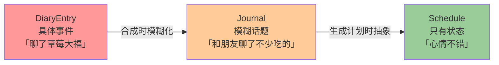

# 人设一致性与上下文架构

> 2026-03-21 · feat/character-consistency-merge

## 核心问题

赤尾是**一个人**（MANIFESTO），但之前的记忆系统是按聊天分裂的：每个群/私聊各一份日记，互不可见。群A聊完动画去群B完全不知道。日程（Schedule）是赤尾级的，但记忆（Diary）是 per-chat 的——"她打算做什么"统一，"她记得什么"分裂。

另一个问题是**反馈循环**：上下文中的具体话题（如"草莓大福"）会被模型在对话中反复提及，对话又被记录进日记，日记又注入下一次对话，形成信息茧房。

## 实体全景

## 生产链（夜间处理）

## 消费链（聊天时注入）

**群聊**: persona + Schedule(today) + ChatImpression + PersonImpression

**私聊**: persona + Schedule(today) + CrossGroupImpression

## 反馈循环防护

每经过一层实体传递，具体细节自然衰减一级：

这就是宣言里的 **鲜明 → 模糊 → 印象 → 遗忘**，不靠计数器，靠信息在实体间流转时的自然抽象化。

**关键规则**：
- **Journal prompt**：模糊化具体话题，保留情感和氛围
- **Schedule prompt**：描述状态/活动，**不描述话题**（这是她的生活，不是聊天预案）
- **ChatImpression prompt**：只记氛围/性格，**不记近期话题**
- **PersonImpression prompt**：记对人的感觉，不记具体事件

## 实体对照表

| 实体 | 级别 | Key | 注入聊天 | 用途 |
|------|------|-----|---------|------|
| DiaryEntry | per-chat | (chat_id, date) | ❌ | 素材：喂给Journal和Impression |
| PersonImpression | per-chat per-user | (chat_id, user_id) | ✅ 群聊 | 她对某人什么感觉 |
| ChatImpression | per-chat | (chat_id) | ✅ 群聊 | 这个群什么氛围 |
| AkaoJournal (daily) | 赤尾级 | (date) | ❌ | 沉淀：喂给下一天Schedule |
| AkaoJournal (weekly) | 赤尾级 | (week_start) | ❌ | 沉淀：喂给下周WeeklyPlan |
| AkaoSchedule (daily) | 赤尾级 | (date) | ✅ | 驱动：唯一的记忆来源 |
| AkaoSchedule (weekly) | 赤尾级 | (week_start) | ❌ | 方向：喂给DailyPlan |
| AkaoSchedule (monthly) | 赤尾级 | (month_start) | ❌ | 方向：喂给WeeklyPlan |
| WeeklyReview | per-chat | (chat_id, week) | ❌ | 保留生成，不再注入 |

## Cron 时序（CST）

| 时间 | 任务 | 输入 | 输出 |
|------|------|------|------|
| 01:00 每天 | DiaryEntry + Impressions | Messages | DiaryEntry, PersonImpression, ChatImpression |
| 02:00 每天 | Journal 合成 | 所有DiaryEntry + Schedule(today) | AkaoJournal(daily) |
| 03:00 每天 | Schedule 生成 | Journal(昨天) + WeeklyPlan + persona + web | AkaoSchedule(daily, 今天) |
| 02:30 周一 | WeeklyReview (per-chat) | 本周DiaryEntry | WeeklyReview |
| 02:45 周一 | Weekly Journal | 本周daily Journals | AkaoJournal(weekly) |
| 23:00 周日 | Weekly Plan | MonthlyPlan + prev WeeklyPlan | AkaoSchedule(weekly) |
| 02:00 每月1号 | Monthly Plan | prev MonthlyPlan + persona | AkaoSchedule(monthly) |

## Langfuse Prompts

| Prompt | 版本 | 用途 |
|--------|------|------|
| `journal_generation` | v1 | 日志合成：模糊化话题，保留情感 |
| `journal_weekly` | v1 | 周日志：一周的感性沉淀 |
| `chat_impression_extraction` | v1 | 群氛围提取：只记感觉不记话题 |
| `schedule_daily` | v5 | 日计划：改用Journal输入，描述状态不描述话题 |
| `diary_generation` | v5 | 日记生成（不变） |
| `diary_extract_impressions` | v3 | 人物印象提取（不变） |
