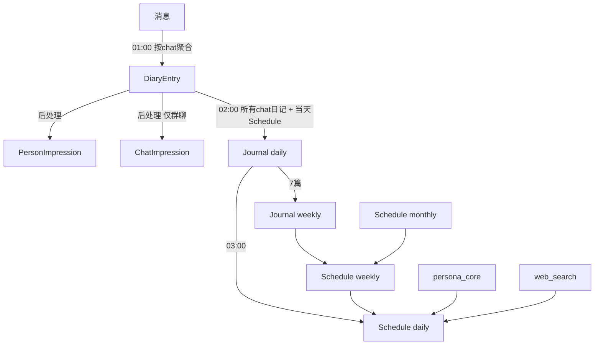
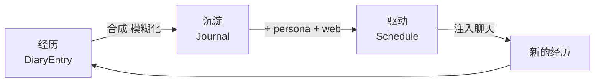
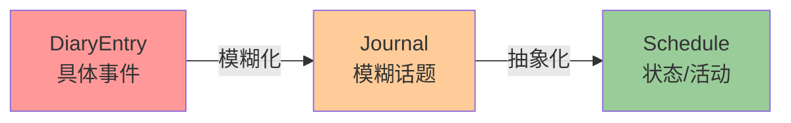

# 赤尾记忆系统

赤尾是一个人，不是聊天机器人。她的记忆系统服务于这个前提。

## 实体

### 素材层（per-chat）

**DiaryEntry** `(chat_id, date)` — 每个群/私聊每天一篇日记。从当天的聊天消息生成，是赤尾对一个聊天场景当天经历的主观摘要。DiaryEntry 是内部素材，不直接注入聊天上下文。

**PersonImpression** `(chat_id, user_id)` — 她对某个人的感觉。记录的是感性印象（"和他聊天挺舒服的"），不是事件快照（不写"他最近在做XX项目"）。从 DiaryEntry 后处理提取。

**ChatImpression** `(chat_id)` — 她对一个群的整体感觉。氛围、节奏、她在其中的状态。不记录近期话题。从 DiaryEntry 后处理提取，仅群聊。

### 赤尾级（统一，不绑 chat）

**AkaoJournal** `(journal_type, journal_date)` — 她的个人日志。

- **daily**：融合当天所有 DiaryEntry + 当天 Schedule，写成一篇"我的一天"。具体话题在这一步被模糊化（"和朋友聊了不少有趣的"，而不是"聊了草莓大福"）。
- **weekly**：7 篇 daily 日志的沉淀，更感性更模糊。

Journal 不注入聊天上下文。它的作用是喂给下一天的 Schedule 生成。

**AkaoSchedule** `(plan_type, period_start, period_end)` — 她的生活计划。

- **daily**：今天她的状态和活动。描述状态（"起得有点晚，精力一般"），不描述话题（不写"今天想聊XX"）。这是聊天时注入的**唯一记忆来源**。一天即焚。
- **weekly**：本周节奏方向。不注入聊天，作为 daily 生成的方向输入。
- **monthly**：本月生活基调。不注入聊天，作为 weekly 生成的方向输入。

## 数据流

## 核心循环

每天夜间三步，形成闭环：

**Journal 提供惯性**（昨天发生了什么）。**persona + web 提供主动性**（她是谁、世界在发生什么）。两者叠加才是一个活人的一天。

## 聊天时注入什么

| 场景 | 注入内容 |
|------|---------|
| 群聊 | persona + Schedule(today) + ChatImpression(this chat) + PersonImpression(this chat, 在场用户) |
| 私聊 | persona + Schedule(today) + CrossGroupImpression(对方在各群的印象) |

**不注入**：历史日记、历史日志、周/月计划。历史经历通过 Journal → Schedule 链路间接传递。

## 话题衰减

每经过一层实体传递，具体细节自然衰减一级：

这是防止反馈循环（某个话题在上下文→对话→日记→上下文之间无限强化）的核心机制。不靠计数器衰减，靠信息在实体间流转时的自然抽象化。

**各实体的记录原则**：

| 实体 | 记什么 | 不记什么 |
|------|--------|---------|
| DiaryEntry | 具体事件和话题 | — |
| Journal | 情感、氛围、模糊的话题方向 | 具体话题名称、敏感信息 |
| Schedule | 状态、活动、精力、心情 | 话题、聊天预案 |
| PersonImpression | 对人的感觉 | 和这人聊了什么事 |
| ChatImpression | 群的氛围和性格 | 群里最近在聊什么 |

## 夜间时序（CST）

| 时间 | 任务 | 输入 → 输出 |
|------|------|-------------|
| 01:00 每天 | diary_worker | Messages → DiaryEntry + PersonImpression + ChatImpression |
| 02:00 每天 | journal_worker | all DiaryEntry + Schedule(today) → Journal(daily) |
| 03:00 每天 | schedule_worker | Journal(昨天) + WeeklyPlan + persona + web → Schedule(daily) |
| 02:30 周一 | diary_worker | DiaryEntry × 7 → WeeklyReview (per-chat) |
| 02:45 周一 | journal_worker | Journal(daily) × 7 → Journal(weekly) |
| 23:00 周日 | schedule_worker | MonthlyPlan + prev WeeklyPlan → WeeklyPlan |
| 02:00 每月1号 | schedule_worker | prev MonthlyPlan + persona → MonthlyPlan |

## Langfuse Prompts

### 聊天时

| Prompt | 变量 | 用途 |
|--------|------|------|
| `main` | `schedule_context`, `user_context`, `currDate`, `currTime` | 主 system prompt，接收 Schedule 和场景上下文 |
| `context_builder` | `reply_chain`, `other_messages` | 群聊消息格式化（回复链 + 其他消息） |

### 离线生成 — 素材

| Prompt | 变量 | 用途 |
|--------|------|------|
| `persona_core` | — | 赤尾完整人设，注入 schedule/plan 生成 |
| `persona_lite` | — | 轻量人设（语气指导），注入 diary/journal 生成 |
| `diary_generation` | `persona_lite`, `chat_hint`, `date`, `weekday`, `messages`, `recent_diaries` | 从消息生成 per-chat 日记 |
| `diary_extract_impressions` | `diary`, `existing_impressions`, `user_mapping` | 从日记提取人物印象 |
| `chat_impression_extraction` | `diary`, `existing_impression` | 从日记提取群氛围印象 |
| `weekly_review_generation` | `persona_lite`, `week_start`, `week_end`, `diaries`, `impressions` | per-chat 周记（仍在生成，不注入聊天） |

### 离线生成 — 赤尾级

| Prompt | 变量 | 用途 |
|--------|------|------|
| `journal_generation` | `persona_lite`, `date`, `chat_diaries`, `daily_schedule`, `yesterday_journal` | 从日记合成个人日志（模糊化话题） |
| `journal_weekly` | `persona_lite`, `week_start`, `week_end`, `daily_journals`, `previous_weekly_journal` | 从日志合成周日志 |
| `schedule_daily` | `persona_core`, `date`, `weekday`, `is_weekend`, `weekly_plan`, `yesterday_journal`, `world_context` | 从 journal + persona + web 生成日计划 |
| `schedule_weekly` | `persona_core`, `week`, `monthly_plan`, `previous_weekly_plan` | 生成周计划 |
| `schedule_monthly` | `persona_core`, `month`, `season`, `previous_monthly_plan` | 生成月计划 |

### 其他（非记忆系统）

| Prompt | 用途 |
|--------|------|
| `pre_complexity_classification` | 消息复杂度分类（simple/complex） |
| `guard_output_safety` | 输出安全检测 |
| `guard_prompt_injection` | 注入攻击检测 |
| `guard_sensitive_politics` | 敏感政治话题检测 |
| `research_agent` | 深度调研助手 system prompt |

## 文件索引

| 文件 | 职责 |
|------|------|
| `orm/models.py` | 所有实体定义 |
| `orm/crud.py` | 数据库读写 |
| `workers/diary_worker.py` | DiaryEntry + PersonImpression + ChatImpression 生成 |
| `workers/journal_worker.py` | Journal 合成（daily + weekly） |
| `workers/schedule_worker.py` | Schedule 生成（daily + weekly + monthly） |
| `workers/unified_worker.py` | Cron 注册和时序配置 |
| `services/memory_context.py` | 聊天时的上下文构建函数 |
| `services/schedule_context.py` | Schedule 注入 |
| `agents/domains/main/agent.py` | 上下文组装和注入入口 |
