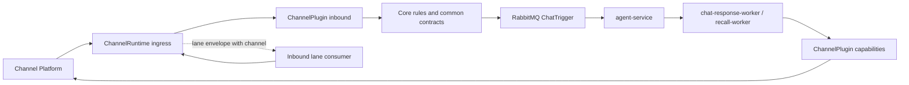
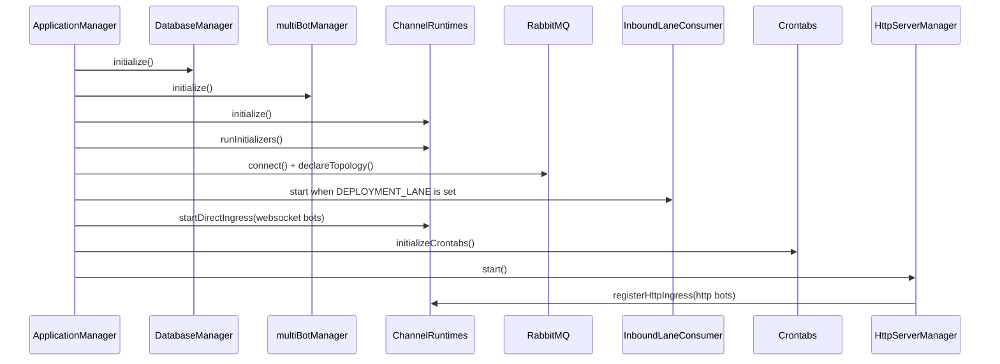

# Channel Server

`channel-server` is the channel gateway for the bot system. It owns channel ingress,
channel-neutral rule dispatch, common/channel message mapping, outbound delivery, recall,
and lane routing. The HTTP server is Bun + Hono.

## Responsibilities

- Receive channel events through plugin-registered HTTP or direct ingress.
- Normalize channel payloads into common message contracts before core rule handling.
- Publish chat triggers and consume lane envelopes through RabbitMQ.
- Send assistant replies and recall messages through the current channel plugin capability.
- Keep `core` channel-neutral; platform SDKs and platform payloads stay outside core.

## Directory Shape

- `api`: HTTP routes such as health, metrics, lane binding admin, and feature routes.
- `core`: channel-neutral contracts, rules, registries, domain models, and services.
- `infrastructure`: storage, cache, RabbitMQ, logging, HTTP clients, and SDK integration helpers.
- `plugins`: channel plugins and channel runtime registration.
- `startup`: application lifecycle orchestration only.
- `workers`: RabbitMQ consumers for chat response, recall, and async jobs.
- `middleware`, `types`, `utils`, `config`: shared server support code.

## Plugin Model

There are two related plugin surfaces.

`ChannelPlugin` is the core-facing capability contract:

- `inbound`: verify/parse raw channel payloads into common messages.
- `addressing`: decide whether a bot should respond.
- `capabilities`: send, reply, recall, resolve common IDs to channel refs, and record outbound mappings.
- `commands`: channel-specific command rules.
- `parseCredentials`: interpret `bot_config.credentials` for that channel.

`ChannelRuntime` is the startup-facing runtime contract:

- `initialize`: initialize platform SDK clients or other channel runtime state.
- `runInitializers`: run optional channel data initializers, such as Lark group sync under `NEED_INIT=true`.
- `registerHttpIngress`: register passive HTTP webhook routes for that channel's HTTP bots.
- `startDirectIngress`: start active ingress such as WebSocket clients for that channel's WS bots.
- `handleInboundLaneEnvelope`: consume lane-dispatched inbound events by channel.
- `shutdown`: close runtime-owned long-lived resources.

Each channel registers both surfaces from its plugin entrypoint. Startup imports
`@plugins/index` once and then talks only to `@plugins/runtime`.

## Current Flow



Outbound workers do not import Lark send/delete helpers. They select the plugin by
`payload.channel`, resolve common IDs through plugin capabilities, and let the channel
implementation render rich content and record platform-specific mappings.

Inbound lane envelopes carry `channel`. Old in-flight envelopes may omit it; the runtime
dispatcher defaults those to `lark` so queued messages created before the channel field was
added can still drain.

## Startup Flow



`startup` should not import a concrete channel implementation. Channel-specific startup
work belongs in the channel runtime, for example `plugins/lark/runtime.ts`.

## Lark Plugin

The current Lark plugin owns:

- inbound parsing and addressing rules;
- Lark-only commands and utility redirects;
- rich text/image/mention rendering for outbound replies;
- common-to-Lark reverse resolution and outbound message mapping;
- Lark HTTP webhook registration, WebSocket ingress, client initialization, and group sync.

## Configuration

Bot configuration drives runtime selection:

- `channel`: selects the plugin/runtime, such as `lark`.
- `init_type`: selects passive HTTP ingress or direct WebSocket ingress.
- `credentials`: opaque to core and interpreted only by the selected channel plugin.

Other important environment groups:

- database/cache: `POSTGRES_*`, `MONGO_*`, `REDIS_*`;
- RabbitMQ/lane routing: RabbitMQ variables plus lane binding config;
- AI service: `AI_SERVER_HOST`, `AI_SERVER_PORT`;
- logging/proxy: `LOG_LEVEL`, `ENABLE_FILE_LOGGING`, `LOG_DIR`, `PROXY_*`.

## Boundary Notes

- `core` must not import platform SDKs, platform message types, or platform DAL tables.
- `startup` must stay channel-neutral and use `@plugins/runtime` for lifecycle work.
- `workers` should route by channel and use `ChannelPlugin.capabilities`, not platform helpers.
- Lark event orchestration lives under `plugins/lark/events`; low-level SDK/client helpers may
  stay in `infrastructure`, but infra should not own plugin-specific inbound orchestration.
- Global injection hooks registered from `plugins/lark/index.ts` remain a pluginization risk for
  future channels because they are process-wide rather than selected per channel.

## Local Commands

```bash
bun test
bunx tsc --noEmit
```

For targeted verification, prefer the package-local paths under `apps/channel-server/src`.
