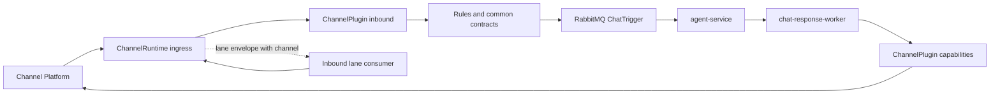
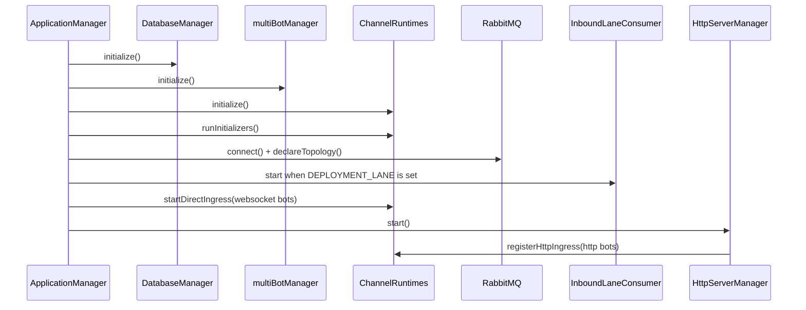

# Channel Server

`channel-server` is the channel gateway for the bot system. It owns channel ingress,
channel-neutral rule dispatch, common/channel message mapping, outbound delivery, and
lane routing. The HTTP server is Bun + Hono.

The Feishu channel is **not** here. It was split into its own service,
`apps/lark-service`, which owns Feishu ingress, rendering, commands and mapping tables
end to end. The only channel plugin left in this service is QQ.

## Responsibilities

- Receive channel events through plugin-registered HTTP or direct ingress.
- Normalize channel payloads into common message contracts before rule handling.
- Publish chat triggers and consume lane envelopes through RabbitMQ.
- Send assistant replies through the current channel plugin capability.
- Keep the channel-neutral contracts (in `@inner/shared`) free of platform SDKs and
  platform payloads.

## Directory Shape

- `api`: HTTP routes such as lane binding admin.
- `infrastructure`: storage, cache, RabbitMQ, logging, and lane routing.
- `plugins`: channel plugins and channel runtime registration.
- `startup`: application lifecycle orchestration only.
- `workers`: RabbitMQ consumers for chat response.
- `middleware`, `types`, `utils`, `config`: shared server support code.

The channel-neutral contracts, rule engine and registries live in `@inner/shared`
(`packages/ts-shared`), because both this service and `lark-service` run on them.

## Plugin Model

There are two related plugin surfaces.

`ChannelPlugin` (defined in `@inner/shared/channel`) is the capability contract:

- `inbound`: verify/parse raw channel payloads into common messages.
- `addressing`: decide whether a bot should respond.
- `capabilities`: send, reply, recall, resolve common IDs to channel refs, and record
  outbound mappings. Individual operations are optional — QQ implements no recall.
- `commands`: channel-specific command rules.
- `parseCredentials`: interpret `bot_config.credentials` for that channel.

`ChannelRuntime` (defined in `@plugins/runtime`) is the startup-facing runtime contract.
Every member except `channel` is optional; the QQ runtime only implements the two marked
below.

- `initialize`: initialize platform SDK clients or other channel runtime state.
- `runInitializers`: run optional channel data initializers on boot.
- `registerHttpIngress` (QQ): register passive HTTP ingress routes for that channel's bots.
- `startDirectIngress`: start active ingress such as WebSocket clients for that channel's
  WS bots.
- `handleInboundLaneEnvelope` (QQ): consume lane-dispatched inbound events by channel.
- `shutdown`: close runtime-owned long-lived resources.

Each channel registers both surfaces from its plugin entrypoint. Startup imports
`@plugins/index` once and then talks only to `@plugins/runtime`.

## Current Flow


```mermaid
flowchart LR
  Platform[Channel Platform] --> Runtime[ChannelRuntime ingress]
  Runtime --> PluginInbound[ChannelPlugin inbound]
  PluginInbound --> Rules[Rules and common contracts]
  Rules --> MQ[RabbitMQ ChatTrigger]
  MQ --> Agent[agent-service]
  Agent --> OutboundWorker[chat-response-worker]
  OutboundWorker --> Cap[ChannelPlugin capabilities]
  Cap --> Platform

  Runtime -. lane envelope with channel .-> Lane[Inbound lane consumer]
  Lane --> Runtime
```

Outbound workers do not import any platform helper. They select the plugin by
`payload.channel`, resolve common IDs through plugin capabilities, and let the channel
implementation render rich content and record platform-specific mappings.

Inbound lane envelopes must carry `channel`; an envelope without one is rejected rather
than guessed at. Guessing used to default to `lark`, which was correct only while Feishu
was the sole user of the queue — after the split a guessed channel would either park the
envelope on a queue this service never consumes, or write `lark-service`'s "already
handled" marker for it. Both fail silently. See `envelopeChannel` in
`infrastructure/integrations/inbound-lane.ts`.

## Startup Flow


```mermaid
sequenceDiagram
  participant App as ApplicationManager
  participant DB as DatabaseManager
  participant Bot as multiBotManager
  participant Runtime as ChannelRuntimes
  participant MQ as RabbitMQ
  participant Lane as InboundLaneConsumer
  participant HTTP as HttpServerManager

  App->>DB: initialize()
  App->>Bot: initialize()
  App->>Runtime: initialize()
  App->>Runtime: runInitializers()
  App->>MQ: connect() + declareTopology()
  App->>Lane: start when DEPLOYMENT_LANE is set
  App->>Runtime: startDirectIngress(websocket bots)
  App->>HTTP: start()
  HTTP->>Runtime: registerHttpIngress(http bots)
```

`startup` should not import a concrete channel implementation. Channel-specific startup
work belongs in the channel runtime, for example `plugins/qq/runtime.ts`.

## QQ Plugin

The only channel plugin in this service owns:

- inbound parsing and addressing rules for the normalized payload posted by `qq-gateway`;
- QQ projection into the common message tables;
- outbound send/reply capabilities and common-to-QQ reverse resolution.

Signature verification and the platform handshake happen in `qq-gateway`, not here, so the
QQ runtime registers a plain internal HTTP route instead of a webhook or a long connection.

## Configuration

Bot configuration drives runtime selection:

- `channel`: selects the plugin/runtime. `bot_config` is shared with `lark-service`, so
  rows for other channels are visible here but have no runtime; the QQ credential parser
  throws if it is ever handed one.
- `init_type`: selects passive HTTP ingress or direct WebSocket ingress.
- `credentials`: opaque to the shared contracts and interpreted only by the selected
  channel plugin.

Other important environment groups:

- database/cache: `POSTGRES_*`, `REDIS_*`;
- RabbitMQ/lane routing: RabbitMQ variables plus lane binding config;
- logging: `LOG_LEVEL`, `ENABLE_FILE_LOGGING`, `LOG_DIR`.

## Boundary Notes

- Nothing here may import a Feishu SDK, Feishu message type, or `lark_*` table. Those live
  in `apps/lark-service` and this service no longer declares the SDK as a dependency.
- `startup` must stay channel-neutral and use `@plugins/runtime` for lifecycle work.
- `workers` should route by channel and use `ChannelPlugin.capabilities`, not platform helpers.
- Channel event orchestration lives under `plugins/<channel>/events`; `infrastructure` should
  not own plugin-specific inbound orchestration.

## Local Commands

```bash
bun test
bunx tsc --noEmit
```

For targeted verification, prefer the package-local paths under `apps/channel-server/src`.
