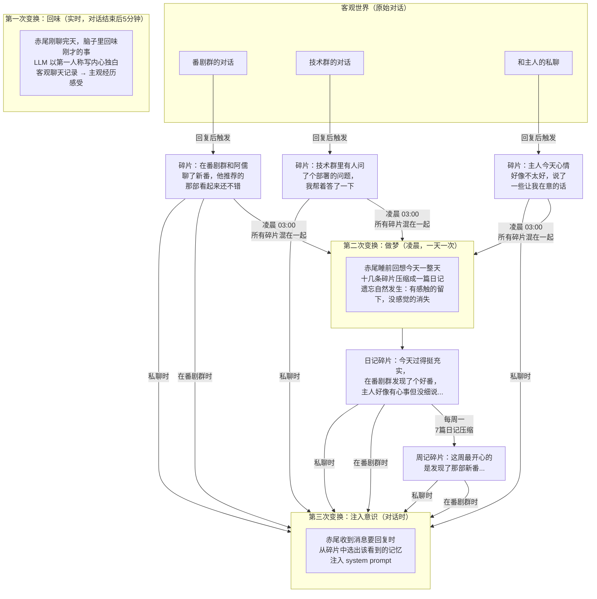
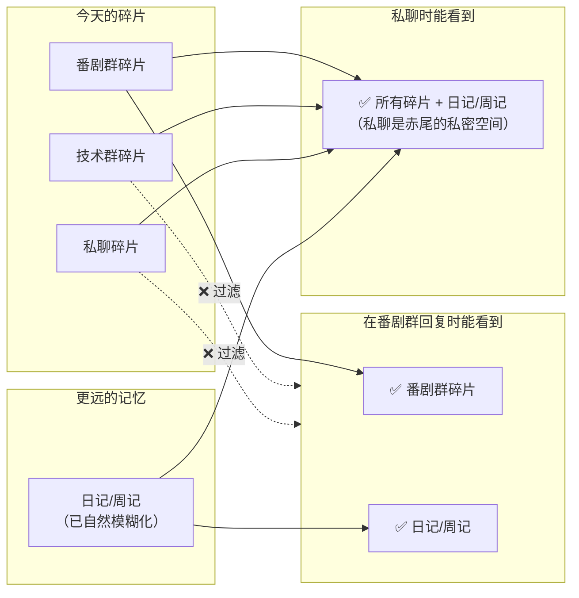

# 赤尾记忆与上下文系统

> 最后更新: 2026-04-06 | 对应版本: agent-service v1.0.0.165 (mem-v3 泳道验证中)

---

## v3 记忆管线（当前实现）

### 核心变化

v2 按群/私聊分桶（DiaryEntry per chat → PersonImpression per chat → Journal 聚合），赤尾在不同群是不同的人。

v3 一张表存所有记忆（`experience_fragment`），赤尾只有一个脑子。隐私通过 context assembly 时过滤实现，不在存储层隔离。

### 数据流

核心是三次变换：**客观对话 → 主观经历 → 模糊记忆 → 注入意识**



**每次变换都是信息压缩**：原始消息（千条）→ 回味碎片（十几条）→ 日记（一条）→ 周记（一条）。越压缩越模糊，越像人的长期记忆。

### 隐私规则

注入意识时的唯一硬规则——**群里不暴露私聊和其他群的细节**：



日记/周记碎片永远可见——因为做梦时已经自然模糊化了（"主人好像有心事"而不是"主人说了XXX"）。

### 隐私过滤（唯一的硬规则）

| 场景 | 可见碎片 | 过滤依据 |
|------|---------|---------|
| 群聊 | 当前群的 conversation/glimpse | `source_chat_id = 当前 chat_id` |
| 群聊 | 所有 daily/weekly | `grain in (daily, weekly)`，无 source_chat_id |
| 私聊 | 所有碎片 | 不过滤 |

daily/weekly 碎片没有 `source_chat_id`（跨群聚合产物），所以任何场景都可见。这是设计意图：做梦已经自然模糊化了。

### 碎片内容里的群名/人名

碎片是自然语言文本。LLM 在生成时知道场景（prompt 里传了群名/私聊对象），自然会在内容里提到。例如：

- `"在番剧群和阿儒聊了新番"` — 群名来自 `lark_group_chat_info.name`
- `"和主人私聊了一些心事"` — 人名来自 `lark_user.name`

群改名后：旧碎片保持旧名（已写死在 content 中），新碎片用新名。跟人的记忆一样。

### 工具

| 工具 | 用途 | 实现 |
|------|------|------|
| `recall` | "想一想" — 模糊联想 | PostgreSQL 全文搜索 experience_fragment |
| `check_chat_history` | "翻聊天记录" — 精确查阅 | 读 conversation_messages 原始消息 |

### experience_fragment 表结构

```sql
CREATE TABLE experience_fragment (
    id              SERIAL PRIMARY KEY,
    persona_id      VARCHAR(50) NOT NULL,
    grain           VARCHAR(20) NOT NULL,       -- conversation/glimpse/daily/weekly
    source_chat_id  VARCHAR(100),               -- 来源群/私聊（daily/weekly 为 NULL）
    source_type     VARCHAR(10),                -- p2p/group（daily/weekly 为 NULL）
    time_start      BIGINT,
    time_end        BIGINT,
    content         TEXT NOT NULL,               -- 赤尾第一人称叙事
    mentioned_entity_ids JSONB DEFAULT '[]',     -- 预留，暂未使用
    model           VARCHAR(100),
    created_at      TIMESTAMPTZ DEFAULT now()
);
```

### 替代关系

| v3 组件 | 替代的 v2 组件 |
|---------|--------------|
| AfterthoughtManager | — (v2 无实时记忆) |
| DreamWorker (daily) | diary_worker + journal_worker (daily) |
| DreamWorker (weekly) | weekly_review + journal_worker (weekly) |
| 碎片中的自然语言描述 | PersonImpression + GroupCultureGestalt |
| recall 工具 | load_memory 工具 |
| check_chat_history | — (新增) |

### 保留不动的组件

- `conversation_messages` — 原始消息
- `AkaoSchedule` + `schedule_worker` — 手帐生成（输入源从 Journal 改为 daily 碎片）
- `IdentityDrift` + `IdentityDriftManager` — 说话风格漂移
- `vectorize_worker` + Qdrant — recall 的语义检索（待接入）
- `bot_persona` — 人格内核

---

## v2 记忆管线（旧系统，保留只读）

> 以下为 v2 架构文档，旧表保留只读，不再写入。

## 系统概览

赤尾的记忆系统是一个多层抽象引擎，将原始聊天消息逐层提炼为结构化认知，最终在对话时注入 system prompt：

```
原始消息 (Chat Messages)
    ↓  03:00 diary_worker
日记 (DiaryEntry)          — 每个群/私聊的当天叙事
    ↓  03:00 post-processing
印象 (PersonImpression)    — 对每个人的感觉
群氛围 (GroupCultureGestalt) — 对每个群的一句话感觉
    ↓  04:00 journal_worker
日志 (AkaoJournal daily)   — 跨群合成的模糊化感受
    ↓  04:45 journal_worker
周志 (AkaoJournal weekly)  — 一周情感趋势
    ↓  05:00 schedule_worker
手帐 (AkaoSchedule daily)  — 明天的生活计划（多 Agent 管线）
    ↓  实时
漂移 (IdentityDrift)       — 当前情绪/精力状态（两阶段锁）
    ↓
内心上下文 (InnerContext)   — 注入 system prompt
```

## 夜间管线时序（CST）

| 时间 | Worker | 输出 |
|------|--------|------|
| 03:00 | diary_worker | DiaryEntry + PersonImpression + GroupCultureGestalt |
| 04:00 | journal_worker | AkaoJournal (daily) |
| 04:30 | diary_worker | WeeklyReview |
| 04:45 | journal_worker | AkaoJournal (weekly) |
| 05:00 | schedule_worker | AkaoSchedule (daily)，三 Agent 管线 |
| 周日 23:00 | schedule_worker | AkaoSchedule (weekly) |
| 每月 1 日 02:00 | schedule_worker | AkaoSchedule (monthly) |

每一层依赖上一层的输出，时序不可打乱。

---

## 一、日记生成（DiaryEntry）

**文件**: `diary_worker.py`

为每个活跃群/私聊生成当天的第一人称叙事。

### 流程

1. **消息收集**: 按 CST 日期范围拉取全部消息
2. **树状时间线**: 按回复关系格式化（最深 3 层）
   ```
   [14:30] 群友A: 今天吃什么
   ├─ [14:33] 群友B: 火锅吧
   │  └─ [14:35] 群友C: 好主意
   └─ [14:36] 群友D: 我也想吃
   ```
3. **LLM 生成**: `diary_generation` prompt + persona_lite + 前 3 天日记
4. **后处理**（自动）:
   - **印象提取**: LLM 输出 `{user_id, impression_text}` JSON，upsert 到 PersonImpression
   - **群氛围蒸馏**: LLM 输出一句话，upsert 到 GroupCultureGestalt

### 激活条件

- 群聊: 近 7 天 bot 回复 ≥ 5 次
- 私聊: 近 1 天 bot 回复 ≥ 2 次

---

## 二、日志生成（AkaoJournal）

**文件**: `journal_worker.py`

### Daily Journal

将当天所有群/私聊的 DiaryEntry 合成为一篇模糊化的个人日志。

- **输入**: 所有 DiaryEntry + 当天 Schedule + 前 3 天 Journal
- **模糊化**: "和朋友聊了个很上头的新番" 而非具体作品名
- **情感锚点**: 保留 2-3 个当天独有的情绪触发点
- **风格**: 碎碎念，不是散文
- **去重**: 对照前 3 天 Journal 避免重复意象/比喻

### Weekly Journal

7 篇 daily journal → 一篇周级情感趋势总结。

---

## 三、手帐生成（AkaoSchedule）— 三 Agent 管线

**文件**: `schedule_worker.py`

三层计划层级: monthly → weekly → daily。核心是 daily 的三 Agent 管线：

### Ideation Agent

- 不给 persona_core（防止搜索被兴趣带偏）
- 只给日期、季节、前 3 天 schedule
- 调用 `search_web` 广撒网搜索真实世界信息
- 输出: 未经筛选的素材

### Writer Agent

- 输入: Ideation 素材 + 周计划 + 昨天 Journal + persona_core
- 输出: 手帐式日程（分时段，含 mood/energy）

### Critic Agent

- 输入: Writer 输出 + 前 3 天 schedule
- 检查: 雷同/ins 风/抽象感受 vs 具体细节
- 不通过 → Writer 带反馈重写（最多 3 轮）

### 核心认知

- search_web 的目的是**事实校准**，不是决定赤尾今天干嘛
- 人设是**筛选器**不是**搜索词**: Ideation 广撒网，Writer 用人设筛选
- 三个 Agent 均用 `offline-model`（gpt-5.4），通过 AgentRegistry 管理

---

## 四、Identity 漂移状态机

**文件**: `identity_drift.py`

实时追踪赤尾在对话中的情绪和精力变化。

### 两阶段锁模型

```
[空闲]
  ↓ 赤尾回复后触发
一阶段（可中断）: 消息收集 + debounce
  · 新消息到达 → 重置 5 分钟计时器
  · 超过 20 条 → 强制进入二阶段
  ↓
二阶段（不可中断）: LLM 漂移计算
  · 输入: 最近消息 + 当前状态 + Schedule + 性格基准
  · 输出: 自然语言内心独白（3-5 句）
  · 存入 Redis（24 小时 TTL）
  ↓
[空闲]（如有新消息则立刻重启一阶段）
```

### 性格基准（漂移锚点）

漂移不是无限制的。`identity_drift` prompt 包含性格基准:

> 元气活泼是默认状态，但不只是元气。有不容易被察觉的腹黑——表面笑嘻嘻，心里早把人看透了。对在意的人有说不出口的占有欲。傲娇是保护色。好奇心是驱动力。善良但不讨好，累了会敷衍，烦了会拒绝。

漂移围绕这个原点波动，不会偏离太远。

### 存储

- Redis hash `identity:{chat_id}` → `state` / `updated_at`
- 24 小时 TTL，跨天自动过期

---

## 五、对话时注入（InnerContext）

**文件**: `memory_context.py` → `build_inner_context()`

每次赤尾收到消息时，从各层记忆组装 inner_context 注入 system prompt：

```
场景提示     — "你在群聊「xxx」中，需要回复 yyy 的消息"
此刻状态     — Identity 漂移状态（Redis）
今日基调     — Journal daily 或 Schedule daily
群氛围       — GroupCultureGestalt（群聊时）
对人的感觉   — PersonImpression（最多 10 人，带时间戳）
记忆引导     — "你有写日记的习惯，记不清可以翻翻日记"
```

优先级: 此刻状态 > 今日基调。漂移是实时叠加层，基调是底色。

---

## 六、Main Prompt 架构

Langfuse `main` prompt（v73）的结构:

```
<identity>      — 瘦身后: 名字/外貌/语气/关系，无性格描述
<inner-context> — build_inner_context() 动态注入
<rules>         — 互动准则 + 输出规范 + 约束
<reply-style>   — few-shot 回复示例（控制长度和温度）
<tools>         — 工具描述
```

性格描述从静态 identity 移到了 identity_drift prompt（作为漂移基准），由漂移状态机动态驱动。

---

## 七、数据模型

| 模型 | 表 | 关键字段 | 唯一约束 |
|------|-----|---------|---------|
| DiaryEntry | diary_entry | chat_id, diary_date, content | (chat_id, diary_date) |
| AkaoJournal | akao_journal | journal_type, journal_date, content | (journal_type, journal_date) |
| AkaoSchedule | akao_schedule | plan_type, period_start, content, mood, energy_level | (plan_type, period_start, period_end, time_start) |
| PersonImpression | person_impression | chat_id, user_id, impression_text | (chat_id, user_id) |
| GroupCultureGestalt | group_culture_gestalt | chat_id, gestalt_text | (chat_id) |
| WeeklyReview | weekly_review | chat_id, week_start, content | (chat_id, week_start) |

---

## 八、Langfuse Prompts

| Prompt | 版本 | 用途 |
|--------|------|------|
| `main` | v73 | 主对话 prompt（瘦身后） |
| `identity_drift` | v4 | 漂移状态计算（含性格基准） |
| `persona_core` | — | 完整人设（Schedule Writer 用） |
| `persona_lite` | — | 轻量人设（Diary/Journal 用） |
| `diary_generation` | — | 日记生成 |
| `diary_extract_impressions` | — | 印象提取 |
| `group_culture_distill` | — | 群氛围蒸馏 |
| `journal_generation` | v3 | 日志合成（碎碎念风格 + 前 3 天去重） |
| `schedule_daily_ideation` | v3 | Ideation Agent（不带人设） |
| `schedule_daily_writer` | v1 | Writer Agent |
| `schedule_daily_critic` | v1 | Critic Agent |

---

## 九、配置参数

| 参数 | 默认值 | 含义 |
|------|--------|------|
| `diary_model` | diary-model | 日记/日志生成模型 |
| `identity_drift_model` | offline-model | 漂移计算模型（gpt-5.4） |
| `identity_drift_debounce_seconds` | 300 | 一阶段等待时间（5 分钟） |
| `identity_drift_max_buffer` | 20 | 强制 flush 消息数 |
| `identity_drift_ttl_seconds` | 86400 | Redis 状态 TTL（24 小时） |

---

## 十、降级策略

| 故障 | 降级行为 |
|------|---------|
| 日记生成失败 | 跳过该群日记，不影响其他群 |
| 日志生成失败 | 聊天时用 Schedule daily 作为今日基调 |
| Schedule Ideation 失败 | Writer 用空素材继续写 |
| Critic 不通过且用完重试 | 用最后一版 Writer 输出 |
| 漂移计算失败 | 下次触发时重试；聊天时无"此刻状态"区块 |
| Redis 状态过期 | fallback 到 Schedule daily |
| 印象提取失败 | 日记正常存储，跳过印象更新 |
