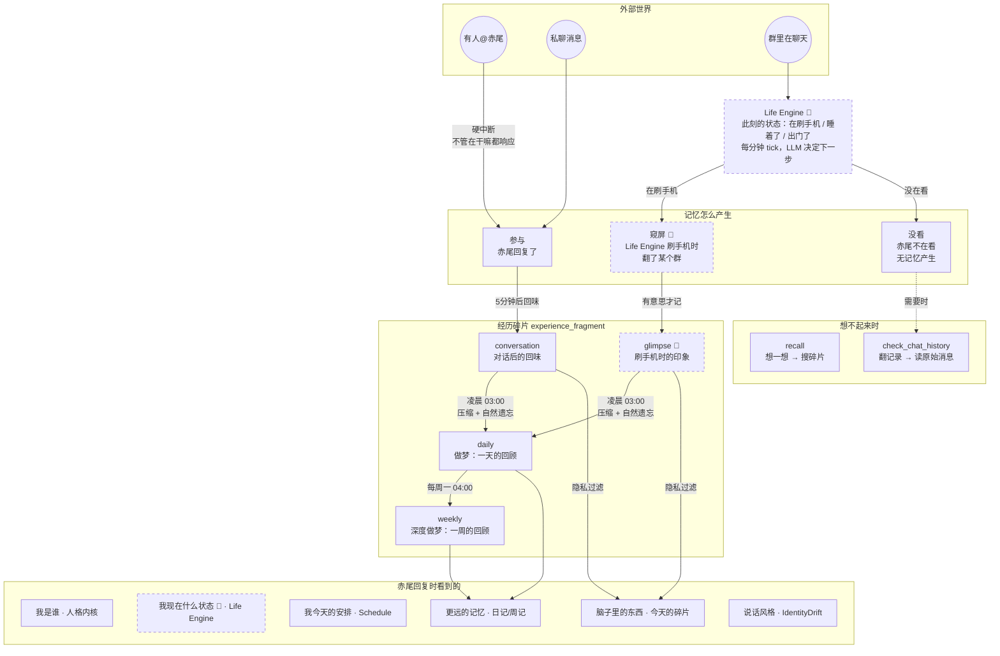

# 赤尾记忆与认知系统

> 最后更新: 2026-04-06 | 对应版本: agent-service v1.0.0.165 (mem-v3 泳道验证中)

## 设计原则

- **LLM 就是赤尾的大脑**，工程只负责在对的时间把对的素材喂给她
- **赤尾只有一个脑子**，不按群隔离记忆
- **遗忘是 LLM 重新叙述时的自然副产品**，不需要 TTL 或删除机制
- **赤尾是一个有生活节律的人**，不是等消息的机器人

---

## 全局架构



> 虚线框 = Plan 2（Life Engine），实线 = 已实现

---

## 碎片怎么产生

### conversation 碎片（已实现）

赤尾回复了一条消息 → 5 分钟内没有新消息（或累计 15 条）→ AfterthoughtManager 触发 → LLM 以赤尾第一人称写一段内心独白。

LLM 的输入是**带场景的对话时间线**：告诉她这是在哪个群、和谁聊的，她自然会在内容里提到群名和人名。

```
输入：你刚才在「番剧群」参与了一段对话
      [09:43] 原智鸿: 最近有什么好看的新番吗
      [09:44] 赤尾: 有啊！这季有一部...

输出：在番剧群和原智鸿聊了新番，他问我推荐，我说了那部...
      感觉他最近看番的口味变了，以前不怎么看这类的。
```

### glimpse 碎片（Plan 2，依赖 Life Engine）

Life Engine 进入"刷手机"状态 → 选一个白名单群翻消息 → 有意思就记一条，没意思就放下。

### daily 碎片（已实现）

凌晨 03:00，赤尾"做梦"：把当天所有 conversation + glimpse 碎片喂给 LLM，写一篇睡前日记。**遗忘在此自然发生**——十几条碎片压缩成一篇，有感触的留下，没感觉的消失。

### weekly 碎片（已实现）

每周一 04:00，7 篇日记压缩成一篇周记。更多遗忘。

---

## 碎片怎么注入意识

赤尾收到消息要回复时，`build_inner_context()` 从碎片中选出她该看到的：

| 区块 | 来源 | 说明 |
|------|------|------|
| 场景提示 | 当前对话 | "你在番剧群" / "你在和原智鸿私聊" |
| 今日基调 | Schedule daily | 手帐生成的今天安排 |
| 脑子里的东西 | 今天的碎片 | **有隐私过滤**，见下 |
| 更远的记忆 | 最近的 daily/weekly | 已自然模糊化，无需过滤 |
| 记忆引导 | 固定文案 | 想不起来可以用 recall / 翻聊天记录 |

### 隐私过滤

唯一的硬规则：**群聊时不暴露其他群和私聊的细节**。

| 碎片 | 在番剧群时 | 私聊时 |
|------|-----------|--------|
| 番剧群的 conversation | ✅ 可见 | ✅ 可见 |
| 技术群的 conversation | ❌ 过滤 | ✅ 可见 |
| 私聊的 conversation | ❌ 过滤 | ✅ 可见 |
| daily / weekly | ✅ 可见 | ✅ 可见 |

过滤依据是碎片元数据 `source_chat_id`（哪个群产生的），不是内容里的文字。

daily/weekly 永远可见——做梦时 LLM 已经自然模糊化了（"和朋友聊了心事"而不是具体说了什么）。

私聊是赤尾的私密空间，所有碎片都可见。

---

## experience_fragment 表

```sql
CREATE TABLE experience_fragment (
    id              SERIAL PRIMARY KEY,
    persona_id      VARCHAR(50) NOT NULL,
    grain           VARCHAR(20) NOT NULL,       -- conversation / glimpse / daily / weekly
    source_chat_id  VARCHAR(100),               -- 来源（daily/weekly 为 NULL）
    source_type     VARCHAR(10),                -- p2p / group（daily/weekly 为 NULL）
    time_start      BIGINT,
    time_end        BIGINT,
    content         TEXT NOT NULL,               -- 赤尾第一人称叙事
    mentioned_entity_ids JSONB DEFAULT '[]',     -- 预留
    model           VARCHAR(100),
    created_at      TIMESTAMPTZ DEFAULT now()
);
```

---

## 实现进度

| 组件 | 状态 | 说明 |
|------|------|------|
| experience_fragment 表 | ✅ | 唯一记忆存储 |
| AfterthoughtManager | ✅ | conversation 碎片（prompt 待调优） |
| DreamWorker | ✅ | daily/weekly 做梦 |
| Context Assembly v3 | ✅ | 碎片注入 + 隐私过滤 |
| recall / check_chat_history | ✅ | 新工具 |
| Life Engine | 🔲 | 生活状态机 |
| Glimpse 管线 | 🔲 | 依赖 Life Engine |
| 被@时状态感知 | 🔲 | "睡着了被@→嗯...干嘛..." |

---

## 与 v2 的关系

| v2 | v3 | 变化 |
|----|-----|------|
| DiaryEntry (per chat) | conversation 碎片 | 实时生成 vs 凌晨批处理；不再按群隔离 |
| PersonImpression | 碎片内容中的自然描述 | 不再是独立的表和字段 |
| GroupCultureGestalt | 碎片内容中的自然描述 | 同上 |
| AkaoJournal daily | daily 碎片 | 输入从 DiaryEntry 改为 conversation 碎片 |
| AkaoJournal weekly | weekly 碎片 | 输入从 daily journal 改为 daily 碎片 |
| load_memory 工具 | recall + check_chat_history | 自然语言搜索 vs mode/hint 结构化参数 |

v2 旧表保留只读，不再写入，不做数据迁移。

## 保留不动的组件

- `AkaoSchedule` + `schedule_worker` — 手帐（输入源改为 daily 碎片）
- `IdentityDrift` + `IdentityDriftManager` — 说话风格漂移
- `conversation_messages` — 原始消息
- `bot_persona` — 人格内核
