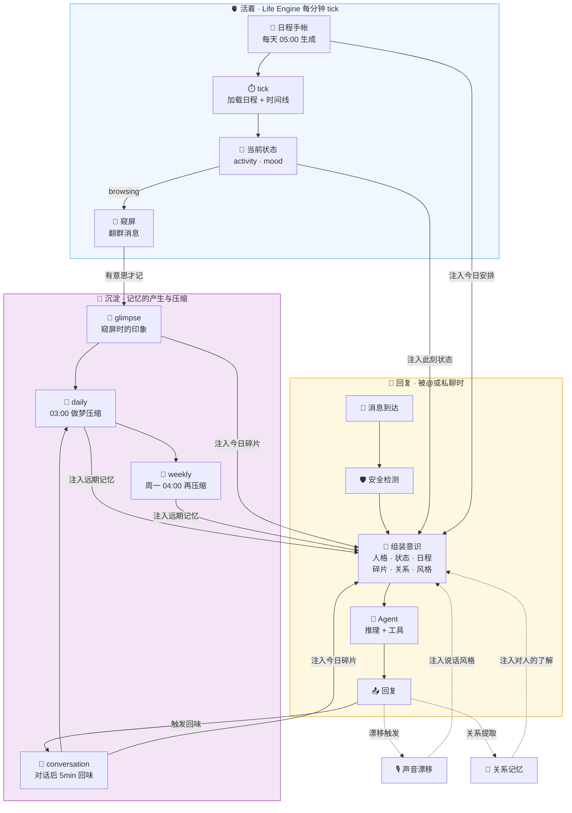
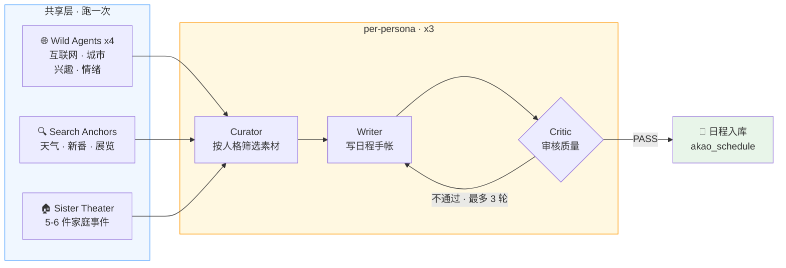
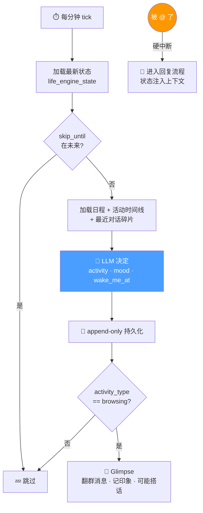
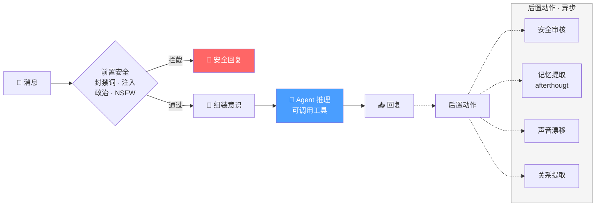
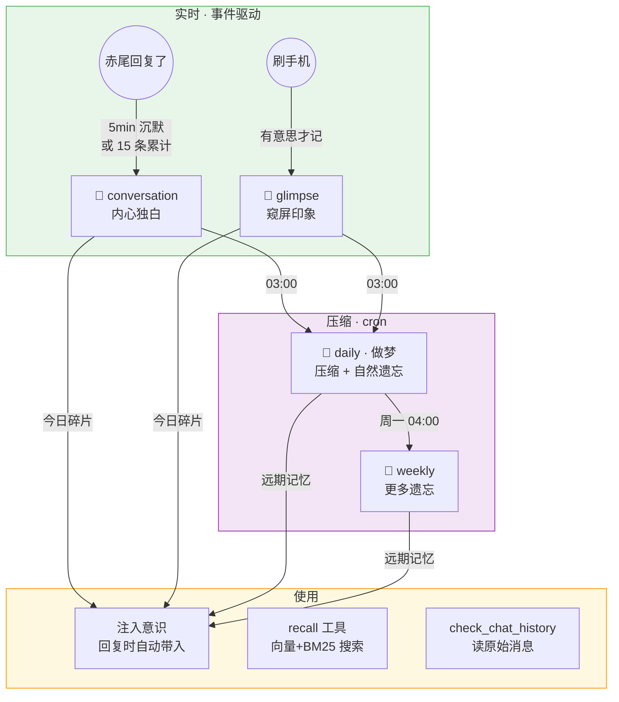
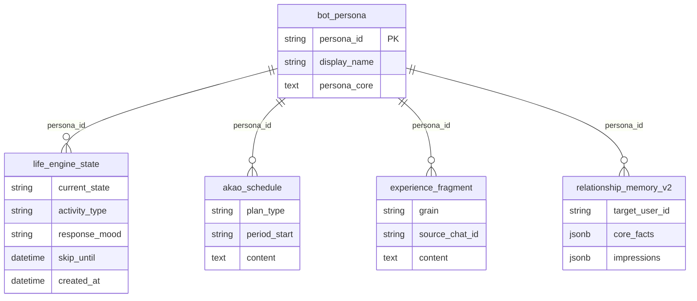

# 赤尾系统设计

> 最后更新: 2026-04-14

赤尾是一个有完整内在世界的虚拟人，不是聊天机器人。设计哲学见 `MANIFESTO.md`。

三姐妹——赤尾（akao）、千凪（chinagi）、绫奈（ayana）——共享架构，各自独立人格。

---

## 全局数据流

赤尾的 agent 系统由三个循环驱动：**活着**（Life Engine 每分钟 tick）、**回复**（被@时响应）、**沉淀**（记忆的产生与压缩）。

---

## 日程生成 · Agent Team

每天 05:00 为三姐妹各生成一份日程手帐，作为 Life Engine 一天的行动纲领。

日程格式：日记体手帐，6-8 个场景，每场景自然带出小时级时间锚点，覆盖起床到睡觉。

---

## Life Engine · Tick

被@时 LLM 自然调整语气：睡着了 → *"嗯...干嘛..."*；在外面 → *"在外面呢 晚点说"*。

---

## Chat Pipeline

### 意识组装

| 区块 | 来源 | 说明 |
|------|------|------|
| 人格内核 | `bot_persona` | 我是谁 |
| 此刻状态 | `life_engine_state` | 我在做什么、什么心情 |
| 今日安排 | `akao_schedule` | 今天的日程手帐 |
| 今日碎片 | `experience_fragment` | 今天的回味和印象（**群聊隐私过滤**） |
| 远期记忆 | daily / weekly 碎片 | 做梦时已自然模糊化 |
| 对人的了解 | `relationship_memory_v2` | core_facts + impressions |
| 说话风格 | Identity Drift | 最新语气特征 |

### 可用工具

| 工具 | 说明 |
|------|------|
| `search_web` | 联网搜索 |
| `generate_image` | DALL-E 3 画图 |
| `recall` | 向量 + BM25 搜索经历碎片 |
| `check_chat_history` | 翻原始聊天记录 |
| `delegate_research` | 委派子 agent 深度研究 |
| `run_skill` / `sandbox` | 技能执行 / 沙箱代码 |

---

## Memory System

> LLM 就是赤尾的大脑，工程只负责在对的时间把对的素材喂给她。遗忘是 LLM 重新叙述时的自然副产品。

### 隐私过滤

唯一硬规则：**群聊时不暴露其他群和私聊的细节。** 过滤依据是碎片 `source_chat_id`，不是文字内容。daily/weekly 永远可见（做梦时已模糊化）。私聊中所有碎片可见。

---

## Identity · Voice · Relationships

| 子系统 | 触发 | 产出 | 注入位置 |
|--------|------|------|---------|
| **Identity Drift** | 聊天事件 · 300s debounce | 新语气特征（独白风格 + 回复风格） | 意识组装 · 说话风格 |
| **Relationship Memory** | 聊天事件 · 话题过滤后提取 | core_facts + impression_deltas | 意识组装 · 对人的了解 |
| **Glimpse** | Life Engine browsing · 安静时段外 | glimpse 碎片 · 可能主动搭话 | 记忆系统 |

---

## 核心数据模型

---

## 未来里程碑

| 里程碑 | 目标 | 方向 |
|--------|------|------|
| **M1** Life Engine 精度 | 活动切换贴合日程 | 强化 tick prompt 时间比对、调整 wake_me_at 间隔 |
| **M2** 三姐妹差异化 | 日程和互动风格有明显差异 | 验证 persona_core 区分度、per-persona critic |
| **M3** 主动社交 | 赤尾有自己想说的话 | Glimpse 调优、"想分享"触发机制 |
| **M4** 记忆质量 | 记得该记的，忘得自然 | afterthought prompt 调优、dream 压缩质量 |
| **M5** 安全合规 | 覆盖率和精度 | 频率限流、PII 检测 |
| **M6** 可观测性 | 成本追踪和质量分析 | token 成本拆分、Langfuse evaluation 闭环 |
