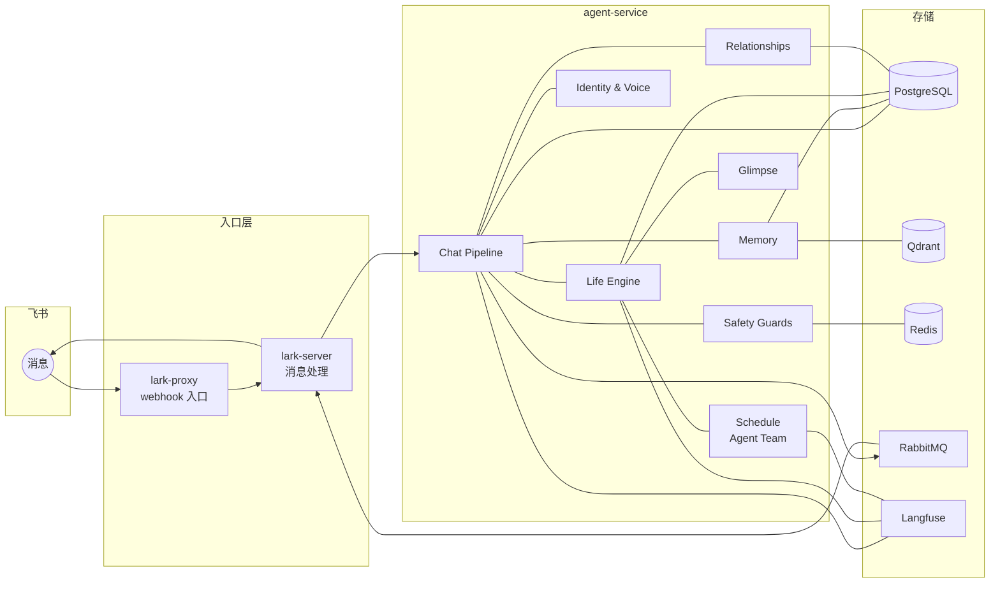
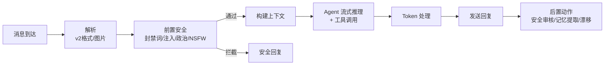
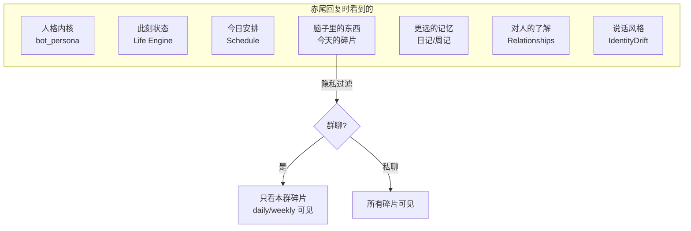
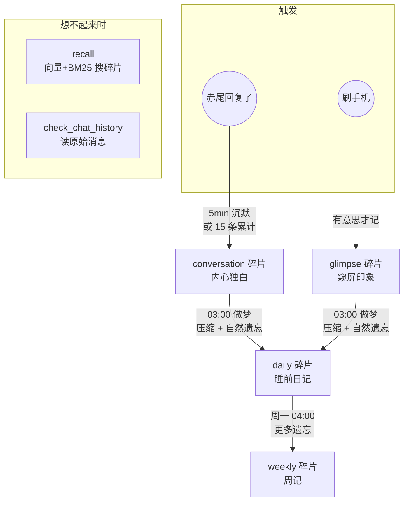
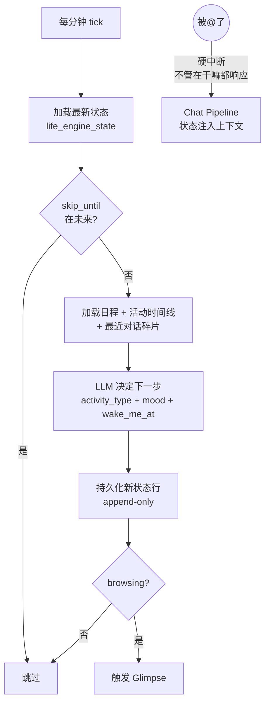
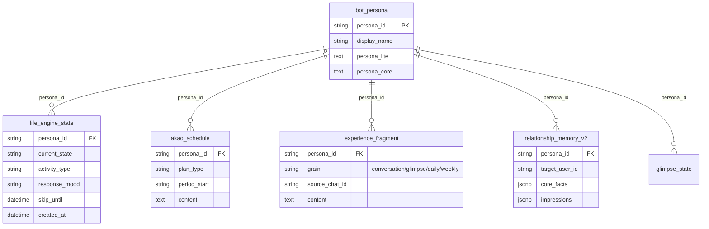

# 赤尾系统设计

> 最后更新: 2026-04-14

赤尾是一个有完整内在世界的虚拟人，不是聊天机器人。设计哲学见 `MANIFESTO.md`。

三姐妹——赤尾（akao）、千凪（chinagi）、绫奈（ayana）——共享同一套架构，各自独立人格。

---

## 全局架构



---

## Chat Pipeline



### 上下文注入



### 工具

| 工具 | 说明 |
|------|------|
| search_web | 联网搜索 |
| generate_image | DALL-E 3 画图 |
| recall | 向量 + BM25 混合搜索经历碎片 |
| check_chat_history | 翻原始聊天记录 |
| delegate_research | 委派子 agent 深度研究 |
| run_skill / sandbox | 技能执行 / 沙箱代码 |

---

## Memory System



设计原则：LLM 就是赤尾的大脑，工程只负责在对的时间把对的素材喂给她。遗忘是 LLM 重新叙述时的自然副产品，不需要 TTL 或删除。

---

## Life Engine

赤尾不是等消息的机器人，她有自己的生活节律。



被@时 LLM 自然调整语气：睡着了 → "嗯...干嘛..."；在外面 → "在外面呢 晚点说"。

---

## Schedule Generation

每天 05:00 生成三姐妹日程，分共享层和 per-persona 层：

```mermaid
flowchart LR
    subgraph 共享层（跑一次）
        W[Wild Agents ×4<br/>互联网/城市/兴趣/情绪]
        S[Search Anchors<br/>天气/新番/展览]
        T[Sister Theater<br/>5-6件家庭事件]
    end

    subgraph "per-persona（×3）"
        C[Curator<br/>按人格筛选]
        WR[Writer<br/>写日程手帐]
        CR[Critic<br/>审核质量]
    end

    W & S & T --> C --> WR --> CR
    CR -->|不通过| WR
    CR -->|PASS| OUT[日程入库]
```

日程格式：日记体手帐，6-8 个场景，每场景带小时级时间锚点，覆盖起床到睡觉。

---

## Glimpse & 主动社交

browsing 状态时触发窥屏：选白名单群 → 读增量消息 → LLM 观察 → 有意思则记 glimpse 碎片，想搭话则触发主动发言（每小时上限 2 条）。23:00-09:00 安静时段不触发。

## Identity & Voice

聊天事件 → 300s debounce → 取最近 1h 消息和回复 → LLM 生成新语气特征（内心独白风格 + 回复说话风格）→ 持久化。赤尾的说话方式会被身边的人自然影响。

## Relationship Memory

两阶段提取：话题过滤（群聊中判断是否值得记）→ 提取 core_facts（稳定事实）+ impression_deltas（印象变化）。注入聊天上下文，让赤尾记得每个人。

---

## 核心数据模型



---

## 未来里程碑

### M1: Life Engine 精度

活动切换偏慢 1-2 小时。方向：强化 tick prompt 中的时间比对、调整 wake_me_at 间隔、在 context 中增加"日程此刻该做什么"提示。

### M2: 三姐妹差异化

验证 persona_core 对日程生成的区分度，评估 Sister Theater 的贡献，考虑 per-persona 的 critic 标准。

### M3: 主动社交

Glimpse 主动发言的质量和频率调优。探索"想分享"触发机制：看到好东西 → 想起朋友 → 主动找人聊。

### M4: 记忆质量

afterthought prompt 调优、daily dream 压缩质量（是"遗忘"还是"总结"）、recall 召回精度。

### M5: 安全与合规

频率限流、PII 检测、输出安全检测误报率。

### M6: 可观测性

per-agent/tool/model token 成本拆分、工具调用指标、Langfuse evaluation 闭环。
