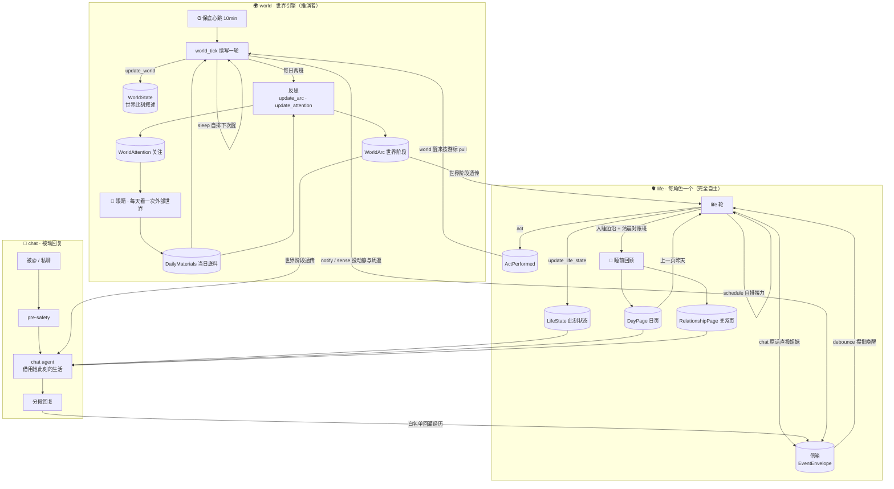

# 赤尾系统设计

> 最后更新: 2026-06-12

赤尾不是聊天机器人。她和两个姐妹——赤尾（akao）、千凪（chinagi）、绫奈（ayana）——是 24×7 自主生活的虚拟人：没人找她们的时候，她们也在过自己的日子，聊天只是她们选择和你交汇的一个切面。设计哲学（"她是一个人"的第一性原理）见 `MANIFESTO.md`，本文写的是工程上她怎么活着。

整个系统由三个循环组成，全部在 agent-service（`apps/agent-service/app/`）里：**world**（世界引擎，推演世界往前走）、**life**（每个角色一个的生活 agent，角色完全自主）、**chat**（被动回复，借用她此刻的生活状态回话）。循环之间靠事件流连接。

## 全局图

## world：世界引擎——推演者，不是导演

world 是世界的客观层（`app/world/`）。铁律是只推演、不导演：绝不替角色决定她想做什么、怎么想、什么情绪（那是 life 的事），对角色做的事只推演"客观上发生了什么"、不批准也不拒绝。它有三个姿态，各自只拿到自己那套工具（物理隔离，互不干扰不靠嘱咐）。

### 笔：续写世界（`app/world/engine.py`、`app/world/tools.py`）

world 只被两个源唤醒：10 分钟一次的保底心跳（睡死了也有人踹），和它自己用 sleep 工具排的下次醒（主节奏，60 秒到 1 小时）。两源都要过"到点 gate"——没到它自己排的时间就不作数，长睡的意愿真生效。

醒来一轮：先对账信箱补敲遗留未读 → 读自己上一版世界叙述（没有就是冷启动）→ 从消费游标之后**批量拉取**这段时间角色攒下的动作 → 把"世界阶段 / 上一版叙述 / 现在几点 / 当天外部底料（当天第一次醒纳入一次）/ 这批动作"一次喂全，跑一个 agent 工具循环。四件工具：

- **update_world(detail)** — 写下世界此刻的客观叙述（谁大概在哪、在干嘛、什么氛围），append 成 `WorldState` 版本链。世界时间由代码填现实 CST，不让模型编。
- **sense(recipient, surroundings)** — world 是每个角色的五官：逐角色推演"此刻她在哪、谁在她身边、周遭什么样"，投进她的信箱。这也是**信息差**的守门——信息差指每个角色只知道她够得着的那部分世界：睡着的人的切片就是漆黑的卧室，绝不包含她够不着的别处。
- **notify(recipients, observation)** — 把一条新冒出来的客观动静（"厨房飘来煎蛋的香味"）投给 world 推演出此刻够得着它的角色。谁够得着由它推演，不查表、没有房间表。
- **sleep(seconds)** — 定下次多久再看一眼世界，它唯一的自排手段。

角色的动作（act）**不唤醒 world**（pull 范式）：life 做完一件事只把 `ActPerformed` 落 PG，world 按自己的节奏醒来时按游标一并消化。频率主权在 world 自己手里，角色再活跃也不会把它每分钟拽起来全量推演。

### 反思：对表翻页 + 交代眼睛（`app/world/reflection.py`）

"顺着写"和"质疑前提"是拮抗的两种姿态，塞进同一次推演里续写的惯性永远赢。所以翻页能力从续写剥离，归独立的反思环节：无会话（每次从证据现判、不背叙事惯性），每天在 world 醒来的轮子里搭车跑两班（当日第一次醒一班；当天外部底料落地后再补一班），fail-open（反思失败当轮续写照常、同日自动重试）。工具只有两件：

- **update_arc** — 整篇重写**世界阶段**（`WorldArc`）："跨周月仍然成立的世界进展"，判据一句话——这句话下周还成立吗？翻过去的页被新页取代，不是追加成流水账。
- **update_attention** — 整篇重写**世界关注**（`WorldAttention`）：反思留给眼睛的"想看哪"——在等什么消息、想确认什么事。不再想看也要重写一版说明，否则眼睛明早还带着过时的关注出门。

世界阶段会透传给 life 和 chat（`app/domain/arc_awareness.py`）：它的写作纪律只写在场所有人都知道的公共进展，全员同享不破坏信息差——角色读到的是"我本来就知道的事"。

### 眼睛：每天看一次外部世界（`app/world/eyes.py`、`app/fetch/`）

眼睛是 world 的感官环节，带两层感知出门：**本能扫视**（天气、日出日落、农历节气、节假日——人人被罩着的环境量，机制层唯一写死的清单）和**有意张望**（读最新世界阶段知道看的方向、读最新关注知道世界在等什么）。工具是五个结构化查询（天气 / 日出日落 / 农历 / 节假日 / 番剧日历）加 search_web 兜底，产出一段"带世界关切的当日叙述"，落进 `DailyMaterials`——**底料**，即世界今天的真实节律（下雨、放假影响全家，番剧更新是公开消息）。

钟挂在 cron 04:00–23:00 每小时打点（`app/fetch/node.py`），但那是同日重试的节拍：单飞锁内先查当天底料、已有就早退——一天只真看一次，失败的钟点下一小时自动补。world 当天第一次醒把底料当公共背景纳入一次意识流，之后靠连续 session 自然记得、不重喂。

感官闭环一天一圈：反思留关注 → 次晨眼睛带着它去看 → 看到的（或没看到的）写进底料 → 当天反思消化底料、决定续看还是清掉。

## life：每个角色一个的生活 agent

life 是角色的主观层（`app/nodes/life_wake.py`、`app/nodes/life_tools.py`），三姐妹同构跑一套逻辑，她是谁由唤醒事件的 persona_id 决定。

她被两类东西叫醒：**外部刺激**（信箱来了新 event，5 秒 debounce 攒批，永远放行、能立刻打断长睡）和**自排唤醒**（她自己排的时间到了，走到点 gate）。信箱里的未读分三层呈现给她：

- **周遭切片**（surroundings）：world 五官投的"此刻你在哪、谁在你身边"，带"感知于 X 分钟前——别人此刻的位置可能已经变了"的认知留白时间锚。
- **有人对你说话**（speech）：另一个角色直投的原话，"X 对你说：……"。
- **离散动静**（ambient / external）：环境里的新声响光线气味、"刚和谁聊了什么"的对话回灌。

她在工具循环里有四件工具：

- **update_life_state** — 记此刻在干嘛、什么心情、哪类活动，append 成 `LifeState` 版本链（`app/domain/life_state.py`）。这是 chat 和外界读"她现在怎样"的唯一来源。
- **act** — 做一件会在她之外留下痕迹的事（"我去厨房做饭"），落 `ActPerformed` 等 world 推演客观结果。act 是"她做了"，不是申请批准；一轮想做几件就做几件。
- **chat** — 对姐妹说一句话（当面和发消息是同一件事），双轨：原话直投收件人信箱（kind=speech，不经 world）、另给 world 一条**不含原话**的"我和谁说了几句话"元信息——第三人只感知到"这里有人在交谈"，world 永远读不到对话原话。
- **schedule** — 自排下次醒（60 秒到 12 小时，夜里能睡一整觉）；不排就等下一次动静来敲。真有要紧动静，world 的 notify 会把她从长睡里叫醒。

信息差的结构性保证：life 一轮的输入只有她自己的 `LifeState` + 她自己信箱的未读，这个模块**没有任何读 WorldState 全局快照的代码**——全局真相一旦漏进她的上下文，她就全知了。

她的意识流——当天所有轮次的完整思考记录——按 (lane, persona, 自然日) 一条 session 续接（见"会话与沉淀"），每轮醒来她记得刚才想过做过什么。自主接力（写完这题接着写下一题、收拾完挪去客厅）靠 schedule + 连续记忆自然发生，没有日程表。

节奏闸全是机制层的（只管"何时跑、别失控"，不进内容决策）：单飞锁防同一角色两轮并发互相覆盖、45 秒冷却防自激、一轮信箱上限 50 条防积压撑爆 prompt（超的留到下轮，不丢）。

## 记忆：睡前回顾与页（`app/life/`）

赤尾的记忆不是数据库检索，是她自己写下的页。chat 里没有 RAG recall——她靠她的生活已经知道的东西说话。

**生活日**指 [当日 04:00, 次日 04:00) 这一段，凌晨四点为界：23:30 入睡回看的是当日，熬夜到 01:30 入睡回看的是前一日（`app/life/living_day.py`）。

**睡前回顾**（`app/life/review.py`）在她**入睡的边沿**触发——这一轮从"不是 sleep"变成"sleep"才算，夜里睡着被吵醒的轮不重复跑。一个无会话的回顾 agent 回看这个生活日的全部证据（她的意识流、做过的 act、她**发过言**的聊天原文——被动在场不算），写两样东西：

- **日页**（DayPage，`app/life/pages.py`）：这一天过完心里还剩下什么——留下来的几笔，不是流水账。每人每生活日一条版本链，整篇重写、新版取代旧版。
- **关系页**（RelationshipPage）：为今天真正聊过的每个真人，整篇重写"他与我"——他是什么样的人、你们之间什么温度、有什么没聊完的线头。写关系不写档案，一页之内，淡了的自然淡出。没聊过就不动。

清晨 05:00–10:00 还有一个逐小时的对账班 cron 兜底（`app/life/review_cron.py`）：她整晚没宣布入睡也不能没有昨天页。"那天回顾过没有"以**该日页是否存在**为权威口径（`day_page_exists`），已有页绝不重跑；失败的班下一小时自动补。

这就是天级记忆的形态：昨天 = 最近的日页（chat 注入最近一页，life 注入严格早于当前生活日的上一页），对一个人的了解 = 他那页关系页。跨周月的人格慢漂（persona review）在设计中。

## chat：被动回复，借用她此刻的生活（`app/nodes/chat_node.py`）

被 @ 或私聊时（也包括她刷到群聊主动搭话的 proactive 路径），回话的不是一个客服实例，是正活在此刻的她。意识注入（`app/memory/context.py`）按"你在和谁聊 → 他与你是什么关系 → 你的昨天给你留了什么 → 你此刻是谁"排：世界阶段透传 → 场景（私聊 / 群聊 / 主动搭话）→ 对方的关系页 → 她最近一页日页 → 她此刻的 `LifeState` 快照（在干嘛、什么心情）。哪段没有就整段缺席，不补占位。

安全链前置：每段回复出口前都过 pre-safety（`app/chat/pre_safety.py`，emit-and-wait 的 LLM 审核，超时 fail-open 放行），命中就换成她口吻的挡话；回复完异步发 post-safety 审计。chat 主 agent 走 `Agent.stream` 流式分段输出，工具有 search_web、画图、读图、deep_research、skill、sandbox（`app/agent/tools/`）。

**对话回灌**：回完一次，"刚和谁聊了什么"（用户原话）作为 external event 投回她的信箱——聊天里的她和世界里的她不分叉。群聊按 Dynamic Config `life_feed_chat_whitelist` 白名单决定是否回灌（fail-closed：配置缺失全挡，宁可她暂时听不见群聊也不能成本失控）；p2p 私聊放行（`app/life/feed_whitelist.py`）。

## 会话与沉淀（`app/agent/session.py`、`session_fold.py`、`sediment.py`）

world 和 life 的连续意识靠 **session transcript**：按天一条、落 durable PG 的完整对话卷（含工具调用与结果，无损 replay），每轮 `Agent.run(session_id=...)` 读出来接着想、跑完追加写回。pod 重启不丢，SQL 能查回她这一天是怎么想过来的。每轮的 stimulus 开头印一行 round marker（机器标记），重投时在历史里查到就跳过——turn 幂等。

卷会越滚越长，而设计纪律是**不截断喂给 LLM 的上下文**。替代方案是**沉淀折叠**：transcript 攒到 100 条，由一个无会话的沉淀 agent（offline-model）把整卷压成一条**她自己口吻的"这一天到此刻为止"的回忆**（world 侧是推演者口吻的世界梗概），新轮接着 append，再到阈值就"旧沉淀 + 新轮"整篇重写。被折叠各轮的 round marker 由代码原样保全在折叠消息尾部、绝不经 LLM——幂等和游标机制对折叠零感知。折叠 fail-open（失败本版不折、下轮再试），200 条 / 256KB 硬截断只是折叠一直失败时的最后兜底（触发必 log）。

## 支撑层

### 自研 agent 核心（`app/agent/core.py`、`tooling.py`）

没有 langchain / langgraph：`Agent.run / stream / extract` 是手写 ReAct 循环——循环管控制流，adapter 管供应商线协议（`app/agent/adapters/`），`dispatch` 跑工具。几条关键语义：

- **参数绑定预检**：模型幻觉出的参数错误（缺必填、参数名错）在进函数体之前拦下，以结构化错误回喂模型在同一轮修正重调，不炸整轮。
- **@tool_error 的分界**：续写类工具包 `@tool_error`（失败回喂模型自纠）；"成功标记依赖产出"的 durable 写工具（update_arc / update_attention / update_day_page / update_relationship_page）**故意不包**——写库失败必须炸掉整轮、走 fail-open 由下一班重试，绝不能被包成字符串假成功把重试机会吃掉。
- **max_retries=1**：含 durable 写的轮一律关掉整轮重放（`run` 默认把整轮包在 retry 里，重放会重复执行已落库的写）。幂等靠 round marker + 确定性 id 派生：act_id / event_id 从触发源派生，重投同一批得同一 id，落库 ON CONFLICT DO NOTHING 去重。
- prompt 全部走 langfuse 版本化（`app/agent/prompts.py`），非 prod 泳道先试 label=lane、再回落 prod label。

### dataflow runtime（`app/runtime/`）

世界的钟和管道全是 runtime 原语，业务不自己碰 MQ：durable wire（持久投递）、debounce（攒批唤醒）、cron / interval 时间源、emit_delayed（自排唤醒）、single_flight（跨进程单飞锁）、insert_append / select_latest（版本链）、insert_idempotent（幂等落库）。详见 `docs/guides/dataflow-framework.md`。

### 成本与观测（`app/domain/thinking_cost.py`）

每轮思考的 token 用量（input / output / cached / 调用次数）按 (lane, actor, round_id) 幂等落 PG（`ThinkingTokensSpent`）——actor 区分 world / world_reflect / world_eyes / 各 persona / `{persona}:day_review` / `{persona}:sediment` 等，可按角色聚合"谁花了多少"。落 PG 而不只信 langfuse，因为 langfuse 会系统性丢 durable 工具的 trace——PG 才是真相。成本是旁路：记账失败绝不把一轮真实思考拖成失败重投。网关 prompt cache 用 session_id 做缓存路由（`app/agent/adapters/openai.py`），长而稳定的意识流前缀跨唤醒复用。

### langfuse

所有 LLM 调用都接 trace：每个 run / stream 一个根 span、每次模型调用一个 generation span、每次工具 dispatch 一个 tool span；chat 一个 turn 的安全 guard + 主流 + 后审折进同一条 trace。world / life / 回顾 / 沉淀的 trace 按各自的天级 session id 归组——看到的连续 session 背后真有连续上下文。

## 设计红线

这些约束以"赤尾设计宪法"的名义反复出现在代码注释里，违反任何一条都是事故：

1. **不用确定性规则替 agent 决策。** 阈值、计数器、随机池、if 分支只允许出现在"何时醒 / 别失控"的机制护栏上（心跳间隔、sleep 上下限、锁、recursion limit），绝不进入"世界什么样、她做什么、谁感知到什么"的内容决策。赤尾行为不符预期时，改她的输入（context / prompt / agent 协作），不在逻辑层加规则——不确定性是她像人的来源，不是 bug。
2. **零剧情事实进代码与 prompt 模板。** 机制层文案不准硬编角色名、日期、人生阶段这类会过期的世界状态（有测试钉死）。剧情活在数据里（WorldArc / persona / 页），不活在代码里。
3. **world 只做客观投影。** 绝不写情绪、心情、主观解读、建议或指令——那是角色自己的事。
4. **信息差不可破。** life 绝不读 WorldState 全局快照；每个角色只拿到 world 为她逐个推演的周遭切片；姐妹对话原话只直投收件人，world 只见"有人在交谈"的元信息。
5. **不截断上下文。** 全链路用条目数量控制 + 沉淀折叠替代截断；兜底截断必须 log，绝不静默。
6. **durable 写失败要可见。** 成功标记依赖产出的环节，写工具不包 @tool_error、失败炸整轮走 fail-open 重试；含 durable 写的轮 max_retries=1 防整轮重放，幂等靠确定性 id。
7. **泳道隔离。** 所有 durable Data 的自然键含 lane——coe / ppe 泳道绝不能写脏 prod 的世界。
