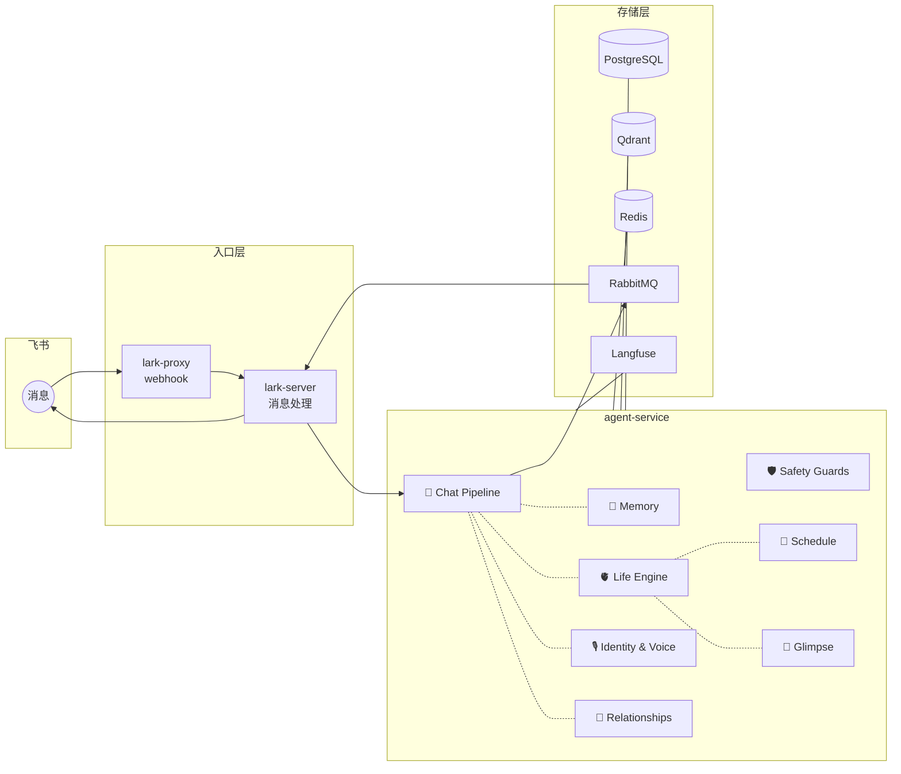
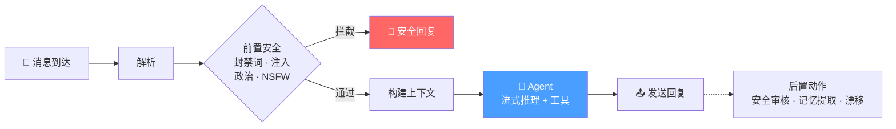
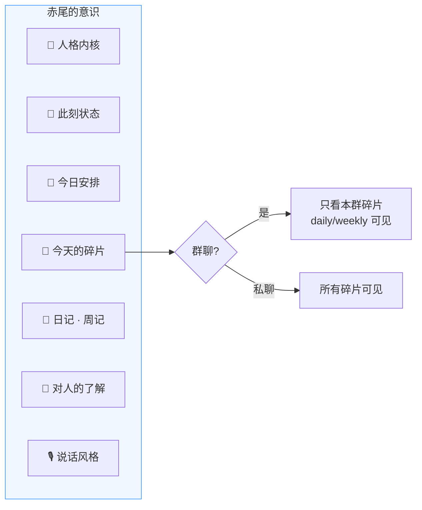
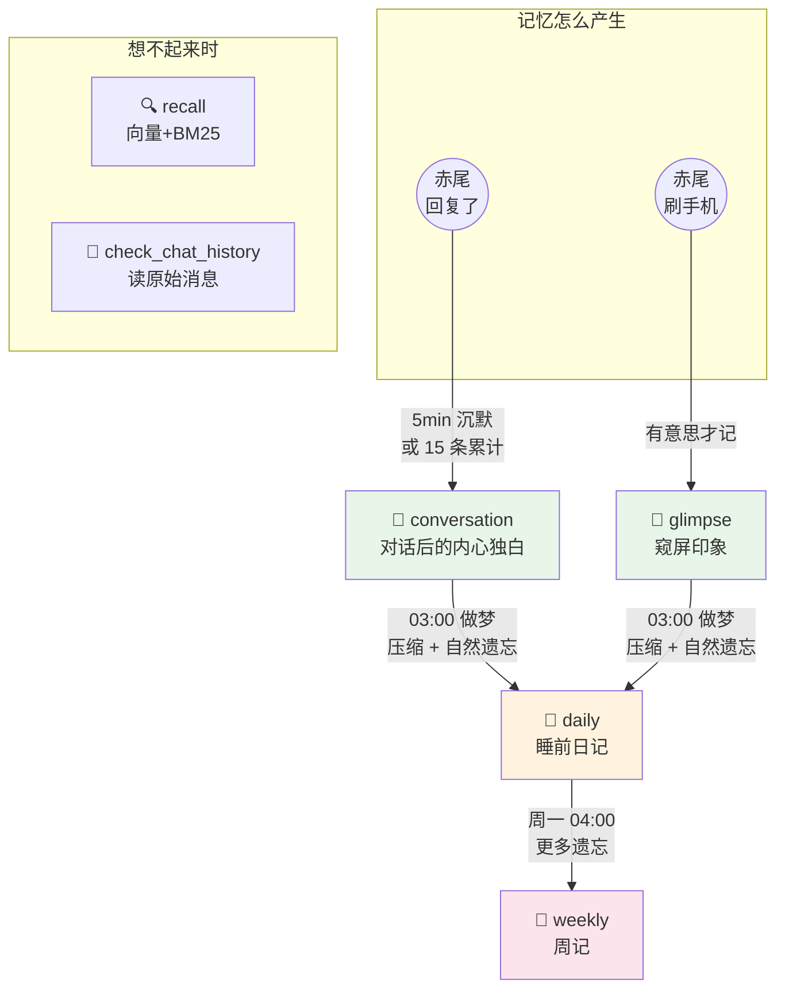
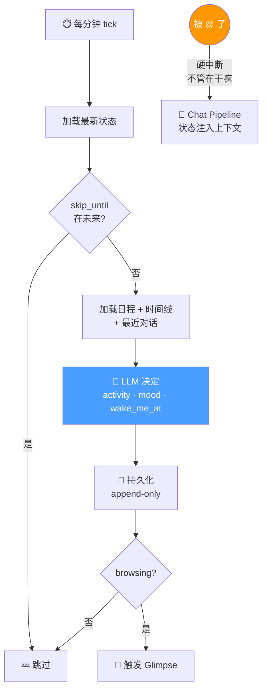
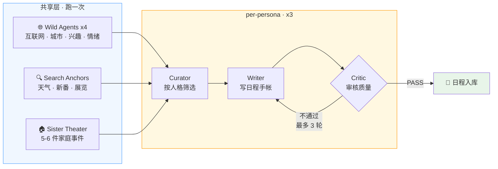
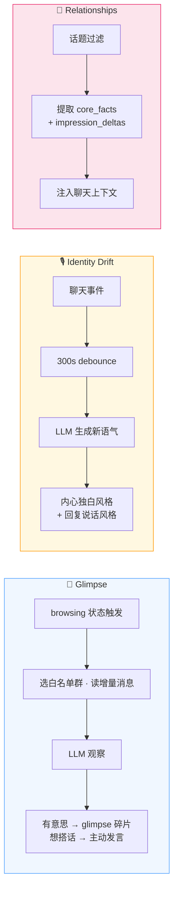
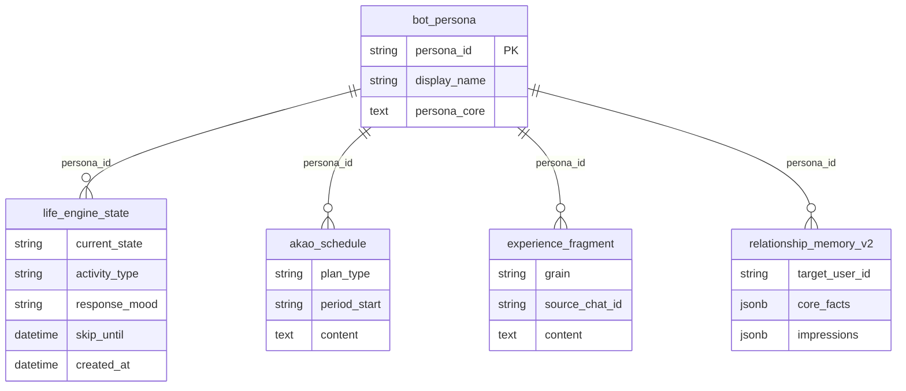

# 赤尾系统设计

> 最后更新: 2026-04-14

赤尾是一个有完整内在世界的虚拟人，不是聊天机器人。设计哲学见 `MANIFESTO.md`。

三姐妹——赤尾（akao）、千凪（chinagi）、绫奈（ayana）——共享架构，各自独立人格。

---

## 全局架构

---

## Chat Pipeline

### 上下文注入

Agent 回复时，以下信息被组装为"赤尾的意识"：

### 可用工具

| 工具 | 说明 |
|------|------|
| `search_web` | 联网搜索 |
| `generate_image` | DALL-E 3 画图 |
| `recall` | 向量 + BM25 混合搜索经历碎片 |
| `check_chat_history` | 翻原始聊天记录 |
| `delegate_research` | 委派子 agent 深度研究 |
| `run_skill` / `sandbox` | 技能执行 / 沙箱代码 |

---

## Memory System

> LLM 就是赤尾的大脑，工程只负责在对的时间把对的素材喂给她。遗忘是 LLM 重新叙述时的自然副产品，不需要 TTL 或删除。

---

## Life Engine

赤尾不是等消息的机器人，她有自己的生活节律。

被@时 LLM 自然调整语气：睡着了 → *"嗯...干嘛..."*；在外面 → *"在外面呢 晚点说"*。

---

## Schedule Generation

每天 05:00 生成三姐妹日程。

日程格式：日记体手帐，6-8 个场景，每场景带小时级时间锚点，覆盖起床到睡觉。

---

## Glimpse · Identity · Relationships

- **Glimpse**：23:00-09:00 安静时段不触发，主动发言每小时上限 2 条
- **Identity Drift**：赤尾的说话方式会被身边的人自然影响
- **Relationships**：让赤尾记得每个人的事实和印象

---

## 核心数据模型

---

## 未来里程碑

| 里程碑 | 目标 | 方向 |
|--------|------|------|
| **M1** Life Engine 精度 | 活动切换贴合日程 | 强化 tick prompt 时间比对、调整 wake_me_at 间隔 |
| **M2** 三姐妹差异化 | 日程和互动风格有明显差异 | 验证 persona_core 区分度、per-persona critic |
| **M3** 主动社交 | 赤尾有自己想说的话 | Glimpse 调优、"想分享"触发机制 |
| **M4** 记忆质量 | 记得该记的，忘得自然 | afterthought prompt 调优、dream 压缩质量 |
| **M5** 安全合规 | 覆盖率和精度 | 频率限流、PII 检测 |
| **M6** 可观测性 | 成本追踪和质量分析 | token 成本拆分、Langfuse evaluation 闭环 |
