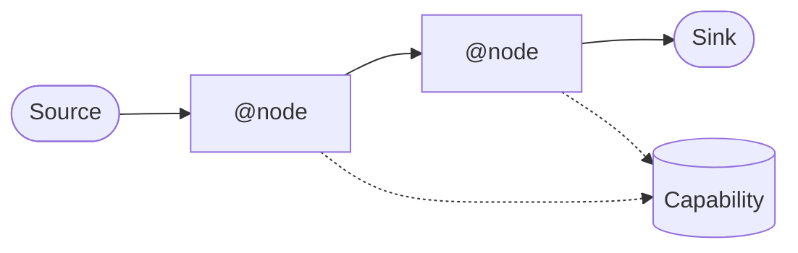
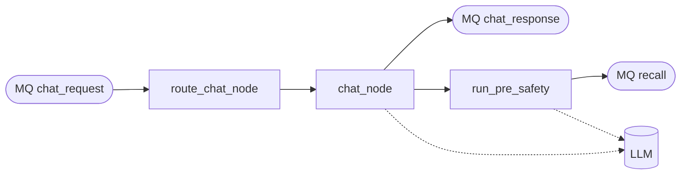
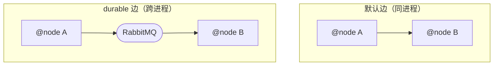
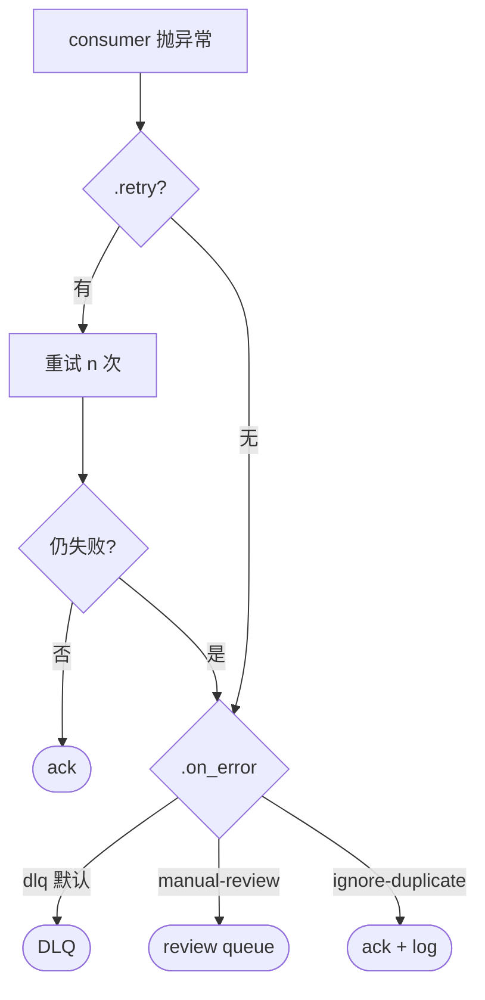
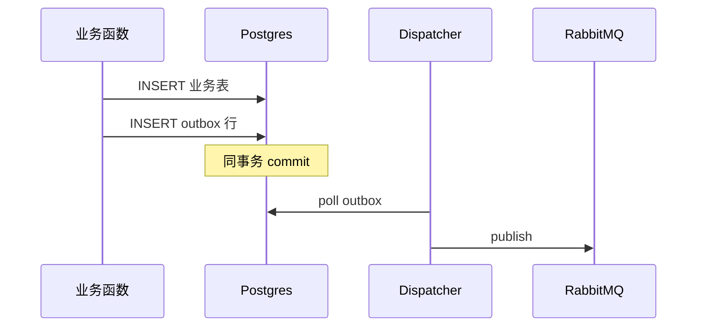

# Dataflow Framework — 人看版

agent-service 的消息流转框架，跨节点用 Data 不可变对象传，wire 声明谁连谁。AI 上手版见 `dataflow-framework.md`（992 行字典）。本文给人看，10 分钟知道这套框架有什么。

## 元素全景

实线 = wire 声明的 Data 流；虚线 = node 调 capability。

- **Data** — 不可变载体（Pydantic frozen），跑在线上的就是它
- **@node** — 拿 Data 进、吐 Data 出（或 None）的纯业务函数
- **wire** — 声明 Data 怎么连到哪个 node，写在 `app/wiring/*.py`
- **Source** — 图的入口（MQ / cron / interval / HTTP）
- **Sink** — 图的出口（把 Data 写到 MQ 让图外消费者读）
- **Capability** — 外部能力封装（LLM / Embedder / VectorStore / HTTP / Agent）

## 一条消息怎么流（chat 主链路）

飞书消息 → channel-proxy → channel-server publish 到 `chat_request` → 进图 → `chat_response` 出图 → chat-response-worker 调飞书 send_message。

## 边的两种：默认 vs durable

- 同 Deployment 内部用默认边，省一次 MQ 跳转
- 跨 Deployment / 要回放 / 失败要 DLQ → `wire(...).durable()`
- durable 边自动管 dedup、ack、lease 续约

## 失败怎么办

每条 wire 配 `.retry(...)` + `.on_error(...)`。DLQ 不是黑洞，`make dlq-replay` 重放。

## 写业务表 + 发消息要一致

业务表写入和发消息走同一个 DB 事务（outbox 模式），后台 dispatcher 自动拾起 outbox 行 publish。代码上用 `transactional_emit(session)`，禁止 commit 后再 `await emit(...)`（broker 一挂消息就丢）。

## 你大致要知道的

写一个新业务节点只需要做四件事：定义 Data、写 `@node` 函数、在 wiring 文件里写一行 `wire(...).to(...)`、（如果要写业务表）用 `transactional_emit`。不用懂 RabbitMQ topology、Redis lock、lane 路由、trace 传递、DLQ replay 机制——这些 framework 自己管。

详细的写法、边的 DSL 所有方法、常见坑见 AI 版 `dataflow-framework.md`。
