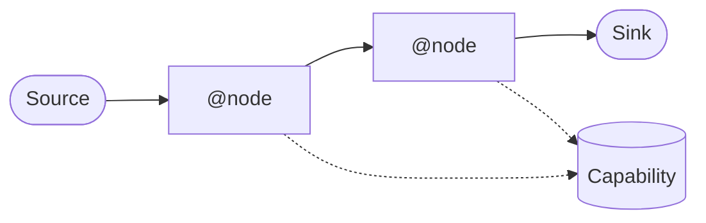
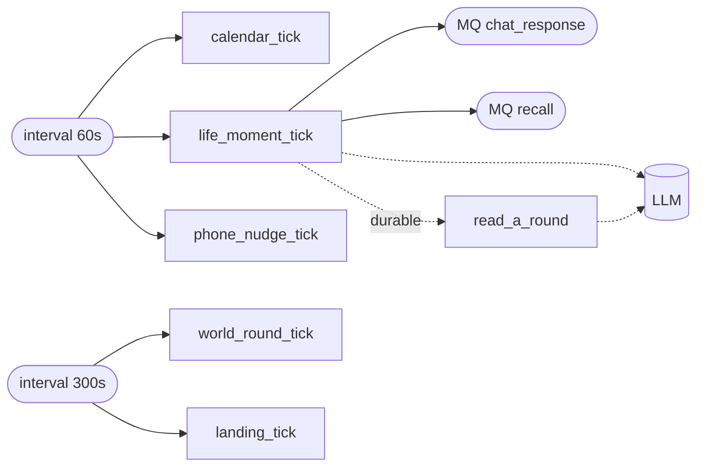
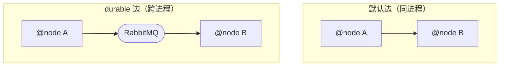
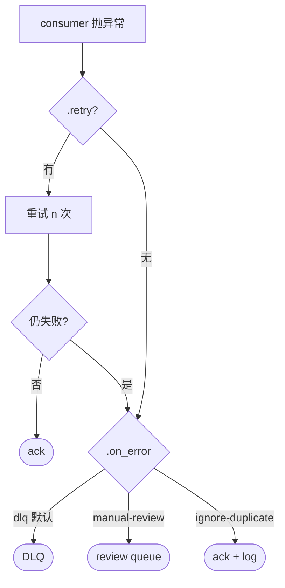
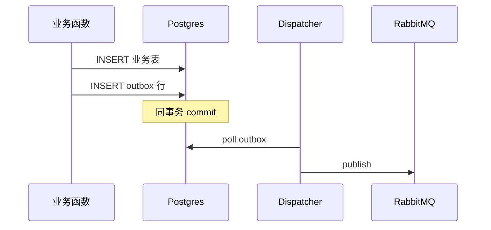

# Dataflow Framework — 人看版

agent-service 的消息流转框架，跨节点用 Data 不可变对象传，wire 声明谁连谁。AI 上手版见 `dataflow-framework.md`（字典式，按需查）。本文给人看，10 分钟知道这套框架有什么。

## 元素全景

```mermaid
flowchart LR
    Src([Source]) --> N1["@node"]
    N1 --> N2["@node"]
    N2 --> Snk([Sink])
    N1 -.-> Cap[(Capability)]
    N2 -.-> Cap
```

实线 = wire 声明的 Data 流；虚线 = node 调 capability。

- **Data** — 不可变载体（Pydantic frozen），跑在线上的就是它
- **@node** — 拿 Data 进、吐 Data 出（或 None）的纯业务函数
- **wire** — 声明 Data 怎么连到哪个 node，写在 `app/wiring/*.py`
- **Source** — 图的入口（MQ / cron / interval / HTTP）
- **Sink** — 图的出口（把 Data 写到 MQ 让图外消费者读）
- **Capability** — 外部能力封装（LLM / Agent / HTTP / Redis / 沙箱 / 图像 / 搜索 / 输出安全）

## 图里现在跑什么（living 引擎）

```mermaid
flowchart LR
    T60([interval 60s]) --> CAL[calendar_tick]
    T60 --> MOM[life_moment_tick]
    T60 --> NUD[phone_nudge_tick]
    T300([interval 300s]) --> WLD[world_round_tick]
    T300 --> LND[landing_tick]
    MOM --> Seg([MQ chat_response])
    MOM --> Rec([MQ recall])
    MOM -. durable .-> RR[read_a_round]
    MOM -.-> LLM[(LLM)]
    RR -.-> LLM
```

**图里没有入站队列**，五条边界全是 `Source.interval`（`app/wiring/living.py`）。她每一缝直接查 `common_message` 看有没有人找她（`app/living/phone.py`），自己决定要不要开口 —— 没有谁把消息推给她。

开口那侧出图：`ChatResponseSegment` → `Sink.mq("chat_response")` → 按 channel 落 `chat_response_lark` / `chat_response_qq`，飞书那条由 lark-outbound 消费、QQ 那条由 chat-response-worker 消费。撤回同理，`Recall` → `Sink.mq("recall")` → `recall_{channel}`。

`read_a_round` 那条是**图内的 durable 边**（`FilePickedUp`）：她在某一缝拿起一个文件，读那一程（取字节、解码、几轮模型调用）在边的另一头异步跑，不把她卡在一缝里。durable 只是边的传输方式，不是入口 —— 边上跑的只有她自己刚 emit 的那个信号。

## 边的两种：默认 vs durable

```mermaid
flowchart TB
    subgraph 同进程["默认边（同进程）"]
      A1["@node A"] --> A2["@node B"]
    end
    subgraph 跨进程["durable 边（跨进程）"]
      B1["@node A"] --> MQ([RabbitMQ])
      MQ --> B2["@node B"]
    end
```

- 同 Deployment 内部用默认边，省一次 MQ 跳转
- 跨 Deployment / 要回放 / 失败要 DLQ → `wire(...).durable()`
- durable 边自动管 dedup、ack、lease 续约

## 失败怎么办

```mermaid
flowchart TD
    Err[consumer 抛异常] --> Rt{".retry?"}
    Rt -->|有| Retry[重试 n 次]
    Retry --> Cont{仍失败?}
    Cont -->|否| Done([ack])
    Cont -->|是| Term
    Rt -->|无| Term
    Term{".on_error"}
    Term -->|dlq 默认| DLQ([DLQ])
    Term -->|manual-review| Rv([review queue])
    Term -->|ignore-duplicate| Ack([ack + log])
```

每条 wire 配 `.retry(...)` + `.on_error(...)`。DLQ 不是黑洞，`make dlq-replay` 重放。

## 写业务表 + 发消息要一致

```mermaid
sequenceDiagram
    participant Biz as 业务函数
    participant DB as Postgres
    participant Dis as Dispatcher
    participant MQ as RabbitMQ
    Biz->>DB: INSERT 业务表
    Biz->>DB: INSERT outbox 行
    Note over DB: 同事务 commit
    Dis->>DB: poll outbox
    Dis->>MQ: publish
```

业务表写入和发消息走同一个 DB 事务（outbox 模式），后台 dispatcher 自动拾起 outbox 行 publish。代码上用 `transactional_emit(session)`，禁止 commit 后再 `await emit(...)`（broker 一挂消息就丢）。

## 你大致要知道的

写一个新业务节点只需要做四件事：定义 Data、写 `@node` 函数、在 wiring 文件里写一行 `wire(...).to(...)`、（如果要写业务表）用 `transactional_emit`。不用懂 RabbitMQ topology、Redis lock、lane 路由、trace 传递、DLQ replay 机制——这些 framework 自己管。

详细的写法、边的 DSL 所有方法、常见坑见 AI 版 `dataflow-framework.md`。
