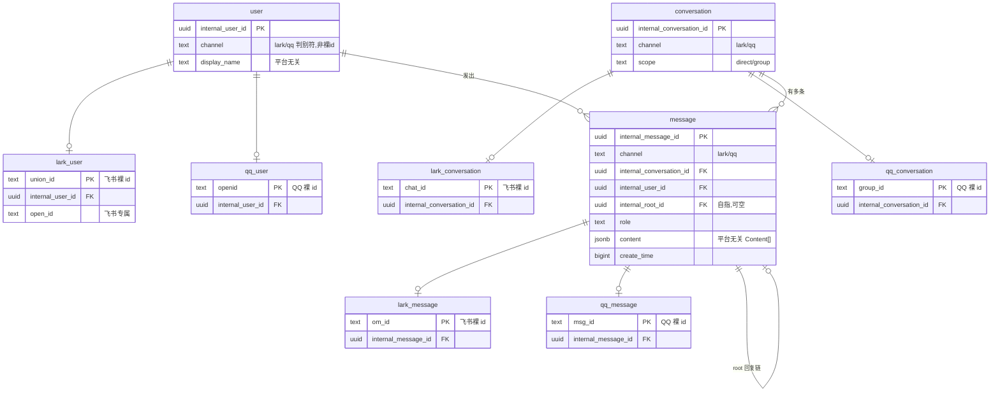
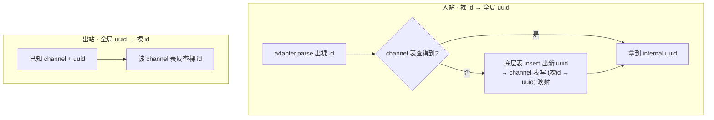

# channel 层 · 数据模型(实体 + 关系)

> 配套 `channel-layer-redesign.md`(高层架构)。这份只讲数据模型和迁移。

## 1. 核心模式:底层表持 id,channel 表持映射

三个领域实体(User / Conversation / Message)。每个实体拆成两层:

- **底层表(平台无关)**:持有全局 `uuid` 主键 + 平台无关字段。下游(agent / Qdrant / dashboard)只认它。
- **channel 表(每平台一张)**:持有该平台裸 id(主键)+ 平台专属字段,外键回指底层 uuid。

每个底层实体跨所有 channel 表恰好对应一行(它从哪个平台来,就在那张 channel 表有一行)。新增平台 = 新增 `xxx_user/conversation/message` 三张表,**底层表和别的平台表都不动**。

**底层表为什么有 `channel`**:它是平台**判别符**(枚举,不是裸 id、不是平台专属字段),不违反"底层无裸 id"。作用:① 出站反查时,读底层行 → 知 channel → 直接去对应 channel 表查裸 id(否则要 union 扫所有 channel 表);② 插件 dispatch / runRules 过滤本就靠它。一条 message/user/conversation 必属单一 channel(三者同 channel),写入即定、永不变,无漂移风险。

## 2. id 翻译怎么走(你设想的流程)

一次入站一个事务:查不到才 `insert 底层 → insert channel`,channel 表裸 id 唯一约束兜并发(同一新用户并发到达只落一行)。

## 3. 当前 prod → 新模型怎么对应(2026-05-30 ops-db 查实)

现状是**混合态、零损坏**,迁移就是把它折进上面的两层:

| 现状 | 查实 | 迁到新模型 |
|---|---|---|
| conversation_messages | 250 万行,message_id `om_` 244万 + ULID 6.1万 | 变成底层 `message`,主键 `om_`/ULID 统一换 uuid |
| identity_user/chat/message 表 | 已存在(im≈6.1万),channel 全 lark | 就是 `lark_*` 表的雏形,去掉 channel 列即 `lark_user/conversation/message` |
| 6.1 万 ULID 行 | 孤儿 = **0**(全可经 identity 表反查回飞书裸 id) | canonical 化:先翻回 `om_`,再统一分配 uuid → 记忆无损 |
| lark_user(union_id PK) | 已存在 | 加 `internal_user_id` 外键 |

迁移顺序(混合态不能错):**① ULID 行反查回飞书裸 id 归一 → ② 底层表分配 uuid + channel 表填映射 → ③ Qdrant 同样翻译 → ④ 下游切 uuid 零 fallback → ⑤ drain(入口现仍在写 ULID,必须真关死)+ 快照 + coe 演练**。

## 4. 关键约束

- id = **UUIDv7 小写**(弃 ULID 大写),PG 原生 `uuid` 列,跨三类天然唯一防串用。
- **底层表绝不出现裸 id**;裸 id 只在 channel 表。下游只见 uuid。
- 反查(uuid → 裸 id)只在 channel-server 出站插件;agent 及下游不反查。
