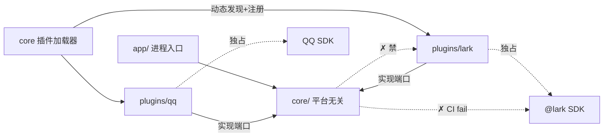
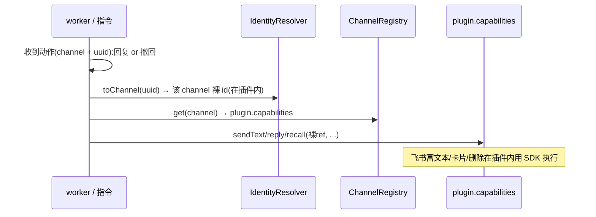
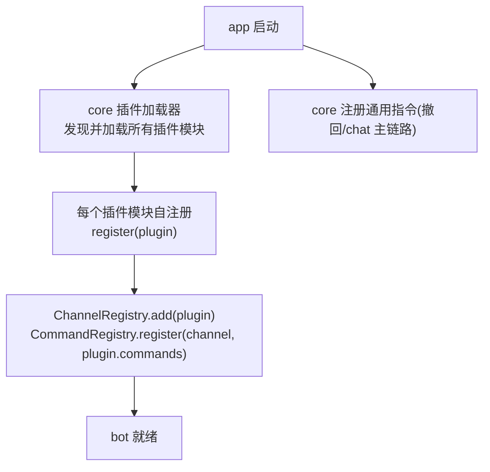

# channel 层 · 技术设计

> 配套:`channel-layer-redesign.md`(高层架构)、`channel-layer-redesign-detail.md`(数据模型 ER + 迁移)。
> 这份讲代码架构:包结构、依赖边界、接口、装配、入出站时序。

## 核心关系:ports & adapters(本体定义接口,插件适配)

- **本体(core)** 拥有流程,并**定义接口(端口)**:入站解析、是否响应、平台能力(send/recall…)。
- **插件** 是**适配器**:为某个平台**实现**这些端口,被动态插进来。
- **控制永远是 core → 端口 → 插件**。插件绝不把平台原始对象交回核心;核心绝不碰平台 SDK。
- **没有任何"取回原始对象"的逃生口**(这是 #228 `larkMessage` 旁挂的病根)。指令要操作平台,只能调能力端口或用插件自己的 SDK,绝不掏原始对象。

## 1. 包结构与依赖边界

单进程,`channel-server/src` 内三层,依赖**单向** `app → {core, plugins}`、`plugins → core`:

```
src/
  core/            平台无关核心 —— 禁 import 任何平台 SDK / 任何 plugin
    domain/          领域模型(User/Conversation/Message/Content/InboundMessage/OutboundReply)
    pipeline/        入站/出站编排
    ports/           端口接口(InboundAdapter/AddressingPolicy/OutboundCapabilities)
    registry/        ChannelRegistry + CommandRegistry + 插件加载器
    identity/        IdentityResolver(uuid ↔ 裸 id)
    commands/        通用指令(撤回、chat 主链路…凡能用能力端口表达的)
  plugins/
    lark/            飞书插件 —— 独占 @lark SDK;实现端口 + 飞书专属指令(用自己 SDK)+ 副作用 + 凭据
    qq/              QQ 插件(未来)
  app/             进程入口(server / workers)
```



**边界靠 dependency-cruiser 硬锁**(命门,#228 没有任何边界检查才烂掉):规则进 CI——`core/**` import `plugins/**` 或任何平台 SDK → 构建失败。零 build 改动、增量可上。

## 2. 端口与能力(core 定义,plugin 实现)

```ts
// ── 插件 = 适配器。动态注册,core 不硬编码任何具体插件 ──────
interface ChannelPlugin {
  channel: string;                       // "lark" / "qq"
  inbound:      InboundAdapter;          // 端口:原始 → ParsedMessage
  addressing:   AddressingPolicy;        // 端口:是否响应 {respond, reason}
  capabilities: OutboundCapabilities;    // 端口:本平台能做的操作
  commands?:    Command[];               // 仅平台专属指令(用本插件自己的 SDK)
  parseCredentials(blob: unknown): unknown;   // 解释 bot_config.credentials
}

// ── 平台能力端口:指令通过它操作平台,绝不碰原始对象 ──────
// 能力可选:平台不支持就不实现 → 依赖它的指令对该平台自然不可用
// (QQ 不能撤回 → 无 recall → 撤回指令对 QQ 不可用,不是 flag、不是降级)
interface OutboundCapabilities {
  sendText(conv: ConversationRef, content: Content[]): Promise<MessageRef>;
  reply(thread: ThreadRef, content: Content[]):        Promise<MessageRef>;
  recall?(msg: MessageRef): Promise<void>;             // 可选
}

// ── 入站/寻址端口 ──────────────────────────────────
interface InboundAdapter {
  verify(raw): boolean;
  handshake(raw): unknown | null;
  parse(raw): ParsedMessage | null;       // 原始 → 裸 id 形态(未 resolve)
}
interface AddressingPolicy {
  decide(msg: ParsedMessage, botIdentity: string): AddressingDecision;
}

// ── 指令:拿到的只有通用消息 + 能力端口 + 解析器,没有 rawOf ──
interface Command {
  name: string;
  category: 'persona' | 'utility';
  requires?: (keyof OutboundCapabilities)[];   // 声明依赖哪些能力,缺则该 channel 跳过
  match(msg: InboundMessage, ctx: CommandContext): boolean | Promise<boolean>;
  handle(msg: InboundMessage, ctx: CommandContext): Promise<Outcome>;
}
interface CommandContext {
  caps: OutboundCapabilities;             // 当前 channel 的能力端口
  resolver: IdentityResolver;             // 全局 uuid ↔ 平台裸 id
  // + 通用服务(admin 判定等),均平台无关
}
```

**指令归属规则**:
- 能用能力端口表达的(撤回 = `caps.recall`、纯文本回复 = `caps.sendText`)→ **通用指令,放 core**。
- 输出是平台专属、无通用对应物的(飞书卡片余额/帮助)→ **放 plugin,用插件自己的 SDK**;输入仍只收通用 `InboundMessage`,不掏原始对象。

领域模型见 detail 文档第 1 节。

## 3. 入站时序

```mermaid
sequenceDiagram
    participant HTTP as HTTP route(平台无关)
    participant PL as plugin.inbound
    participant POL as plugin.addressing
    participant ID as IdentityResolver
    participant CMD as CommandRegistry
    participant DB as 底层表+channel表
    participant MQ as RabbitMQ

    HTTP->>PL: verify(raw) + parse(raw) → ParsedMessage(裸id)
    PL->>POL: decide(msg, botIdentity) → {respond, reason}
    Note over POL: 不响应 → 记可查日志,停(禁静默)
    POL->>ID: resolve 三类裸id → uuid<br/>(查不到则 insert底层+写channel表映射)
    ID->>CMD: InboundMessage(全 uuid) → 按 channel 取指令派发
    Note over CMD: 单一终态出口;指令只经 caps 端口操作平台
    CMD->>DB: 存底层 message(uuid + content)
    CMD->>MQ: chat_request(channel + uuid)
```

铁律:`parse → decide → resolve → dispatch → store → MQ` 顺序钉死;任一步失败 fail-loud(不写库、不发 MQ、记日志,绝不退裸 id 往下)。

## 4. 出站时序(撤回 / 回复都走能力端口)



撤回:通用指令 → `caps.recall(messageRef)`;飞书插件实现 recall = 调飞书 SDK 删消息。安全自动撤回(recall 队列)复用同一个 `recall` 能力。

## 5. 装配:动态加载(无硬编码插件)



- core 全程不认识任何具体插件;加平台 = 新增 `plugins/xxx` 模块,它自注册,core 零改动。
- **已定(决策一)= (a) 构建期自注册**:插件模块 import 即自注册进 registry,一处清单 `plugins/index.ts` 列出所有插件 import;core 不认识任何具体插件,bootstrap 不写死 `new LarkPlugin()`,加平台零改 core。与 `bun --compile` 单二进制兼容。(否决 (b) 运行时热插拔——与单二进制打架、成本高、当前无此需求。)

## 6. 现状(#228)→ 目标的改造点

| 现状 | 目标 |
|---|---|
| `engine.ts:1` import 飞书 SDK | core 零平台 import,dependency-cruiser 守 |
| 10 飞书指令硬编码 `chatRules` + `channels:['lark']` flag | 平台专属指令搬进 `plugins/lark` 自注册;通用指令(撤回)放 core |
| `RuleMessage` 旁挂 `larkMessage`,指令 `requireLarkContext` 掏 | **删旁挂、删 rawOf**;指令只经 `caps` 端口 + 通用消息 |
| 出站 native `sendPost`/`replyPost` | 收进 `OutboundCapabilities`,承载富 Content |
| 入站 `MessageTransferer` + adapter 双解析 | 单解析:plugin.inbound 是唯一碰生对象处;副作用归插件 |
| 单张 identity 表(ULID,混合态) | 底层表 + 每平台 channel 表(UUIDv7),见 detail |
| bootstrap 硬编码插件 | 动态加载 + 自注册,core 不认识具体插件 |

## 7. 决策状态(全部已定)

- **动态加载** = (a) 构建期自注册:`plugins/index.ts` 一处清单 import,插件自注册,core 不认识具体插件,加平台零改 core。
- **包隔离** = dependency-cruiser CI gate 守 `core/**` 零平台 import。物理拆 workspace 包留作后续可选。
- **能力端口模型** = core 定义 `OutboundCapabilities`,插件实现;指令只经端口,无 rawOf、无原始对象逃生口。
- **content** = 直接存 `Content[]`,不带 schema_version(YAGNI)。

设计已定稿,下一步:收口成实现 spec 的 task 清单(TDD,严控单次 cutover 范围)。
