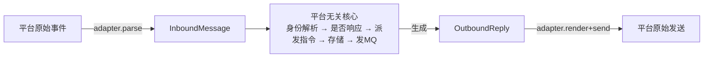

# channel 层目标架构 · 领域模型为中心

> 已定:出站收进插件 adapter · 身份迁移随本次一起做 · 单 channel-server 进程、核心零平台依赖(CI 锁死)。

核心只认下面这套**平台无关领域模型**;每个平台写一个 **adapter** 负责双向翻译;核心永远不碰平台对象。

## 1. 平台无关领域模型(核心词汇只有这些)

| 模型 | 是什么 |
|---|---|
| **Identity** = User / Conversation / Message | 三类全局 ID,由 `(channel, 渠道内ID)` 映射而来,三张映射表。核心一律用全局 ID,绝不出现裸渠道 ID。**ID 格式 = UUIDv7(小写)**:时间有序、PG 原生 uuid 类型、跨三类天然唯一(防 ID 串用)。弃用原 ULID(全大写难看) |
| **InboundMessage** | 归一化入站:`来源(channel/bot)` + `Identity` + `scope(direct/group/…非强制二元)` + `addressing(谁被指向,抽象的@)` + `Content[]` + `replyTo?` + `时间` |
| **Content** | 判别联合:`Text / Image / Audio / File / Sticker / Unsupported`。喂 AI + 存储的统一内容 |
| **AddressingDecision** | `要不要回 + 原因`(不回也必须有可查原因) |
| **OutboundReply** | bot 要发什么:`目标 Conversation` + `replyTo?` + `富 Content`(支持飞书富文本) |
| **Command** | `谓词(要不要触发我) + handler`。核心只内置「聊天主链路」;平台指令由插件注册 |
| **Bot** | `channel + persona + 不透明 credentials`(核心不解释 credentials 形状) |

## 2. 平台如何映射(翻译全在 adapter 内部)

| 领域模型 | 飞书 | QQ |
|---|---|---|
| User | union_id | openid |
| Conversation | chat_id | group_id / c2c |
| Message | message_id | message id |
| scope | p2p→direct,group | C2C→direct,group |
| addressing | mention 含 robot_union_id | at 含 bot appid |
| Content | text/post/image/sticker/file/audio/… | text(本期仅纯文本) |
| 验签 | verification_token + encrypt_key | Ed25519 |

## 3. 平台 adapter 要实现什么(插件契约)

每个平台一个插件包,**只暴露这几样**,核心通过它们与平台打交道:

- **verify(raw)** —— 验签 / 回调校验;**handshake** —— 接入握手
- **parse(raw) → InboundMessage** —— 含渠道内身份、scope、addressing 线索、Content 映射
- **shouldRespond(msg, bot) → AddressingDecision**
- **render+send(OutboundReply) → 渠道内 messageId** —— 把富 Content 渲染成平台原生消息发出(出站归口于此)
- **解释 credentials**(从不透明 blob 取本平台凭据)
- **注册本平台的指令**(复读/余额/撤回… 进核心指令注册表)+ 承载本平台副作用(识图/presence)

> 验收:接第三个差异极大的平台(如纯 HTTP 问答),只写一个新插件实现以上几样,不改核心、不改别的插件 → 模型才算抽对了。

---

剩两个低风险点我按默认推:**channel-proxy** 退化成薄的平台无关入口泳道路由(验签归插件)、**改造方式**边界 clean-slate + adapter 实现复用现有代码。有异议再说。

> 字段级模型 + 调用方覆盖 + 身份迁移面:见 `channel-layer-redesign-detail.md`。
