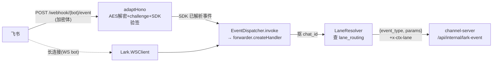
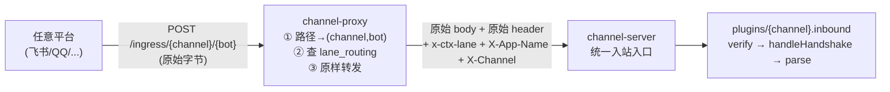
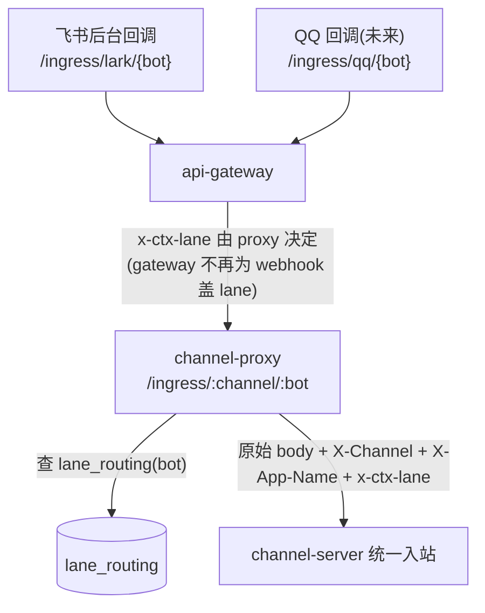

# channel-proxy 退化设计 · 薄的平台无关入口路由层（C3）

> 配套 `channel-layer-redesign.md`（高层架构）、`channel-layer-redesign-tech.md`（channel-server 内部 ports & adapters）、`service-topology.md`（现状拓扑）。
> 这份只讲 **channel-proxy 这个独立服务** 怎么从"懂飞书的门卫"退化成"不懂任何平台的入口路由"。
> 范围：只动 `apps/channel-proxy`。channel-server 入站收口（验签/握手/解析进 `plugins/lark`）由另一条线做，本文只定义两者的衔接契约。

---

## 0. 一句话目标

今天 channel-proxy 自己用飞书 SDK 解事件、应飞书握手、起飞书长连接——飞书细节糊在入口层。C3 要把它削成：**收原始 HTTP webhook → 看路径判出是哪个 bot / 哪个平台 → 查泳道 → 原样把原始报文转给 channel-server，由 channel-server 的平台插件去验签/握手/解析**。proxy 退化后对"飞书"这个词零认知。

---

## 1. 现状拆解：channel-proxy 现在到底干了哪些事

源码 9 个文件（`apps/channel-proxy/src/`）。逐文件按"飞书特定 vs 平台无关"拆：

| 文件 | 做什么 | 飞书特定？ |
|---|---|---|
| `index.ts` | 进程装配：连 PG、起 Hono、挂 metrics/health/admin、`botManager.registerBots(app)`、SIGTERM 关 WS | **平台无关骨架**（但 registerBots 内部是飞书的） |
| `bot-manager.ts` | 从 `bot_config` 读 `channel='lark'` 的 bot；按 `init_type` 分 http / websocket；http 的注册 `/webhook/{bot}/event` + `/card` 两条路由并挂飞书 `EventDispatcher` / `CardActionHandler`；websocket 的起 `Lark.WSClient` 长连接；把 `credentials` JSONB 解释成飞书四件套（app_id/app_secret/encrypt_key/verification_token） | **几乎全是飞书**：SDK、四件套凭据、事件类型清单、ws 长连接 |
| `lark-adapter.ts` | `adaptHono`：从 Hono request 取 body → 用 `AESCipher` + encryptKey 解密飞书加密体 → 应飞书 `url_verification` challenge → 调 `dispatcher.invoke` 让 SDK 验签+派发 | **纯飞书**：AES 解密、challenge 握手、SDK 验签 |
| `forwarder.ts` | 拿 SDK 已解析的事件 → 从 params **尽力抠 chat_id** → 查 lane（先 chat 后 bot）→ 拼 `{event_type, params}` POST 给 `channel-server/api/internal/lark-event`，带 `X-App-Name`/`x-trace-id`/`Authorization`/`x-ctx-lane` | **混合**：转发+泳道是平台无关的；但 `extractChatId` 钻 `message.chat_id`/`context.open_chat_id` 是飞书事件结构；body 形状 `{event_type, params}` 是飞书 SDK 产物 |
| `lane-resolver.ts` | 查 `lane_routing` 表（route_type=bot/chat），30s 内存缓存 | **平台无关** |
| `admin.ts` | `/api/lark/lane-bindings` GET/POST/DELETE，X-API-Key 鉴权，写 `lane_routing` 表 + 清缓存 | **平台无关**（但 basePath `/api/lark` 名字带 lark，需正名） |
| `health.ts` | `GET /api/health` | **平台无关** |
| `metrics.ts` | Prometheus 中间件 + `/metrics` | **平台无关** |
| `package.json` / `Dockerfile` | 依赖含 `@larksuiteoapi/node-sdk`、`@inner/lark-utils`；Dockerfile COPY lark-utils 包 | **飞书依赖** |

**结论：脏东西集中在两个文件**（`lark-adapter.ts` 整个 + `bot-manager.ts` 大半）外加 `forwarder.ts` 的 `extractChatId` 和 body 形状、`package.json`/`Dockerfile` 的飞书依赖。`lane-resolver` / `admin` / `health` / `metrics` 已经是干净的平台无关件，退化后原样保留。

### 现状数据流（飞书细节在 proxy）

proxy 现在的核心病灶：它必须持有每个飞书 bot 的 **encrypt_key + verification_token** 才能解密验签，必须 import 飞书 SDK，必须知道 12 个飞书事件类型名，还要起飞书长连接。这些全是平台知识，不该在一个"门卫"里。

---

## 2. 目标薄入口职责：退化后留什么

退化后 channel-proxy 只剩三件事，全部平台无关：

1. **入口匹配**：收原始 HTTP POST，从 URL 判出 `(channel, bot_name)`。不解析 body、不解密、不验签、不应握手。
2. **泳道决策**：拿 `bot_name`（以及——见 §5 取舍——可选的 chat 维度）查 `lane_routing`，得出目标 lane。
3. **透传转发**：把**原始请求体字节 + 原始相关 header** 原样 POST 给 channel-server 的统一入站入口，附 `x-ctx-lane`、`X-App-Name`、鉴权、trace。channel-server 的平台插件负责验签/握手/解析。

保留的现有平台无关件：`lane-resolver`、`admin`（正名后）、`health`、`metrics`、`index.ts` 装配骨架。

删除的飞书件：`lark-adapter.ts`（整文件删）、`bot-manager.ts` 里的 SDK/凭据/事件清单/WS 逻辑、`forwarder.ts` 的 `extractChatId` 和 `{event_type, params}` 封装、`package.json` 的 `@larksuiteoapi/node-sdk` 与 `@inner/lark-utils`、Dockerfile 的 lark-utils COPY。

### 退化后数据流（飞书细节全在 channel-server 插件）

握手回环（飞书 `url_verification` challenge）：proxy 不识别它，原样转给 channel-server；channel-server 插件 `handleHandshake` 返回 challenge 响应，proxy 把这个响应体**原样回给平台**。即 proxy 对"同步响应体"也要透传（见 §6 衔接点的握手细节）。

---

## 3. 飞书逻辑迁移去向：删干净，零兼容

channel-proxy 删掉的每一块飞书逻辑，在 channel-server 的 `plugins/lark` 里都已有或将有对应归属，**不是搬运、是各归其位**：

| proxy 删掉的飞书逻辑 | 去向（channel-server） | 说明 |
|---|---|---|
| `adaptHono` 的 AES 解密 + SDK 验签 | `plugins/lark/inbound.ts` 的 `verify(raw)`（契约 `InboundAdapter.verify`） | 验签所需的 encrypt_key/verification_token 已在 channel-server 侧 `bot_config.credentials`，proxy 不再持有这些凭据。**注意**：`inbound.ts` 现在 `import { larkSignVerify } from '@lark/sign'`，但 `@lark/sign`（= `infrastructure/integrations/lark/sign`）**这个文件目前不存在**，只在测试里被 mock——即 channel-server 侧的真实验签+解密尚未落地。这正是"channel-server 入站收口"那条线要补的（把 proxy 的 AESCipher 解密 + SDK 验签逻辑作为行为参考、在 `@lark/sign` 里重写）。proxy 退化依赖这块就绪 |
| `adaptHono` 的 `url_verification` challenge | `plugins/lark/inbound.ts` 的 `handleHandshake(raw)` | 已实现：检测 `challenge` 字段并回 `{challenge}` |
| 飞书事件体解析（SDK 把加密体解成 `{event_type, params}`） | `plugins/lark/inbound.ts` 的 `parse(raw)` + channel-server 入站入口先解密 | 解密本属验签同一步；parse 已把飞书原生结构翻成 `InboundMessage` |
| `bot-manager` 的 12 个飞书事件类型清单 | channel-server 的 `EventRegistry` / `larkEventHandlers`（已存在） | 事件分发本就在 channel-server，proxy 不该有这份清单 |
| `bot-manager` 的飞书四件套凭据解释 | channel-server 的 `lark-credentials.ts` / `plugins/lark` `parseCredentials`（已存在） | proxy 退化后完全不读 bot 凭据 |
| `forwarder.extractChatId`（飞书事件抠 chat_id） | 不再需要（见 §5 取舍） | chat 维度泳道改由 bot 维度兜底，或由 channel-server 解析后回流（本期不做） |

迁移铁律遵守项目规范：**proxy 这边对应逻辑直接删，不留 re-export、不留 deprecated wrapper、不留"过渡期双跑"**。channel-server 插件就绪后，proxy 的飞书代码一次性删除。

### 关键衔接点：WebSocket bot 怎么办

现状 `bot-manager` 对 `init_type=websocket` 的 bot 起 `Lark.WSClient` 长连接——这是飞书 SDK 直连飞书的另一条入站路径，**根本不经过 HTTP webhook，也就不经过"入口路由"**。退化后的 proxy 是纯 HTTP 入口路由，承载不了长连接语义。

设计取舍：**WS 长连接的归属是 channel-server 的 lark 插件，不是 proxy**。理由——WS 直连需要飞书 SDK + bot 凭据 + 事件解析，这三样退化后都在 channel-server 侧；让 proxy 保留 SDK 只为起 WS，等于退化没削干净。所以 WS bot 的接入移到 channel-server lark 插件内（plugin 自己用飞书 SDK 起长连接，解出事件后直接喂自己的入站 pipeline，不出进程）。

> 这是一条 **跨服务衔接点**，需要 channel-server 那条线确认承接。本文把它列为 task T5 的前置依赖；若 channel-server 暂不承接 WS，则保留"proxy 仅对 WS bot 例外地用 SDK"作为**临时**状态并显式标注——但这违反零兼容原则，**默认方案是迁到 channel-server**，例外需用户拍板。

---

## 4. 多平台入口怎么统一：按什么判别 channel

退化后 proxy 要能接任意平台的 webhook，必须平台无关地判出"这条请求是哪个平台、哪个 bot"。判别只能靠**入口可见的信息**（proxy 不解 body）：

**方案（已选）：路径携带 channel + bot**，统一为 `POST /ingress/{channel}/{bot_name}`。

- `{channel}`（如 `lark`/`qq`）告诉 channel-server 该用哪个平台插件，proxy 自己不解释其含义、只透传成 `X-Channel` header。
- `{bot_name}` 用于查 `lane_routing`（route_type=bot）和填 `X-App-Name`。
- proxy 对 `{channel}` 不做枚举校验、不 fail-closed——未知平台原样转发，由 channel-server 的 `ChannelRegistry.get(channel)` fail-closed（避免两处都维护平台清单，平台知识只在 channel-server）。

为什么不靠 body 判别平台：proxy 一旦解 body 就又懂平台了，违背退化目标。为什么不靠 header（如平台自带的签名头）判别：那要 proxy 认识各平台的签名头格式，仍是平台知识。**路径是唯一让 proxy 平台无关的判别位**——每个平台在自己后台配的回调地址里写死 `/ingress/{channel}/{bot}`，proxy 只做字符串匹配。

现状路径 `/webhook/{bot}/event` 和 `/card` 是飞书专属（event/card 是飞书的事件/卡片二分）。退化后 **event/card 不再在路径里区分**——那是飞书内部的事件子类型，应由 channel-server lark 插件从 body 里自行判断。proxy 只认 `/ingress/{channel}/{bot}` 一条入口形状。

---

## 5. 设计取舍：chat 维度泳道 vs 平台无关

**这是退化的最大权衡。** 现状 `forwarder` 先按 chat_id 查 lane、查不到再按 bot 查（`extractChatId` 钻飞书事件结构）。chat 维度泳道的用途：把某个具体群/会话单独引到测试泳道，做更细粒度的灰度。

退化后 proxy 不解 body，**拿不到 chat_id**，只能按 bot 维度查 lane。三个选项：

1. **放弃 chat 维度泳道（本期默认）**：泳道路由只按 bot。代价——失去"单群引流"能力；收益——proxy 真正平台无关、零 body 解析。考虑到 chat 维度绑定的实际使用（看 `admin` 支持 route_type=chat，但飞书 dev 测试主要按 bot 绑），本期先砍，按 bot 维度足够覆盖 dev bot 泳道验证。
2. **chat 维度移到 channel-server**：channel-server 解析出 chat 后，若发现该 chat 绑了别的 lane，再内部重路由——但 channel-server 间重路由要额外机制，复杂度高，且消息已落在错 lane 的进程里。不推荐。
3. **proxy 保留对 chat_id 的"窄抽取"**：让平台插件在 channel-server，但 proxy 仍 peek 一个平台无关的 chat 字段——做不到，chat_id 位置每个平台不同，peek 就是懂平台。否决。

**默认走选项 1**，并在 task 验收里明确："chat 维度 lane_routing 绑定本期不再生效，dev 测试改用 bot 维度绑定"。若用户认为 chat 维度必须保留，则需重新讨论（可能要 channel-server 回流 lane 决策给一个轻量"预解析"端点，但那是单独的设计）。

---

## 6. 调用方 & 部署影响

### 6.1 webhook URL 变更（需飞书后台改回调地址）

- **旧**：`/webhook/{bot}/event`、`/webhook/{bot}/card`
- **新**：`/ingress/{channel}/{bot}`（如 `/ingress/lark/chiwei-main`）

飞书开放平台后台每个 app 的"事件订阅请求地址 URL"和"卡片回调地址"都要改成新路径。**这是有外部依赖的一次性操作，必须列入上线清单**：cutover 时先部署新 proxy + 新 channel-server 入口，再去飞书后台逐 app 改 URL，改完飞书会发一次 `url_verification` 握手——握手必须打通（验证 §6.4 的握手透传）。卡片回调若飞书要求独立 URL，则 `/ingress/lark/{bot}` 需能同时收事件和卡片（channel-server lark 插件从 body 区分），或保留 `/ingress/lark/{bot}/card` 子路径——**这一点需在实现期用飞书后台实际配置项确认**，spec 阶段不臆断。

### 6.2 api-gateway 规则

webhook 从集群外进来先过 api-gateway（Go 服务，规则是 DB 动态真值，非静态 yaml；基线种子在 `paas-engine/internal/service/gateway_rule_seed.go` 的 `BaselineGatewayRules()`）。现状两条相关基线规则：

- `default-channel-proxy-webhook`：`/webhook/` → `channel-proxy:3003`，**target.lane 留空 = 跟随请求 x-lane 透传，不写死 lane**。webhook 进来时本就没有 x-lane（飞书不会带），所以 gateway 实际不盖 lane，泳道完全由 proxy 查 `lane_routing` 决定——没有冲突源。
- `default-channel-proxy-lark`：`/api/lark/` → `channel-proxy:3003`，这是 proxy 的 **admin 泳道绑定** 入口（§3 要正名的 basePath）。

退化后：

- 入口前缀 `/webhook/` 改为 `/ingress/`，target.lane 仍留空（沿用现状透传语义）。按项目规范走 `/ops gateway upsert` 动态规则、不改静态种子作为日常入口；上线前用 `/ops gateway explain` 预览命中，备好 `/ops gateway rollback`。**同时基线种子 `gateway_rule_seed.go` 也要把这两条改掉**（`/webhook/`→`/ingress/`，`/api/lark/`→正名后的 admin 前缀），否则全新库冷启动 `EnsureBaseline` 会灌回旧前缀。
- 这是退化里风险最低的一环——proxy 一直是 webhook 泳道决策的唯一来源，退化没改变这个职责归属，只改了入口前缀。

### 6.3 凭据 / 配置影响

- proxy 退化后 **不再需要 bot 凭据**（encrypt_key/verification_token/app_secret）。proxy 的 ConfigBundle 里若注了这些，可清理（非阻塞）。
- proxy 仍需 `POSTGRES_*`（查 lane_routing）、`INNER_HTTP_SECRET`（转发鉴权）、`CHANNEL_SERVER_URL`。
- `bot_config` 表 proxy 退化后**只读 `bot_name` + `channel`**（为了知道有哪些 bot 名做路由匹配——其实连这个都可不读：路径里已带 bot_name，proxy 可完全不查 bot_config，未知 bot 由 channel-server fail-closed）。**默认方案：proxy 不再读 bot_config**，进一步削依赖。

### 6.4 部署顺序（cutover）

复合 cutover（改路径 + 改协议 + 外部回调地址），按影响清单和回滚顺序走：

1. channel-server 统一入站入口就绪（能收原始 body、调插件 verify/handshake/parse）——这条是 channel-server 线的产出，proxy 依赖它。
2. 部署新 channel-proxy（薄入口）+ 新 channel-server 到泳道，绑 dev bot，飞书后台把 dev app 回调改 `/ingress/lark/{bot}`，验握手 + 真实消息链路。
3. 验收通过后上 prod：先发 channel-server，再发 channel-proxy，再去飞书后台逐 prod app 改回调 URL。
4. **回滚**：飞书后台 URL 改回 `/webhook/...` + release 回旧 proxy + 旧 channel-server。回滚要 URL 和镜像一起回，单回一个会断。

部署 = 杀 pod = 断异步任务，按规范上线前确认无在跑的 rebuild/afterthought。

---

## 7. 与 channel-server 入站收口的衔接点（契约）

proxy 退化能否成立，完全取决于 channel-server 的统一入站入口契约。两条线的接口约定如下（proxy 按此设计，channel-server 线需对齐）：

**入口形状**：channel-server 暴露一个**平台无关**的统一入站入口（取代现状只认 `{event_type, params}` 的 `/api/internal/lark-event`），接收：
- **原始请求体字节**（不是 `{event_type, params}`，是平台发来的原文，含加密体）。
- header：`X-Channel`（哪个平台插件）、`X-App-Name`（bot_name）、`x-ctx-lane`（proxy 决策的泳道）、`Authorization`（INNER_HTTP_SECRET）、`x-trace-id`。

**channel-server 侧处理**（已有半成品）：取 `X-Channel` → `ChannelRegistry.get(channel)` 取插件 → `plugin.inbound.verify(raw)` 验签 → `handleHandshake(raw)`（非 null 则同步返回响应体）→ `parse(raw)` → 走 §3 钉死的契约链。

**握手同步响应**：飞书 `url_verification` 要求**同步**返回 `{challenge}`。所以 channel-server 统一入口对握手要**同步返回响应体**（不能 fire-and-forget），proxy 要把这个响应体**原样回传给飞书**。这跟现状"proxy 立即回 `{ok:true}`、异步处理"不同——退化后 proxy 必须等 channel-server 的同步响应（至少握手场景要等）并回传。**这是衔接点里最容易翻车的一处**，需在握手 e2e 里专门验。

> 现状 `internal-lark.route.ts` 是"已 SDK 解析 + 立即 ack + 异步 handler"模型，**不满足**新契约（它收 `{event_type, params}` 而非原始字节、不验签、握手不同步）。而且现状 channel-server **根本没有自己的飞书 SDK 入口**——它唯一的入站口就是这个 `/api/internal/lark-event`，所有 AES 解密/SDK 验签今天全在 channel-proxy。退化等于把"解密+验签+解析"这条链整体从 proxy 移到 channel-server 插件，channel-server 线需新建/改造统一入口 + 补上不存在的 `@lark/sign`。proxy 线不碰 channel-server 代码，但 T2/T5/T6 验收依赖它就绪。

---

## 8. 粗颗粒 task 清单（目标 + 产出 + 验收口径）

> 只写"做什么 / 产出什么 / 怎么算对"，不写实现步骤、不写代码、不写文件行号。实现细节在动手时基于实际代码生成。
> 标注 [依赖] 的 task 需要 channel-server 线先就绪。

**T1 · 入口路由收敛为平台无关 `/ingress/{channel}/{bot}`**
- 目标：proxy 只暴露一条平台无关入口形状，删掉 `/webhook/{bot}/event` 和 `/card` 的飞书二分。
- 产出：proxy 注册 `/ingress/:channel/:bot` 路由，从路径取出 channel + bot；不解 body、不验签、不应握手。
- 验收：对 `/ingress/lark/anybot` 发任意 POST，proxy 不解析 body 就能取到 `channel=lark`、`bot=anybot`；旧 `/webhook/...` 路径不再注册（请求 404）。单测覆盖路径解析。

**T2 · 转发改为原始 body + 原始 header 透传**
- 目标：forwarder 不再封 `{event_type, params}`，改原样转发请求体字节给 channel-server 统一入口，带 `X-Channel`/`X-App-Name`/`x-ctx-lane`/鉴权/trace。
- 产出：重写 forwarder 的转发逻辑；删 `extractChatId`；lane 只按 bot 维度查（§5 选项 1）。
- 验收：单测断言转发请求的 body === 入站原始 body、带正确 header；无 lane 时不带 `x-ctx-lane`、lane=prod 时不带、其他 lane 带；不再出现 `event_type` 封装。

**T3 · 删尽飞书代码与依赖**
- 目标：proxy 对"飞书"零认知。
- 产出：删 `lark-adapter.ts`、`bot-manager.ts` 的飞书部分（SDK/凭据/事件清单/WS，WS 见 T5）、`package.json` 去 `@larksuiteoapi/node-sdk` + `@inner/lark-utils`、Dockerfile 去 lark-utils COPY；`admin` 的 basePath `/api/lark` 正名为平台无关名（如 `/api/lane-bindings` 或 `/api/routing`），同步改 dashboard/调用方。
- 验收：`grep -rn "lark\|Lark\|larksuite" apps/channel-proxy/src` 零业务命中（注释里的历史说明除外或一并清）；proxy 构建不再拉飞书 SDK；admin 调用方（monitor-dashboard 的泳道绑定）指向新路径并通。

**T4 · admin 泳道绑定保持平台无关 + 调用方对齐**
- 目标：lane_routing 的增删改查保留，但去掉 lark 命名，确认所有写绑定的调用方（dashboard / `/ops bind`）跟着改。
- 产出：admin 路由正名；列全调用方并改 import / URL；连带改 gateway 基线种子里 `default-channel-proxy-lark` 的 `/api/lark/` 前缀（外部经 gateway 访问 admin 走这条）。
- 验收：列出每个调用 lane-bindings 的来源（dashboard 泳道绑定页、`/ops bind`、gateway `/api/lark/` 规则），逐个确认指向新路径；bind→查 lane_routing→proxy 路由生效 端到端通。

**T5 · [依赖 channel-server] WebSocket bot 接入迁到 channel-server lark 插件**
- 目标：proxy 不再起飞书长连接；WS bot 由 channel-server lark 插件用飞书 SDK 自接。
- 产出：proxy 删 WS 全部逻辑（`createWebSocketClient`/`startWebSocketBot`/`closeWebSocketClients`/SIGTERM 关 WS）；channel-server lark 插件承接 WS（这部分属 channel-server 线，本 task 在 proxy 侧只负责删干净 + 确认承接方就绪）。
- 验收：proxy 进程不再 import 飞书 SDK、不再持 WS 客户端；WS bot 的事件经 channel-server 插件正常入站（用一个 WS dev bot 实测收消息）。若 channel-server 暂不承接，停在此 task 并把分歧抛给用户（不擅自保留 proxy WS 兼容）。

**T6 · [依赖 channel-server] 握手同步透传打通**
- 目标：飞书 `url_verification` 握手经 proxy → channel-server 插件 `handleHandshake` → 同步响应原样回飞书。
- 产出：proxy 对统一入口的同步响应做原样回传（至少握手场景等待并回传响应体）；与 channel-server 线对齐"哪些场景同步、哪些 fire-and-forget"。
- 验收：在飞书后台对 dev app 配置新回调 URL，飞书发起的握手返回 200 + 正确 challenge；真实消息事件 proxy 仍快速返回不阻塞（非握手场景不被同步等待拖慢）。

**T7 · api-gateway 入口规则 + 飞书后台回调地址 cutover**
- 目标：外部入口前缀 `/webhook/` → `/ingress/`，target.lane 留空（跟随请求透传，与现状 `default-channel-proxy-webhook` 规则一致）。
- 产出：用 `/ops gateway upsert` 加 `/ingress/` 规则（指向 channel-proxy:3003、target.lane 留空）；同步把 `gateway_rule_seed.go` 的 `default-channel-proxy-webhook` 种子前缀改 `/ingress/`（避免空表冷启动 `EnsureBaseline` 回退旧前缀）；飞书后台逐 app 改回调 URL（运维动作，列入上线清单）。
- 验收：`/ops gateway explain` 预览 `/ingress/lark/{bot}` 命中 channel-proxy 且不盖 lane；dev app 改 URL 后握手 + 消息链路通；备好 `/ops gateway rollback` 快照。

---

## 9. 现状 → 目标差距小结（对照设计）

| 维度 | 现状 | 目标 |
|---|---|---|
| 入口路径 | `/webhook/{bot}/event` + `/card`（飞书二分） | `/ingress/{channel}/{bot}`（平台无关，一条） |
| 验签 / 握手 / 解密 | proxy 用飞书 SDK + AESCipher 做 | channel-server `plugins/lark.inbound` 做，proxy 透传 |
| 转发 body | `{event_type, params}`（SDK 产物） | 原始字节透传 |
| 平台判别 | 隐式（只认 lark） | 路径 `{channel}`，proxy 不解释、channel-server fail-closed |
| 泳道粒度 | bot + chat（抠飞书 chat_id） | 仅 bot（§5 取舍） |
| WS 长连接 | proxy 起 `Lark.WSClient` | channel-server lark 插件承接 |
| 凭据 | proxy 读飞书四件套 | proxy 零凭据 |
| 依赖 | `@larksuiteoapi/node-sdk` + `@inner/lark-utils` | 去飞书依赖 |
| admin 命名 | `/api/lark/lane-bindings` | 平台无关命名 |
| 保留不动 | — | `lane-resolver` / `health` / `metrics` / `index` 骨架 |
