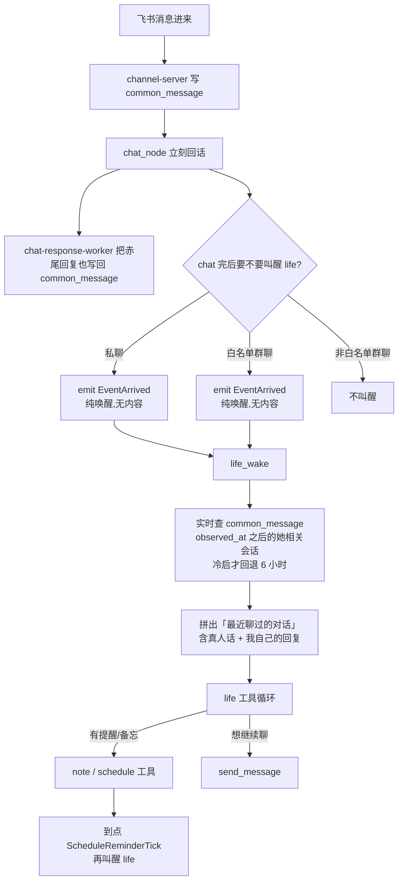

# Chat -> Life 感知链路草图

## 一句话

chat 负责“当场回话”，life 负责“把刚聊过的事变成生活里的行动”。所以 chat 完以后不再把内容塞进信箱，只发一个空的醒来信号；life 醒来后实时读聊天记录。

## 图



## 这次要修的问题

上一版 coe 已经做了“群聊纯唤醒”，但有两个缺口：

1. 私聊不叫醒 life。你私聊她“5 分钟后提醒我吃饭”，chat 可以当场答应，但 chat 没有日程工具；日程工具在 life 里。私聊不叫醒 life，就可能不会立刻建提醒。
2. life 每次都回看固定 6 小时，确实会重复看旧聊天。正确水位应该是上一轮 `LifeState.observed_at`；只有冷启 / 脏时间才回退 6 小时。

## 目标改法

私聊和白名单群聊都纯唤醒 life。差别只在白名单：

- 私聊：默认在她感知范围内，直接纯唤醒。
- 白名单群聊：在 `life_feed_chat_whitelist` 里才纯唤醒。
- 非白名单群聊：只 chat 回复，不叫醒 life。

## 伪代码

```python
async def chat_node(req):
    # 1. 当场回话
    reply = await render_chat_turn(req)
    await emit_chat_response(reply)

    # 2. chat 完以后只决定要不要叫醒 life
    await wake_life_after_chat(req)
```

```python
async def wake_life_after_chat(req):
    if not req.persona_id:
        return

    if req.is_p2p:
        # 私聊也要纯唤醒。内容不塞信箱。
        await emit(EventArrived(
            lane=current_deployment_lane() or "prod",
            persona_id=req.persona_id,
        ))
        return

    if await should_feed_chat_to_life(chat_id=req.chat_id, is_p2p=False):
        # 白名单群聊纯唤醒。内容不塞信箱。
        await emit(EventArrived(
            lane=current_deployment_lane() or "prod",
            persona_id=req.persona_id,
        ))
```

```python
async def life_wake_node(arrived):
    snapshot = await find_life_state(...)
    unread_events = await list_unread_events(...)

    if snapshot and parse_time(snapshot.observed_at):
        since_ms = to_ms(snapshot.observed_at)
    else:
        # 冷启兜底：第一次醒来需要一点上下文，但后续不能反复扫 6 小时。
        since_ms = now_ms() - 6 * HOUR

    recent_chats = await find_persona_related_chats_recent(
        persona_id=arrived.persona_id,
        since_ms=since_ms,
        max_conversations=5,
        per_chat_limit=10,
    )

    if not unread_events and not recent_chats:
        return

    round_id = uuid5(
        "life-round",
        sorted(event.id for event in unread_events)
        + sorted(message.id for chat in recent_chats for message in chat.messages),
    )

    prompt = [
        render_unread_events(unread_events),
        render_recent_chats(recent_chats),
        "如果刚聊过的对话里有你答应记下/提醒/安排的事，就用本子或日程工具处理；不要复读已经回过的话。",
    ]

    await Agent.run(prompt, tools=[
        note,
        update_notebook_entry,
        send_message,
        act,
        update_life_state,
    ])
```

## 最关键的不变量

```python
# chat 内容不进 EventEnvelope
assert no_deliver_event_for_chat_content

# life 的聊天上下文来自 common_message
assert recent_chats_include_user_message
assert recent_chats_include_akao_reply_as_me

# 私聊里的提醒需求能立刻进入 life 工具循环
assert p2p_chat_emits_event_arrived

# 空信箱纯聊天轮不会全部撞同一个 round_id
assert life_round_id_includes_recent_chat_message_ids

# 不是每轮重复扫 6 小时；有 LifeState 时按 observed_at 增量读取
assert recent_chat_since_ms == last_life_state_observed_at_ms
```

## 验证用例

1. 私聊：“5 分钟后提醒我吃饭”
   - chat 当场回复。
   - 随后 life 被纯唤醒。
   - life 的 prompt 里看到“最近聊过的对话”。
   - life 调 schedule/note 工具建提醒。

2. 白名单群聊：“赤尾，等会儿回群里提醒我”
   - chat 当场回复。
   - life 被纯唤醒。
   - life 看到群聊上下文。
   - 如果她要继续说，用 `send_message(group:<id>)` 回同一个群。

3. 非白名单群聊
   - chat 当场回复。
   - 不叫醒 life。
   - 不写信箱。
