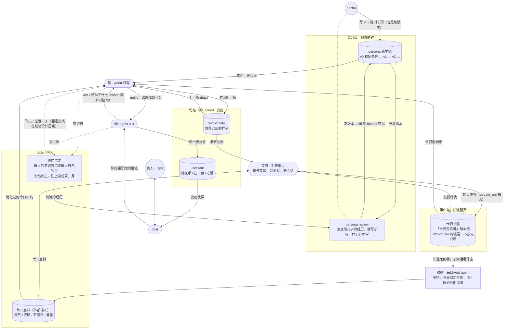

# 活的世界：让「她是谁」也随时间流动

2026-06-10。起因是一个真实穿帮：高考 6 月 9 日考完，6 月 10 日问赤尾在干嘛，她说在学校准备上课。

## 问题

排查证据链是这样的：chat 没问题——trace 里她忠实地从 life 此刻状态出发说话；底料没问题——当天的天气、农历、节假日都是新鲜的；world 甚至**知道高考考完了**——它推演出的 life 状态里写着「又听到『结果怎么样』这种考试后经典追问」。但它还是把她推回了教室，因为她的 persona 写死了「高三学生」，底料说今天是工作日，推演者拿着一张定格的身份卡，只能推出「学生 + 工作日 = 上学」。

根因不是推演能力，是**长弧状态无处落脚**：world 每轮醒来都从同一张定格 persona 重推一遍今天，昨天推出的「考完了」到今天就蒸发了。她只能永远 18 岁、永远高三。

这个穿帮只是第一个露头。同样的「定格」藏在各处：冰箱的菜永不增减、三姐妹的关系停在写设定那天、考完的高考没在她心里压下任何东西。活着的世界的定义就是万物都在变——**哪里有「写死一次就不动」的设定，哪里就在跟活世界打架。**

## 设计核心：时间常数分层

把「她是谁」按变化速度拆成几层钟，每层都在走，只是快慢不同：

**轮级（约 30 分钟）——此刻。** LifeState（她在哪、在干嘛、心情）和 WorldState（世界此刻的样子），world/life 每轮自排醒来写一版。已有，已在流。**这是目前唯一在流动的自产状态层。**

**天级——今天过成什么样。** 目前缺。天级只有底料（天气、农历、节假日）这个外部输入在流；world 自产的「今天」没有落脚处——昨天只存在于上一版 detail 里碰巧还带着的部分，过几轮就被冲淡。记忆沉淀补的就是这层：每天的意识流收拢成一页可回看的经历，往上自然滚成周、月。

**事件级——长弧翻没翻页。** 也缺。这层**不按人归属，它是世界的**：就是 WorldState 的慢层——同一个模式（版本链、自然语言、world 写 world 读），只是钟慢。WorldState 写「世界此刻的样子」，这层写「世界的长弧走到哪」：「赤尾考完了在等 6 月 25 放榜；千凪在职；绫奈初二；这家人在广州，入夏了」。高考结束、放榜、搬家、换工作这类翻页事，world 推演到了就更新这层；翻页事件天然不归属单个人（高考是赤尾的页也是全家的页，搬家是三个人的页），所以**不建 per-persona 归属**——文字里自然写到谁就是谁，谁该感知什么照老规矩由 world 推演决定。这就是当初否掉 room_id 的同一课：不用结构化归属去切天然连续的东西。

world 每轮推演读「persona 底色 + 长弧走到哪 + 今天的底料 + 上一版此刻」。这样考完第二天她自然不去学校，6 月 25 她自然忐忑，9 月她自然成大学新生，全程不需要人碰 persona。她自己的自我认知不从这份世界文档里读——从**她自己活过的链**里来：此刻级在 LifeState 链里（她亲历了高考），长弧级由她自己的记忆沉淀补（每人的意识流沉成每人自己的页，天然有主、不用分类）。

**周月级——性格的慢漂。** 性格本身也是经历的沉淀物，会动态漂移。到点（从月级起步，周期本身只是钟）回头读她这段日子真实经历了什么，像给人物写小传一样轻轻重写 persona：「这个月被成绩的事悬着，她比从前更不爱把话说满」。漂移必须从经历里长出来，不是凭空变。

## persona 的著作权拆分

- **初始条件归 bezhai**：出身、家庭、三姐妹、性格底色的起点。这是 v0。
- **人生进展归 world**：事件驱动，推到翻页就写。
- **性格慢漂归周月 review**：最慢的钟。
- **bezhai 的干预**：随时可以改——干预也是版本链上的一个新版本。著作权从「永久锁定人设」变成「写初始条件 + 看着她长大 + 必要时干预」，像父母而不像提线。

persona 从此不再是「设定文档」，而是**最慢的那层状态**。所有版本 append-only 留痕（沿用 WorldState/LifeState 的版本化模式），可追溯、可回滚，禁止覆盖。

## 护栏（宪法对齐）

- **全程自然语言推演，禁止状态机**。没有 phase 枚举、没有「亲密度 +1」计数器、没有库存表。物理演化（食材见底、牛奶过期）维持已定原则：world 从意识流和 act 纯推演。
- **漂移要慢、幅度要小、必须援引真实经历作依据**。LLM 重写自己人设是自反馈回路，复利漂移会把特色磨平、向通用 AI 人格回归——这是这类系统的经典死法。每次 review 的 diff 对 bezhai 可见，他是这个回路的外部 reviewer。
- **cron 只是钟，不是决策器**。到点触发 review 跟 world 的自排唤醒同性质；漂什么、漂多少、漂不漂，全由推演说了算。
- **喂给 review 的上下文不截断**，用条目数量控制。

## 三种姿态：眼睛、反思、笔

world 不是一个单一姿态的模型。「续写场景」和「质疑前提」是相互拮抗的两种姿态——塞进同一次推演里，续写的惯性永远赢（实证：高考结束次日，world 手握现实日期、自己的常识和长弧引导三样线索，依然顺着旧剧本把她推去上学）。所以按姿态拆成三个互不干扰的环节：

**眼睛——每日输入处理。** 一个全能、多轮的采编 agent（由现有 fetch agent 升级）：读世界的长弧知道该往哪看（家里有考完等放榜的孩子，就该主动去看放榜消息），多轮工具调用追线索，把原始外部消息消化成「今天对这个家而言是什么样的一天」。**原始外部消息从此不直接进续写。**

**反思——慢钟的写入者。** 独立 agent 调用、无会话（每次从证据现判，不背叙事惯性）：拿现实此刻 + 日历、长弧、最新此刻、今日底料对表——「这条长弧放在现实日期里还成立吗？哪页该翻了？」底料有就以底料为准，底料没说的用对真实世界的常识加日期推。工具只有翻页（update_arc），明令禁止叙述场景。跑在每天第一次醒来（新底料注入那刻）和冷启动时。失败不阻塞续写（记错误日志、当轮用旧长弧）。

**笔——续写。** 既有的 world 推演：顺着流往前推，不质疑前提。工具集里**没有** update_arc——互不干扰不靠嘱咐，靠工具集物理隔离：续写者无手碰长弧，反思者无手碰此刻。

快钟归续写，慢钟归反思家族——记忆沉淀和 persona review 天然是反思家族的后续成员。

## 不只是她：万物同构

世界长弧覆盖所有人和所有物：千凪的工作变动、绫奈的升学、季节流转、家里的大物件，都是同一条长弧上的翻页（不按人切、也不按「人 / 物 / 关系」分系统）；关系的质地变化天然落在长弧 + 各自的记忆沉淀 + persona 慢漂里，不单独建「关系系统」。

## 数据流转

虚线框是本设计新增的三块（世界长弧、记忆沉淀、persona review），其余都是已有并已在流动的部分。

读这张图的要点：状态层就是几层钟，全部版本化留痕。**目前真正在流动的自产状态只有轮级那一层**（WorldState + LifeState，约 30 分钟一版）；天级只有底料这个外部输入，world 自己的「今天」无处收拢——所以三个虚线框分别补天级（记忆沉淀）、事件级（世界长弧）、周月级（persona review）这三层缺失的钟。归属原则只有一条：**世界的归世界（长弧不按人切，文字里写到谁就是谁），自己的归自己（记忆沉淀按 agent 天然有主）**。写入方各司其职：bezhai 只写最慢层的初始条件，world 写轮级和事件级，life 写轮级，沉淀和 review 负责把快钟的内容滚进慢钟；chat 只读不推演（借 life 的快照说话，聊完把对话回写进她的信箱）。

## 落地顺序

四块有依赖关系，按序做，做一块验一块：

**第一块：世界长弧 + 反思环节。** 新增「世界的长弧走到哪」持久化版本链（自然语言、不按人归属，WorldState 的慢层）；翻页由独立的反思环节负责（每日首醒 + 冷启动，无会话，工具只有 update_arc），续写只读不写长弧。验收口径：不手动改 persona 的前提下（「工作日要上学」那句过期底色特意留作试金石），反思自己把「高考结束」写进长弧，之后她不再被推去上学。

**第二块：眼睛升级。** fetch agent 从采集员升级成多轮采编：读长弧定方向、多轮工具调用追线索、把原始外部消息消化成对这个家有意义的「今天」。独立验收：底料的内容从「天气+农历+番剧罗列」变成带世界关切的当日叙述（比如临近放榜会主动盯放榜消息）。

**第三块：记忆沉淀**（已有规划，这里只说衔接）。它就是缺失的天级钟：每天的意识流收拢成一页可回看的经历，往上滚成周、月。既是 review 的输入前提——否则 review 面对几千条原始意识流没法回头看——也让 world 推演终于有「昨天」可读，而不是只剩上一版 detail 里碰巧带着的残影。

**第四块：周月级 persona review。** 依赖记忆沉淀。读这段日子的沉淀经历 + 当前 persona，产出新版本 persona，diff 留痕可见。

不做的事：不在这次动 chat（管道已通）；不建任何结构化的人生阶段 / 关系 / 库存模型；不做「为未来某种角色」的通用抽象——就为三姐妹这个世界服务。
