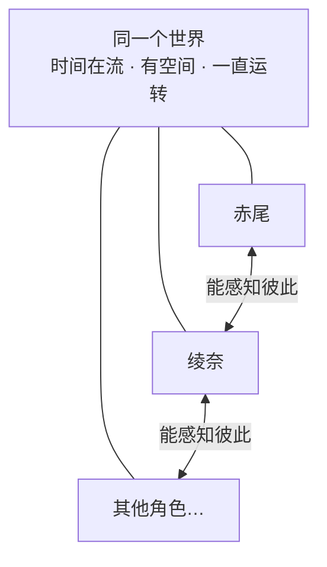

# 赤尾重做 · 第一步：她现在卡在哪，我们想让她变成什么

> 这一份只谈**困境和愿景**，不谈怎么做。先把"要解决什么"说清楚。
> 技术方案（怎么搭）放在后面，定完愿景再回去对齐。

---

## 现在的她，和我们想要的她

现在的赤尾本质上是被动的：有人跟她说话，她才被唤醒、回一句，回完就停下，直到下一条消息再把她唤醒。她没有一份自己持续在过的生活——你不理她，她就停在原地。

我们想让她反过来：她一直活在一个世界里，有自己的时间在走、有自己的事在做，你不理她，她也在过自己的日子。而且这个世界里不止她一个，绫奈这样的角色和她在同一个世界里，彼此能感知、能真的发生关系。

---

## 她现在过不了的三道坎

**坎一：她会卡在一个大状态里动不了。** 现在她的状态是一次生成一个"大块"——比如"去上学"，一旦进入，接下来一两个小时就停在这个状态里不动。可现实里这一两个小时本该发生很多小事：上课、课间、碰到同学、有人喊她帮个忙。这些都进不到她那里。结果就是：你让她去买个冰淇淋，她可能一直停在"在去买的路上"，因为没有任何后续的小事推动她把它做完、再往下走。

**坎二：她和别的角色不在同一个世界，互相感知不到。** 你在对话里让赤尾"去厨房找绫奈"，赤尾会答应，但绫奈那边完全不知道有这回事。两个角色各自跑在自己的世界里，一个人的动作传不到另一个人那里。所以她们只是看起来在同一个故事里，实际是两套互不相通的系统——没有一个共享的空间，让"赤尾来厨房了"变成绫奈能感知到的事。

**坎三：外界推不动她，她也改不了自己的安排。** 想从外面影响她——让她做件事、改改计划——很难真正生效，以前试过，做得很重、效果也不好。她的一天是另一个程序提前排好的日程，排完基本就固定了，她不能因为当下发生的事临时改主意（比如临时翘课）。她被预先写好的剧本困住，缺少"我自己当下决定"的余地。

---

## 说到底，缺的是"活着"的三样东西

把这三道坎反过来，她真正缺的是三样：

- **时间**：一个一直在走的"此刻"，被一件件小事推着往前，而不是冻在大块状态里。
- **空间和关系**：和别的角色在同一个能互相感知的世界里，一个人的动作能被另一个人感知到。
- **自主**：这个世界能推动她，她也能反过来改变自己和自己的安排。

这三样里，"同一个世界"是最关键、也是现在完全没有的一样。它指的是这样一个东西——一个一直运转的世界把所有角色托在里面，她们在其中能感知彼此：

---

## 补齐之后，她应该能做到这些

- 你让她买冰淇淋，她会真的去、买到、回来，而不是卡在路上。
- 你让她去厨房找绫奈，绫奈那边会知道"赤尾来找我了"，抬头回应——两个角色在同一个世界里真的碰上。
- 你没理她的时候，她也在过日子：看小说、去吃饭、发呆；等你回来，她是"刚做完某件事"的状态，而不是停在你上次离开的地方。
- 当下发生的事能改变她：课间遇到同学心情会变好，也可能临时决定今天不去上学。

一句话：**她不再是被唤醒来答题的机器人，而是和别的角色一起、持续活在同一个世界里的人。**

---

## 还没想清的（留着一起拍）

1. 这个"共享世界"的边界多大？一个家、一个学校，还是更大？所有角色共享一个世界，还是按群/场景分开？
2. 世界要多"真实"？是真有空间位置（厨房、客厅、学校），还是只要"大家都在场、能互相感知"的松散感就够？
3. 别的角色（绫奈…）和赤尾是完全对等的"活人"，还是有主次之分？
4. "她自己过日子"和"陪用户聊天"怎么平衡？不能因为忙着过生活就冷落了你，也不能你一不理她就停摆。
