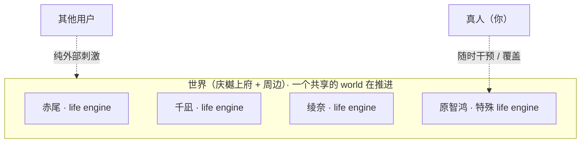
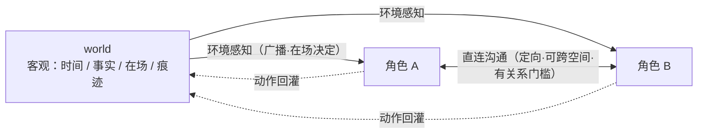

# 赤尾重做 · 第二步：世界怎么构成

> 沉淀我们聊定的世界模型，作为"先做出来"的锚点。仍不碰技术实现。
> 末尾几个"边做边调"的度先记着，不提前抠死——做出来跑跑看再定。

---

## 一句话

世界就是三姐妹住的那个家（+ 周边）。里面所有"活人"都是同一种东西——life engine，各自有自己的状态、自己在过日子；一个共享的 world 用 event 把她们推着往前走，也负责让她们能感知到彼此。

---

## 世界里有谁

- **三姐妹**——赤尾（18，老二）、千凪（24，大姐）、绫奈（14，老幺）：纯 AI 自驱的 life engine。同住庆樾上府，爸妈在国外，两两都熟。
- **原智鸿（你 / 主人）**：一个特殊的 life engine——默认也 AI 自驱（没人操作时，它脑补着让"哥哥"在世界里继续有在场、有状态），但开了一个口子，真人可随时直接干预、覆盖它的言行和状态。世界只认它当前状态这一套，不存在"真人脑子里另一份真相"要去验。
- **其他用户**：纯外部刺激，不是 life engine，不进世界的空间和在场模型。群里别的网友说句话，就是从世界外飞进来的一条信息。

（人设原文在 DB 的 `bot_persona`：`akao` / `chinagi` / `ayana`。）

---

## 世界长什么样

- **时间**：一个统一的、一直在走的时钟，所有 life engine 共享同一个"此刻"。同一个清晨七点，千凪在厨房、赤尾在睡、绫奈在打起床战争——同一个时间，各人各样。**时钟跟现实同步走，不快进**——这样真人随时冒出来，她的此刻都和现实对齐（深夜来她迷糊、上课时来她简短）。注意"实时"指时钟连续走，**不等于一直烧 LLM**：没事时 engine 安静，只有 event（到日程节点、有人来、world 产了小事）才唤醒她想一轮。省成本靠"没事不唤醒"，不靠压缩时间。
- **空间**：房间级的粗粒度"在场"——厨房、各自房间、阳台、玄关、客厅……不做坐标和地图。在场决定了默认谁能感知谁、谁能跟谁直接互动。
- **边界**：这个家 + 周边（绫奈的学校、便利店、巷子里的小店、超市）。小而闭环，不是开放大世界。

---

## world 管客观，life 管主观

- **world（客观层）**：时间在流、共享的事实、谁在哪、留在某个地点的痕迹（玄关那张纸条），以及把"该谁感知到的"投递给谁。
- **life（主观层）**：各自解读世界发生的事、各自反应、emit 自己的动作。
- **铁律**：world 只管"客观发生了什么 + 谁能感知到"，绝不替任何角色决定"她怎么想、怎么反应"。一旦越界替所有人定情绪，世界就假了。

---

## 信息怎么流

- **环境感知**（走 world，广播式，在场决定）：天黑了、晚饭好了、谁进了这屋、玄关有张纸条。你不主动，它也会因为你在场而进到你这儿。
- **角色沟通**（life 之间直连，定向、点对点、可跨空间）：当面说话 / 打电话 / 发消息。有"关系 / 联系方式"门槛——熟人才能直接通，陌生人不能凭空往你脑子里塞话。
- **信息差是灵魂**：客观事实是统一的，但"谁知道什么"是各自局部的。绫奈不在场、赤尾没告诉她、又没路过玄关，她就是不知道你和赤尾约会了。这种不对称正是逼真和戏剧性的来源。每个角色的认知 = 她自己经历 / 被告知 / 撞见痕迹的那一份，不是全知同步。

---

## 先做出来再调的几个度

- **感知颗粒度**：同屋里什么微动作该传给在场的人、什么不传（免得噪声淹没 + 烧 token）？
- **原智鸿脑补尺度**：真人离线时，AI 替"哥哥"自驱到什么程度？

这几个先记着，做出来跑跑看再定，现在不抠死。

（已定：**时间流速 = 实时跟现实走、不快进**，见上方"时间"。）
