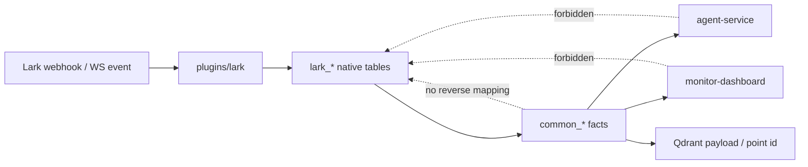
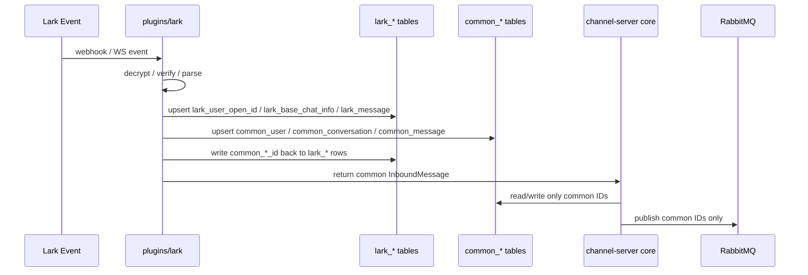
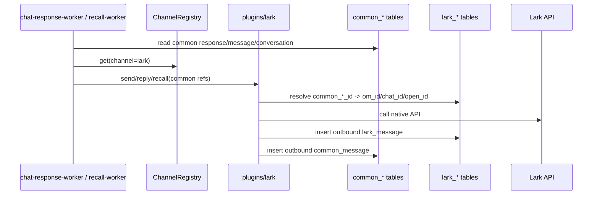

# common/channel 分层身份设计

## 背景

上一版 `identity_*_v2` 方案把 `(channel, channel_id) -> internal_id` 做成公共映射表。
这会让 agent-service、dashboard 等下游很容易通过公共映射表反查到 `lark_*` 表，实际等于把
平台细节泄漏到 common 层。

新的目标不是“公共 identity 表负责所有平台映射”，而是：

```text
平台原生层(lark_*) -> 平台无关事实层(common_*) -> agent-service / dashboard / Qdrant
```

平台插件拥有平台 ID 与 common ID 的映射；common 层只表达平台无关事实，不知道飞书裸 ID。

## 核心原则

1. `lark_*` 是飞书插件私有的数据层，允许出现 `open_id`、`union_id`、`chat_id`、`om_id` 等飞书字段。
2. `common_*` 是平台无关事实层，只出现 common UUID、`channel` 判别符、抽象后的字段。
3. `common_*` 不维护 “common -> lark” 的公共映射表；映射关系存放在 `lark_*` 层。
4. agent-service、monitor-dashboard、Qdrant 只消费 `common_*`，不 join `lark_*`，不 join `identity_*`。
5. 出站需要从 common ID 反查飞书裸 ID 时，只能由 `plugins/lark` 在 lark 层完成。
6. 迁移完成后不保留双读 fallback；旧表只作为迁移输入和回滚快照，不作为运行时兼容层。

## 分层模型



## 表设计

### 用户

#### `common_user`

平台无关用户事实。下游只认这张表。

| 字段 | 类型 | 说明 |
|---|---|---|
| `common_user_id` | uuid PK | common 用户 ID，UUIDv7 |
| `channel` | varchar(64) | `lark` / `qq` / ...，只是平台判别符 |
| `display_name` | varchar(256) nullable | 当前展示名，平台无关 |
| `avatar_url` | text nullable | 当前头像，平台无关 |
| `created_at` | timestamp | 创建时间 |
| `updated_at` | timestamp | 更新时间 |

#### lark 用户层

现有 `lark_user` / `lark_user_open_id` 保留为飞书层。映射 common 的职责在 lark 层：

| 表 | 字段调整 | 说明 |
|---|---|---|
| `lark_user_open_id` | add `common_user_id uuid` | inbound 事件拿到的是 app-scoped `open_id`，这里是最稳定的入口映射点 |
| `lark_user` | 保留 `union_id` profile | union profile 仍是飞书层资料，不暴露给 common 消费者 |

`lark_user_open_id.common_user_id` 外键指向 `common_user.common_user_id`，并加 unique 约束：

```text
unique(app_id, open_id)
index(common_user_id)
```

如果后续决定同一个 `union_id` 下多个 `open_id` 合并成同一个 common 用户，这个合并逻辑也属于
`plugins/lark` / lark 数据层，不进入 common 表契约。

### 会话

#### `common_conversation`

平台无关会话事实。agent-service 和 dashboard 查群名、私聊名、权限策略时读这里。

| 字段 | 类型 | 说明 |
|---|---|---|
| `common_conversation_id` | uuid PK | common 会话 ID，UUIDv7 |
| `channel` | varchar(64) | `lark` / `qq` / ... |
| `scope` | varchar(16) | `direct` / `group` / 未来其他 scope |
| `display_name` | varchar(256) nullable | 群名或私聊展示名 |
| `avatar_url` | text nullable | 会话头像 |
| `member_count` | integer nullable | 成员数；没有该概念的平台可空 |
| `is_active` | boolean | 会话是否仍可用 |
| `attachment_policy` | jsonb nullable | 平台无关附件/下载策略 |
| `created_at` | timestamp | 创建时间 |
| `updated_at` | timestamp | 更新时间 |

`attachment_policy` 不直接暴露飞书字段名，例如不让 agent-service 读
`download_has_permission_setting`。由 lark 插件把飞书配置翻译成平台无关策略：

```json
{
  "download_allowed": true,
  "source": "lark"
}
```

#### lark 会话层

现有 `lark_base_chat_info` / `lark_group_chat_info` 保留为飞书层。映射 common 的职责在
`lark_base_chat_info`：

| 表 | 字段调整 | 说明 |
|---|---|---|
| `lark_base_chat_info` | add `common_conversation_id uuid` | 所有飞书 chat 的 common 映射点 |
| `lark_group_chat_info` | 保持 group 专属字段 | 群名、群权限、成员数等原生字段继续只在 lark 层 |

约束：

```text
lark_base_chat_info.chat_id primary key
lark_base_chat_info.common_conversation_id unique references common_conversation
lark_group_chat_info.chat_id references lark_base_chat_info(chat_id)
```

### 消息

#### `common_message`

平台无关消息事实。替代下游对 `conversation_messages` 的直接依赖。

| 字段 | 类型 | 说明 |
|---|---|---|
| `common_message_id` | uuid PK | common 消息 ID，UUIDv7 |
| `channel` | varchar(64) | `lark` / `qq` / ... |
| `common_conversation_id` | uuid FK | 所属 common 会话 |
| `common_user_id` | uuid FK nullable | 发送者；系统消息可空 |
| `sender_display_name` | varchar(256) nullable | 消息发生时的发送者名快照 |
| `role` | varchar(20) | `user` / `assistant` / `system` |
| `content` | jsonb | 平台无关 `Content[]` |
| `content_text` | text nullable | 给搜索、dashboard、prompt 渲染的文本投影 |
| `common_root_message_id` | uuid nullable | 根消息 common ID |
| `common_reply_message_id` | uuid nullable | 被回复消息 common ID |
| `scope` | varchar(16) | 冗余会话 scope，便于查询 |
| `message_type` | varchar(30) nullable | 平台无关粗分类：`text` / `image` / `post` / ... |
| `bot_name` | varchar(50) nullable | bot 标识 |
| `response_id` | varchar(100) nullable | 关联响应 session |
| `event_time` | bigint | 平台事件毫秒时间 |
| `created_at` | timestamp | DB 写入时间 |

注意：

- `sender_display_name` 是历史快照，不是查 `common_user.display_name` 的动态结果。
- `common_message` 不保存 `om_id`、`chat_id`、`open_id`。
- 回复链只用 common message ID。

#### `lark_message`

新增飞书消息层表。它维护飞书消息与 common 消息的映射。

| 字段 | 类型 | 说明 |
|---|---|---|
| `om_id` | varchar(256) PK | 飞书原生 message id |
| `common_message_id` | uuid unique FK | 对应 common 消息 |
| `chat_id` | varchar(256) | 飞书原生 chat id |
| `sender_open_id` | varchar(256) nullable | 飞书 open_id |
| `sender_union_id` | varchar(256) nullable | 飞书 union_id |
| `root_om_id` | varchar(256) nullable | 飞书 root message id |
| `reply_om_id` | varchar(256) nullable | 飞书 reply message id |
| `message_type` | varchar(64) | 飞书原生 message type |
| `raw_event` | jsonb nullable | 可选原始事件快照，供排障 |
| `created_at` | timestamp | 创建时间 |

反查 common -> lark 的能力只允许 `plugins/lark` 使用这张表。common 消费者不读它。

### 响应状态

`agent_responses` 当前已经承担 AI 回复 session ledger、安全检查状态机、已发送回复列表等职责。
它不是飞书 profile 表，语义上属于 common 层；但现表名和字段里仍混有旧身份口径，`replies`
里也保存飞书裸 message id。因此目标形态明确为新增 `common_agent_response`，旧
`agent_responses` 只作为迁移输入。

`common_agent_response` 的职责：

- 记录一次 chat request / AI response session。
- 记录触发消息、会话、bot、persona。
- 记录响应完成/失败状态，供 chat request redelivery 幂等判断。
- 记录 post-safety 状态，供安全检查和 recall-worker 协作。
- 记录已发出的回复 common message id，供撤回、审计、历史关联使用。

| 字段 | 类型 | 说明 |
|---|---|---|
| `response_id` | uuid PK | 响应行 ID |
| `session_id` | varchar(100) unique | session |
| `trigger_common_message_id` | uuid FK | 触发消息 |
| `common_conversation_id` | uuid FK | 会话 |
| `bot_name` | varchar(50) nullable | bot |
| `persona_id` | varchar(50) nullable | persona |
| `response_type` | varchar(30) | `reply` / 未来其他 response 类型 |
| `replies` | jsonb | 回复 common message ID 列表，不存 `om_id` |
| `response_text` | text nullable | 回复文本 |
| `agent_metadata` | jsonb | agent 元信息 |
| `safety_status` | varchar(20) | 安全状态 |
| `safety_result` | jsonb nullable | 安全结果 |
| `status` | varchar(20) | 响应状态 |
| `created_at` | timestamptz | 创建时间 |
| `updated_at` | timestamptz | 更新时间 |

`replies` 中如果需要记录平台发送结果，只记录 common message id：

```json
[
  {
    "common_message_id": "0197...",
    "content_type": "post",
    "sent_at": "2026-06-01T..."
  }
]
```

飞书 `om_id` 在 `lark_message` 中通过 `common_message_id` 反查。

状态语义：

| 字段 | 典型值 | 说明 |
|---|---|---|
| `status` | `pending` / `completed` / `failed` / `recalled` | AI 回复 session 状态 |
| `safety_status` | `pending` / `passed` / `recalled` / `recall_failed` | post-safety 状态 |

`status` 和 `safety_status` 分开保留：前者回答“AI 回复链路是否完成”，后者回答“发出后安全检查
是否通过/是否已撤回”。这两个状态机不能合并。

## 入站写入流程



顺序要求：

1. 先落 lark 层，因为它是平台原生事实和映射拥有者。
2. 再从 lark 层投影/转换到 common 层。
3. channel-server core 和下游拿到的入站消息只包含 common ID。

## 出站流程



出站反查不是公共服务，不是 `common -> lark` 表；它是 lark 插件内部对 `lark_*` 的读取。

## 下游消费契约

agent-service 只消费：

- `common_message`
- `common_conversation`
- `common_user`
- `common_agent_response`
- Qdrant 中以 common ID 写入的 payload

monitor-dashboard 只消费：

- `common_message`
- `common_conversation`
- `common_user`
- `common_agent_response`

禁止：

- agent-service join `lark_group_chat_info`
- agent-service join `identity_conversation_v2`
- dashboard join `lark_group_chat_info`
- dashboard join `identity_*`
- Qdrant payload 保存 `om_id` / `oc_id` / `open_id`

## 与现状表的关系

| 现状表 | 目标命运 |
|---|---|
| `conversation_messages` | 迁移输入；由 `common_message` 替代 |
| `agent_responses` | 迁移输入；由 `common_agent_response` 替代 |
| `identity_user` / `identity_chat` / `identity_message` | 迁移输入，用于旧 ULID 反查飞书裸 ID；迁移后删除 |
| `identity_user_v2` / `identity_conversation_v2` / `identity_message_v2` | 当前过渡写入；迁移输入；目标架构不保留为公共映射表 |
| `lark_user` | 保留为 lark profile 表 |
| `lark_user_open_id` | 保留并增加 `common_user_id` |
| `lark_base_chat_info` | 保留并增加 `common_conversation_id` |
| `lark_group_chat_info` | 保留为 lark group profile 表 |
| `lark_group_member` | 保留为 lark 成员表；如 common 层需要成员能力，另建 common 成员投影 |
| `bot_chat_presence` | 可迁到 common 层或保留为 lark 层状态，需按使用方再定 |
| `user_blacklist` / `user_group_binding` | 当前是 lark union/chat 口径，需决定是否抽成 common 能力 |

## 迁移策略

### Phase 0：冻结设计边界

产出：

- common 表 DDL 草案
- lark 表增量 DDL 草案
- downstream 禁止依赖清单

验收：

- 代码搜索确认 agent-service / dashboard 当前所有 `lark_*` 读取点。
- 每个读取点都有对应 common 字段或明确不迁。

### Phase 1：建 common 表和 lark 映射字段

新增：

- `common_user`
- `common_conversation`
- `common_message`
- `common_agent_response`
- `lark_message`

增量修改：

- `lark_user_open_id.common_user_id`
- `lark_base_chat_info.common_conversation_id`

本阶段只建结构，不切流量。

### Phase 2：历史回填

输入来源：

- `conversation_messages`
- `agent_responses`
- 旧 `identity_*`
- 新 `identity_*_v2`
- `lark_*` profile 表

关键规则：

1. 对 `conversation_messages` 中旧 ULID 行，先通过旧 `identity_*` 反查回飞书裸 ID。
2. 对已经是 UUID 的行，通过 `identity_*_v2` 仅作为迁移输入定位对应 lark row。
3. 对裸 ID 行，直接用 lark 原生 ID 建 `lark_message` / lark user / lark conversation 映射。
4. 为每条历史消息创建 `common_message`。
5. 将飞书原生 `om_id -> common_message_id` 写入 `lark_message`。
6. 将飞书 `chat_id -> common_conversation_id` 写入 `lark_base_chat_info`。
7. 将飞书 `(app_id, open_id) -> common_user_id` 写入 `lark_user_open_id`。
8. 将 `agent_responses` 回填到 `common_agent_response`：
   - `trigger_message_id` 经消息映射转为 `trigger_common_message_id`
   - `chat_id` 经会话映射转为 `common_conversation_id`
   - `replies[].message_id` 经 `lark_message` / 消息映射转为 `replies[].common_message_id`
   - 保留 `session_id`、`bot_name`、`persona_id`、`status`、`safety_status`、`safety_result`

历史消息 common id 分配：

- 已经由新链路写出的 UUID 行，可以复用 `identity_*_v2` 中的 UUID 作为 common ID。
- 旧 ULID / 裸 ID 历史行生成新的 UUIDv7。
- 生成过程必须幂等：同一飞书裸 ID 多次回填得到同一个 common ID。

### Phase 3：读侧切 common

改 agent-service：

- message 查询改读 `common_message`
- group/profile 查询改读 `common_conversation`
- username 读 `common_message.sender_display_name` 或 `common_user.display_name`
- chat request 幂等、post-safety 状态读写改读 `common_agent_response`
- quick-search / context 中 persona 关联改经 `common_message.response_id -> common_agent_response.session_id`
- vectorize payload 改用 common IDs

改 dashboard：

- 消息列表读 `common_message`
- 群名/私聊名读 `common_conversation.display_name`
- 活跃度读 `common_message.common_conversation_id`
- response/session、安全状态类视图读 `common_agent_response`

验收：

- agent-service 代码中不再出现对 `lark_*` / `identity_*` 的查询。
- dashboard 代码中不再出现对 `lark_*` / `identity_*` 的查询。
- agent-service 不再直接查询旧 `agent_responses`。

### Phase 4：写侧切 common

改 channel-server：

- lark 插件入站先 upsert lark 层，再 upsert common 层。
- core / rules / MQ payload 只传 common IDs。
- persona 主链路抢锁成功后创建 `common_agent_response` pending 行，再 publish chat request。
- chat-response-worker / recall-worker 调用 plugin capabilities 时传 common refs。
- lark plugin 内部用 `lark_*` 表完成 common -> lark 反查。
- chat-response-worker 发送成功后：
  - 插入 outbound `lark_message`
  - 插入 outbound `common_message`
  - 追加 `common_agent_response.replies[].common_message_id`
  - 更新 `common_agent_response.status`
- recall-worker 从 `common_agent_response.replies` 读取 common message id，交给 lark plugin 反查并撤回。

验收：

- 新入站消息同时有 lark 原生行和 common 行。
- MQ payload 不含 `om_` / `oc_` / `ou_` / `union_id`。
- agent-service 可完整处理新消息。
- `common_agent_response.replies` 不含飞书裸 ID。

### Phase 5：Qdrant 重建

Qdrant point id 和 payload 全部改 common ID。

建议：

- `point_id = common_message_id`，不再 `uuid5(message_id)`。
- payload 中只保存 `common_message_id`、`common_conversation_id`、`common_user_id`、`channel`。
- 不保存飞书裸 ID。

### Phase 6：drain + prod cutover

因为 `conversation_messages` 当前仍实时写，prod 执行必须 drain：

1. 停入站写入或让入口排队。
2. 等 MQ 关键队列 drain。
3. pg_dump + Qdrant snapshot。
4. 在 coe 完整演练 Phase 2-5。
5. prod 执行回填和切换。
6. 验证 common 写入和下游读取。
7. 删除运行时对 legacy 表的依赖。

## 明确不做

- 不让 agent-service 通过 `identity_conversation_v2` 反查 `lark_group_chat_info`。
- 不把 `identity_*_v2` 作为目标架构的公共映射表保留。
- 不在 common 表保存飞书裸 ID。
- 不在 `common_agent_response.replies` 保存飞书裸 ID。
- 不在 Qdrant payload 保存飞书裸 ID。
- 不做“如果 common 查不到就 fallback lark”的运行时兼容。
- 不把 Lark 的 `download_has_permission_setting` 字段名暴露给 agent-service。

## 待确认问题

1. `common_user` 的 Lark 归并粒度：按 `(app_id, open_id)` 一人一 common，还是同 `union_id` 归并为同一 common 用户。
2. `bot_chat_presence` 是 common 能力还是 lark 插件私有状态。
3. `user_blacklist` / `user_group_binding` 是否需要平台无关化，还是保持 Lark 插件私有。
4. `common_message.content` 是否第一阶段就切 `Content[]` JSONB，还是先保留 text 投影并把 JSONB 作为新增列。
