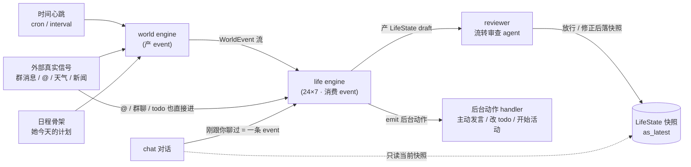
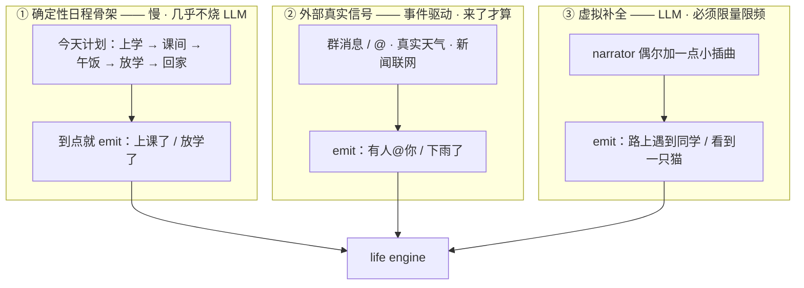
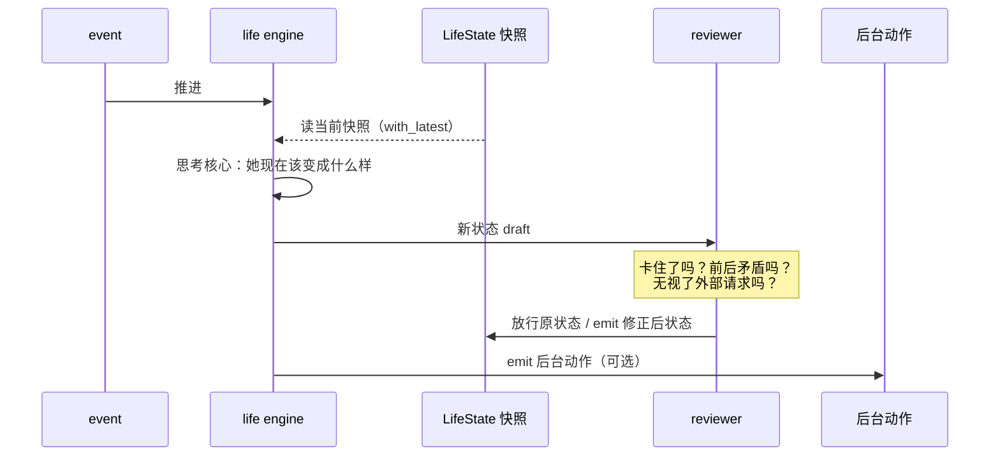

# 赤尾重做：world / life engine 脑暴

> 状态：**脑暴，不是 spec**。目的是把这套世界观想透、用图锁住，再谈落地。
> 来源：2026-05-27 0:00 群里那段 vision + `agent-infra-design.md`。
> 一句话主张：**把"她活着"的驱动力，从 life engine 自己定时拍状态，搬到 world engine 不停产 event。life engine 退化成只做三件事——消费 event、维护快照、emit 动作。**

---

## 0. 核心翻转：从"定时拍状态"到"被 event 推着走"

旧世界 —— life engine 自己每隔几小时拍一个大状态，拍完就干等，期间不工作：

```
日程agent ── 拍 ──▶ [ 在上学 (2h) ] ───── 干 等 ───── ▶ [ 回家 (1h) ] ── 干等 ─▶
                         │
                         │  这 2 小时里：
                         │  · engine 不动
                         │  · 有人让她买冰淇淋 → 没人推她 → 永远"在买冰淇淋的路上"
                         ▼
                      卡 死
```

新世界 —— life engine 24×7 活着，world engine 不停喂 event，每个 event 顶她一下：

```
                 event   event   event   event   event
                   │       │       │       │       │
   world engine ───┴───────┴───────┴───────┴───────┴────▶  (时间在流)
                   ▼       ▼       ▼       ▼       ▼
   life engine  [上课]→[课间]→[遇同学]→[去买冰淇淋]→[买到了]→[回教室] ...
                   │
                   └─ 状态一直在动，没有"卡住"这回事，因为下一个 event 总会来顶
```

**差别只有一句**：旧的是 life engine 自己产状态；新的是状态被外部 event 推着流转，life engine 不自己拍板"接下来几小时干嘛"。

---

## 1. 整体架构：谁产 event、谁消费、谁只读



读法：

- **world engine** 是唯一"主动产 event"的东西。它有心跳，能联网，把"世界正在发生什么"变成一串 event。
- **life engine** 只被动消费 event：读自己当前快照 → 想一轮 → 写新快照 + emit 动作。它**不替自己规划未来几小时**。
- **chat 只读快照**，不驱动 life engine；聊完把"刚聊过"当一条 event 回灌。
- **reviewer** 站在 life engine 出口，挡一下不合理的流转（下面第 4 节）。

> 框架层面这些都是现成原语（`Source.cron` / `wire` / `as_latest` / `with_latest` / `fan_out_per` / `emit`），不新造东西。这份脑暴只管"上层怎么摆"，不碰框架。

---

## 2. 最硬的问题：world engine 怎么产 event 才不爆炸、不烧钱

如果 world engine 是"每分钟用 LLM 模拟她一整天"，成本和发散都失控。所以 event 必须分三个来源，**烧钱的那个严格限量**：



**成本红线（这是 ③ 的命门，要拍死）：**

```
①  确定性，不调 LLM           → 随便产，成本≈0
②  事件驱动，外部来才触发      → 自然限流，成本跟着真实世界走
③  LLM 生成 ← 危险区          → 默认低频 + 单次条数上限 + 可一键关
```

③ 不能每分钟跑一次"模拟她这一分钟"。倾向：**只在背景层切换时（上学→放学）补一小批小插曲**，或者干脆默认关、需要"她生活更鲜活"时才开。这个频率/条数/开关策略是脑暴要定的事（见第 6 节）。

---

## 3. 状态分层：为什么这样就"卡不住"

快层会被下一个 event 自然顶掉，所以不可能像旧设计那样卡在大状态里：

```
背景层 (慢, 小时级)   ┃■■■■■■■■  今天在上学  ■■■■■■■■┃■■  放学回家  ■■┃
                       ┃                                  ┃             ┃
此刻层 (快, 分钟级)    上课 ─▶ 课间 ─▶ 遇到同学 ─▶ 去买冰淇淋 ─▶ 买到了 ─▶ 回教室
                        ▲       ▲        ▲            ▲            ▲
event 来源:           铃响    铃响     ③补全      ②群里有人让买    ②到店
```

- **背景层**：稳定的底色（"她在上学"），由 ① 日程骨架维持，几小时才换一次。
- **此刻层**：被 event 一下下顶着走，几分钟就变。"买冰淇淋"只是此刻层的一小段，**买到了就过去了**，下一个 event 把它顶掉——这正是旧设计做不到、她"一直在买冰淇淋路上"的根因。
- 两层都塞进同一个 `LifeState` 结构化快照里，不需要新原语。

---

## 4. 一个 event 怎么被处理（含 reviewer）



**reviewer 不准写成状态机。** 它是个 agent，判断标准是宽泛的人话——"她是不是卡住了 / 前后矛盾 / 把别人晾着了"——交给模型判，不写 `if 状态A不能接状态B` 这种规则。它的价值是"自反馈 LLM 系统得有人打断死循环"。

---

## 5. 她能 emit 哪些后台动作

life engine 想完一轮，除了更新快照，还能 emit 动作（每个动作 = 一种 Data，wire 到对应 handler）：

```
主动发消息  ·  更新/勾掉 todo  ·  开始或切换一个活动  ·  改自己的日程  ·  记一笔记忆
```

注意：**"要不要主动找你"不再是定时 tick + 0.15 骰子**，而是她在 event 流里想一轮后的自然产物。那个随机概率不进新世界。

---

## 6. 真正还没想清的（脑暴重点，带我的倾向，等你拍）

```
① world / life 是两个独立 agent 还是一个？event 走 MQ 还是进程内？
   倾向：两个独立 agent，event 走现成 durable wire + fan_out_per（按 persona 扇出）。
   职责分明、复用框架。但两个 LLM agent 常驻，成本要算。

② 虚拟补全 ③ 怎么不烧钱不发散？← 最没底的一个
   倾向：默认低频（背景层切换时补一小批）+ 单次条数硬上限 + 可一键关。
   不做"每分钟模拟一整天"。具体频率/条数要你定。

③ 快层被顶掉时，"没做完的事"（冰淇淋还没买到）怎么不丢？
   倾向：LifeState 里带一个"进行中的意图"，新 event 来时由思考核心决定
   继续还是被打断，而不是无脑覆盖。这是状态结构的设计细节。

④ 日程谁产、她能不能改？
   vision 说"以前单独 agent 生成但改不了"。
   倾向：日程是 ① 的确定性骨架来源，但 life engine 在流转中能反过来 emit"改日程"
   （她临时决定翘课）。日程从"死产物"变成"可被她自己改写的 event 源"。

⑤ reviewer 每个 event 都跑吗？（成本）
   倾向：不是每个都跑，只在状态大跳变 / 长时间没动时跑。
   但"什么算可疑"谁判断——若写成规则又回工程脑了。这个触发时机要脑暴。

⑥ chat 读到的快照过期了怎么办？
   vision 明确："对话只读当前快照，不驱动 life engine。"
   倾向：就读快照 + 把"刚聊过"异步回灌当 event，不为聊天同步催一次 life tick。
   接受快照有几分钟延迟——真人也不是每秒刷新自己在干嘛。
```

---

## 7. 用 vision 里的例子验一遍

"别人让她买个冰淇淋，她可能一直在买冰淇淋的路上" —— 新设计怎么破：

```
② 群里："赤尾帮我带个冰淇淋"        → event 进 life engine
   life engine：此刻层 → "去小卖部买冰淇淋"（带"进行中意图"）
② 到店 / 时间推进                    → event：此刻层 → "买到了"
③ 或 ① 下一个 event（铃响/同学搭话） → 顶掉"买冰淇淋"，此刻层往前走
   ↑ 关键：买到了就过去，绝不会卡住，因为 event 永远在来
```

旧设计这里会卡，是因为没有"② 到店""① 铃响"这些后续 event 来推她——engine 自己不产、外界又进不来。新设计把"推进"这件事彻底外包给 world engine 的 event 流，问题就不存在了。
