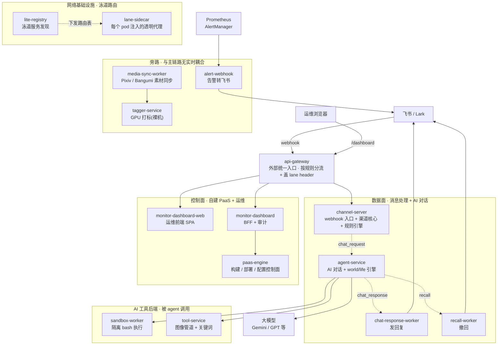
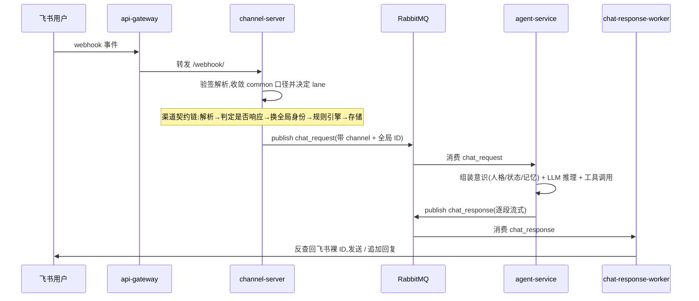
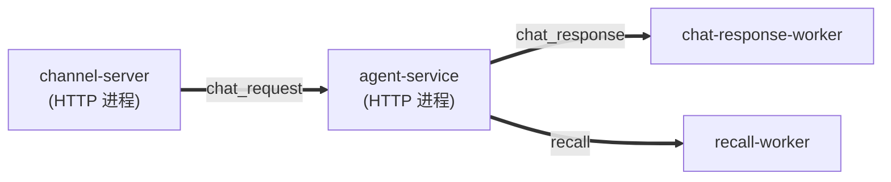
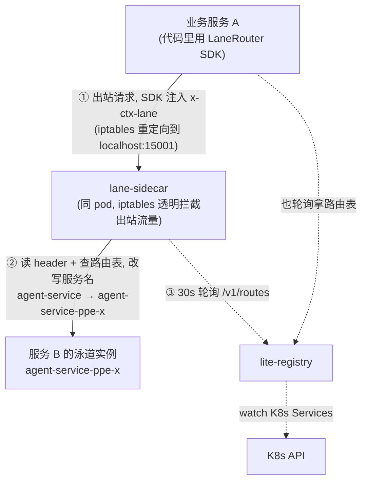
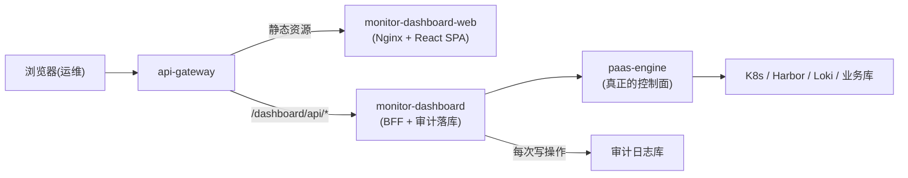

# 赤尾平台 · 服务拓扑现状

> 最后更新:2026-06-12。
> 范围:`apps/` 下 13 个应用目录 → 13 个 K8s Deployment(口径:channel-server 一镜像产出 3 个,agent-service 单 Deployment,其余 9 个目录各 1 个)+ 1 个注入式 sidecar(lane-sidecar)+ 1 个裸机 GPU 服务(tagger-service,不进 K8s)+ `packages/` 4 个共享包。
> 这是**现状**梳理,不含目标架构和改造方案。术语在文中随用随解释。

---

## 一、这个平台到底是什么

一句话:这是一个跑在 K8s `prod` namespace 的 monorepo,核心业务是让虚拟人「赤尾(三姐妹)」在飞书里像真人一样聊天和自主活动。围绕这个核心,平台自己还长出了一整套**部署系统**(自建 PaaS)、**运维后台**、和**泳道路由**(让一份代码能并行跑多套隔离环境用于测试)。

这些服务并不在同一个层面,它们分属五个不同的「面」:

- **数据面**:真正处理消息、跑 AI 对话的链路。
- **AI 工具后端**:agent 推理时会调用的外部能力(执行代码、处理图片)。
- **控制面**:管构建、部署、配置的自建 PaaS + 运维后台。
- **网络基础设施**:让请求能按「泳道」路由到不同环境的三件套。
- **旁路**:告警转发、媒体素材同步与 GPU 打标,跟主链路没有实时耦合。

把它们按面分清楚,是看懂这个拓扑的第一步——很多「这个服务为什么存在」的困惑,都是因为把不同面的东西混在一张图里看。

---

## 二、服务全景

外部流量(飞书 webhook、运维浏览器、开发机)统一从 **api-gateway** 进集群,它按规则把请求分流到对应服务,并盖上泳道 header。

虚线箭头是 RabbitMQ 消息队列(异步),实线是直接 HTTP 调用。注意 agent-service 不直接发飞书消息——它把回复丢进队列,由 channel-server 的 chat-response-worker 代发,因为只有 channel-server 持有飞书的 bot 凭证。lane-sidecar / lite-registry 不在某条线性调用链上,它们横切所有服务间调用(见第五节)。tagger-service 是图里唯一不跑在 K8s 上的服务:裸机 GPU 主机 + systemd 托管,media-sync-worker 通过 HTTP 提交打标任务、用回调收结果。

---

## 三、核心数据流:一条消息的旅程

这是整个平台最重要的一条链路。一个用户在飞书 @ 了赤尾,到她回话,中间发生了什么:

三个服务各自的角色,用人话说:

- **channel-server** 是「webhook 入口 + 渠道核心 + 规则引擎」。飞书 webhook 经 api-gateway 直达它；入站走一条钉死顺序的契约链——插件验签解析 → 收敛成 common 口径 → 平台无关的规则引擎分发 → 存消息 → 发 `chat_request`。
- **agent-service** 是「大脑」。它消费 `chat_request`,把赤尾的人格、当前状态、相关记忆「组装」成上下文喂给大模型,用自研的 agent 工具循环驱动推理(不依赖 langchain 之类的框架),推理过程中可以调工具(搜索、画图、找图、执行代码、技能脚本),最后把回复分段流式地丢回 `chat_response` 队列。

除了「回复」这条主线,赤尾还有自己的后台生活(细节见 `docs/chiwei-system-design.md`,这里不展开):**world/life 引擎**(world 按自己定的节奏推演世界,每个角色的 life agent 自主安排并执行生活)和**记忆沉淀**(会话转写沉淀 + 睡前回顾把一天压成记忆页)。这些都跑在 agent-service 主进程里,由 dataflow runtime 驱动。

---

## 四、RabbitMQ 队列地图

跨服务的异步通信全靠 RabbitMQ。生产方几乎都在 channel-server 和 agent-service,消费方分散在两个服务的不同 worker 进程里。

| 队列 | 生产者 | 消费者 | 干什么 |
|---|---|---|---|
| `chat_request` | channel-server | agent-service | 「请赤尾回这条消息」 |
| `chat_response` | agent-service | chat-response-worker | 「这是赤尾的回复,帮我发飞书」 |
| `recall` | agent-service(安全审核后) | recall-worker | 「刚那条要撤回」 |

agent-service 内部还有一批异步事件(比如 `CommonMessageContentSynced`——消息里的图片落 TOS 后回写消息记录)走 dataflow runtime 的 durable 节点,底下的 RabbitMQ 队列由 runtime 框架按 Data 类型声明和管理,不在上表逐一列出。另有 `proactive_eval` 队列在 channel-server 代码里声明了但**没有任何生产者和消费者**,是死队列。

所有队列都带泳道后缀(`xxx_<lane>`),泳道队列有 10s TTL,过期后消息降级回 prod 队列——这保证了未部署泳道的服务能 fallback 到线上。

---

## 五、泳道路由怎么工作

「泳道(lane)」= 一套并行的隔离环境,用一个 header `x-ctx-lane` 标识。同一份代码可以部署成 `agent-service`(prod)、`agent-service-ppe-x`(测试泳道)等多个实例,请求带不同的 lane header 就会被路由到不同实例;某个服务没部署对应泳道时,自动落回 prod。

实现这件事靠三个服务 + 一个 SDK 配合:

- **lite-registry** 是泳道路由的「真值源」。它 watch K8s 里所有 Service,聚合成一张表:每个服务名 → 它在哪些泳道有部署、端口是多少。对外只提供 `GET /v1/routes`。
- **lane-sidecar** 是被注入到**每个业务 pod** 里的透明代理(不是独立 Deployment,是个 sidecar 容器,由 paas-engine 在部署时注入)。它用 iptables 把 pod 所有出站 TCP 劫持到自己,读请求里的 `x-ctx-lane`,把目标服务名改写成带泳道后缀的名字。业务代码完全无感知。
- **LaneRouter SDK**(在 `ts-shared` 和 `py-shared` 各一份)是应用层的配合件:负责在发请求时注入 `x-ctx-lane` header。有了 sidecar 之后,**真正的服务名改写挪到了 sidecar 的网络层**,SDK 不再自己拼泳道后缀,只管注 header。两者是互补,不是重复。
- **api-gateway** 是从集群**外部**进来的反向代理入口(开发机到集群的唯一出口)。它轮询 paas-engine 下发的网关规则,按路径前缀匹配,选中目标后转发,并盖上 `x-ctx-lane` header。它管的是「外→内」的入口路由,sidecar 管的是「内→内」的服务间路由。

---

## 六、控制面与运维链路

这条线和飞书 / AI 完全无关,是平台自己的「基础设施管理」:构建镜像、蓝绿部署、改配置、看状态、查库。

- **paas-engine** 是这条线的核心,自建 PaaS 引擎。它本职是**构建**(用 Kaniko 在 K8s 里跑构建 Job,推 Harbor)和**部署**(创建 K8s Deployment + Service,支持蓝绿)。但它还累积了不少别的职责:网关规则的增删改查、动态配置(运行时下发给业务 SDK 的模型/阈值/开关)、ConfigBundle(部署时的环境变量集)、CI 流水线、日志查询(Loki),以及一个能对**业务库**跑 SQL 和 DDL/DML 审批的 ops 网关。
- **monitor-dashboard** 是无状态的 **BFF(给前端用的后端)+ 审计网关**。它本身不做任何控制决策,只是:校验授权 → 把请求转发给 paas-engine(或 channel-server 做泳道绑定)→ 把每次写操作记进审计日志库。它存在的核心价值是「统一审计入口」和「给前端收口」。
- **monitor-dashboard-web** 是纯静态 React SPA,Nginx 托管,把 `/dashboard/api/*` 反代到 api-gateway。

---

## 七、部署拓扑:一镜像多服务

一个 Docker 镜像可以产出多个独立的 K8s Deployment(不同进程、不同 pod)。这是排查问题时最容易踩坑的地方——查 chat-response-worker 的日志不能用 channel-server 的服务名。全平台共 13 个 K8s Deployment:

| 镜像 | 产出的 Deployment | 角色 |
|---|---|---|
| channel-server | **channel-server** | HTTP,处理消息 |
| channel-server | **recall-worker** | 消费 recall 队列,调飞书撤回 |
| channel-server | **chat-response-worker** | 消费 chat_response 队列,发飞书回复 |
| agent-service | **agent-service** | 单 Deployment:HTTP(健康检查 + admin)+ chat 消费 + dataflow durable 节点 + world/life 引擎 |
| 其余 9 个 | 各自 1 个同名 Deployment | — |

两个不在此表的例外:`lane-sidecar` 不是独立 Deployment,而是注入到上面每个业务 pod 里的容器;`tagger-service` 完全不在 K8s 里,跑在裸机 GPU 主机上由 systemd 托管。

---

## 八、数据存储归属

谁连哪个库,看清楚有助于理解「改了某张表会影响哪些服务」:

| 存储 | 谁在用 |
|---|---|
| PostgreSQL · 业务库(chiwei) | channel-server、agent-service、tool-service、monitor-dashboard,以及 paas-engine 的 ops 网关(读 + DDL/DML 审批) |
| PostgreSQL · paas_engine 库 | paas-engine 自己 |
| MongoDB | channel-server(对话/事件)、media-sync-worker(媒体)、monitor-dashboard |
| Redis | channel-server、agent-service、tool-service、chat-response-worker(图片注册表)、media-sync-worker |
| TOS(对象存储) | tool-service(图像管道上传);channel-server / agent-service 只在消息记录里传递 TOS 文件名,不直连 |
| MinIO(对象存储) | media-sync-worker(素材入库)、tagger-service(打标取图) |
| Harbor(镜像仓库) | paas-engine(Kaniko 构建产物) |
| K8s API | paas-engine、lite-registry、lane-sidecar |

---

## 九、服务职责速查表

| 服务 | 栈 | 面 | 一句话职责 |
|---|---|---|---|
| channel-server | Bun/TS | 数据面 | webhook 入口 + 渠道契约链 + 规则引擎 + 存储,决定是否触发 AI |
| recall-worker | Bun/TS | 数据面 | 消费 recall,调飞书撤回消息 |
| chat-response-worker | Bun/TS | 数据面 | 消费 chat_response,发飞书回复 + 存储 |
| agent-service | Python | 数据面 | AI 对话引擎(自研 agent 工具循环 + dataflow runtime)+ world/life 引擎 + 记忆沉淀 |
| sandbox-worker | Python | AI 工具 | 隔离环境跑 bash / 技能脚本 |
| tool-service | Python | AI 工具 | 图像管道(下载→压缩→TOS)+ jieba 关键词 |
| paas-engine | Go | 控制面 | 构建+部署+网关规则+动态配置+CI+日志+业务库 ops |
| monitor-dashboard | Bun/TS | 控制面 | 运维 BFF + 审计落库,转发 paas-engine |
| monitor-dashboard-web | React | 控制面 | 运维前端 SPA |
| api-gateway | Go | 网络基建 | 外部反向代理入口,按规则分流 + 盖 lane header |
| lite-registry | Go | 网络基建 | watch K8s Service,提供泳道路由真值表 |
| lane-sidecar | Go | 网络基建 | 注入每 pod,透明改写出站服务名做泳道路由 |
| alert-webhook | Go | 旁路 | Prometheus 告警转飞书 |
| media-sync-worker | Bun/TS | 旁路 | 定时从 Pixiv/Bangumi 同步素材到 MongoDB / MinIO,并驱动 tagger-service 打标 |
| tagger-service | Python | 旁路 | Pixiv 图片 GPU 打标管线(裸机 systemd,不进 K8s) |

**共享包(不部署)**:`ts-shared`(TS 中间件/缓存/日志/HTTP/MongoDB/LaneRouter SDK/实体)、`py-shared`(Python 同类基建 + LaneRouter SDK + 动态配置)、`lark-utils`(飞书 SDK 封装)、`pixiv-client`(Pixiv API client)。

---

## 十、现状里值得重新设计的点

以下是梳理时观察到的问题,**按重要性排序**。(2026-06-01 版列在最前的「channel 多渠道抽象泄漏」和「身份迁移双状态」两点,已分别被 channel-server 平台无关重构(PR #244:core 不再 import 平台 SDK,飞书代码全部收进 `plugins/lark/`)和 common identity 层迁移(commit 448e0fe,agent-service 不再解析 app_id/open_id)解决,不再列出。)

### 1. agent-service 主进程承担过多

它同时是 chat 的 MQ 消费者、admin/DLQ 管理 HTTP、一批 dataflow durable 节点,还是 world/life 自主生活引擎的宿主。面向用户的对话延迟,和后台自主行为,挤在同一个 Deployment 里抢资源。

### 2. paas-engine 是个「全能控制面」

build/release 是本职,但它还累积了网关规则、动态配置、ConfigBundle、CI、日志、以及对业务库跑 SQL/DDL 的 ops 网关。多数(配置类)自洽,唯一像跑错地方的是业务库 ops 控制台。

### 3. 杂项

跨语言队列契约各写一遍(TS 的 `rabbitmq.ts` 和 Python 的 wiring 各一份,有漂移风险);`proactive_eval` 是死队列;`CLAUDE.md` 的项目结构只列 5 个 app(全量 13 个目录的清单在根 README 和本文档)。
