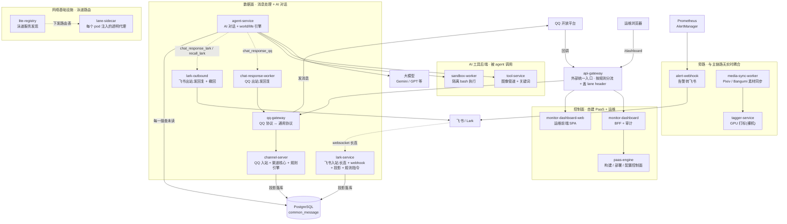
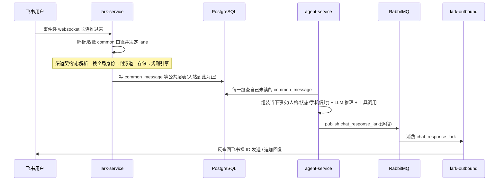
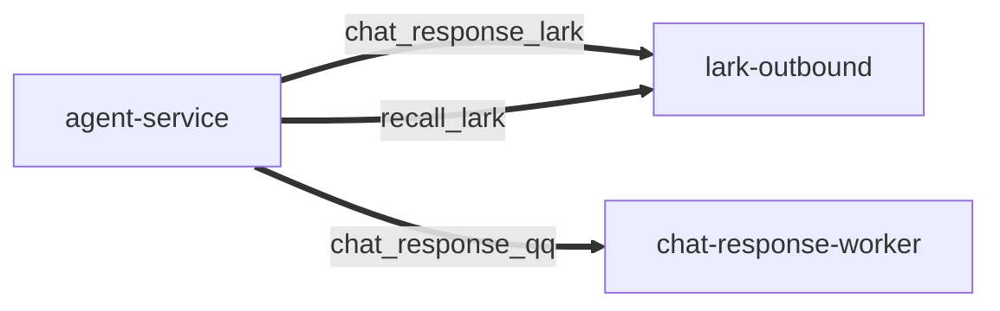
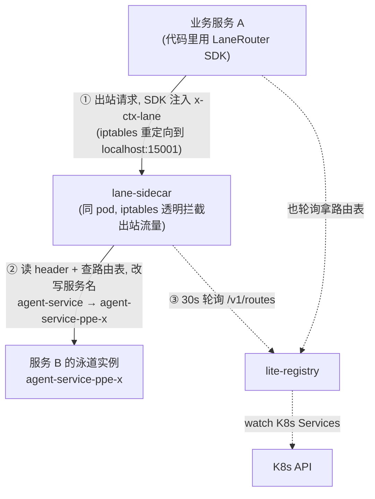
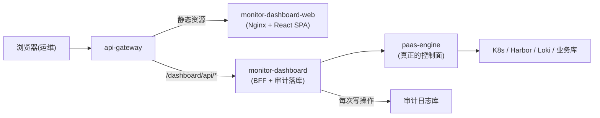

# 赤尾平台 · 服务拓扑现状

> 最后更新:2026-09-04。
> 范围:`apps/` 下 15 个应用目录 → 15 个 K8s Deployment(口径:lark-service 一镜像产出 2 个,channel-server 一镜像产出 2 个,lane-sidecar 与 tagger-service 不产出 Deployment,其余 11 个目录各 1 个)+ 1 个注入式 sidecar(lane-sidecar)+ 1 个裸机 GPU 服务(tagger-service,不进 K8s)+ `packages/` 4 个共享包。
> 这是**现状**梳理,不含目标架构和改造方案。术语在文中随用随解释。

---

## 一、这个平台到底是什么

一句话:这是一个跑在 K8s `prod` namespace 的 monorepo,核心业务是让虚拟人「赤尾(三姐妹)」在飞书(以及 QQ)里像真人一样聊天和自主活动。围绕这个核心,平台自己还长出了一整套**部署系统**(自建 PaaS)、**运维后台**、和**泳道路由**(让一份代码能并行跑多套隔离环境用于测试)。

这些服务并不在同一个层面,它们分属五个不同的「面」:

- **数据面**:真正处理消息、跑 AI 对话的链路。
- **AI 工具后端**:agent 推理时会调用的外部能力(执行代码、处理图片)。
- **控制面**:管构建、部署、配置的自建 PaaS + 运维后台。
- **网络基础设施**:让请求能按「泳道」路由到不同环境的三件套。
- **旁路**:告警转发、媒体素材同步与 GPU 打标,跟主链路没有实时耦合。

把它们按面分清楚,是看懂这个拓扑的第一步——很多「这个服务为什么存在」的困惑,都是因为把不同面的东西混在一张图里看。

---

## 二、服务全景

外部流量(运维浏览器、开发机)从 **api-gateway** 进集群,它按规则把请求分流到对应服务,并盖上泳道 header。**两个渠道的入站都不经它**:消息是各自主动持 websocket 长连收下来的——lark-service 连飞书开放平台,qq-gateway 连 QQ 的 bot gateway,平台把事件推过来。(飞书的 `/webhook/{bot}/...` 路由仍然注册着,走 api-gateway 进来,是长连之外的被动入口;QQ 侧在 api-gateway 里没有任何规则。)

```mermaid
flowchart TB
    Feishu["飞书 / Lark"]
    QQ["QQ 开放平台"]
    Browser["运维浏览器"]
    Prom["Prometheus<br/>AlertManager"]
    LLM["大模型<br/>Gemini / GPT 等"]

    GW["api-gateway<br/>外部统一入口 · 按规则分流 + 盖 lane header"]

    subgraph data["数据面 · 消息处理 + AI 对话"]
        LKS["lark-service<br/>飞书入站:长连 + webhook + 投影 + 规则指令"]
        LKO["lark-outbound<br/>飞书出站:发回复 + 撤回"]
        QGW["qq-gateway<br/>QQ 协议 ↔ 通用协议"]
        CS["channel-server<br/>QQ 入站 + 渠道核心 + 规则引擎"]
        AS["agent-service<br/>AI 对话 + world/life 引擎"]
        CRW["chat-response-worker<br/>QQ 出站:发回复"]
    end

    subgraph tools["AI 工具后端 · 被 agent 调用"]
        SB["sandbox-worker<br/>隔离 bash 执行"]
        TS["tool-service<br/>图像管道 + 关键词"]
    end

    subgraph ctrl["控制面 · 自建 PaaS + 运维"]
        DW["monitor-dashboard-web<br/>运维前端 SPA"]
        DB["monitor-dashboard<br/>BFF + 审计"]
        PE["paas-engine<br/>构建 / 部署 / 配置控制面"]
    end

    subgraph net["网络基础设施 · 泳道路由"]
        REG["lite-registry<br/>泳道服务发现"]
        LS["lane-sidecar<br/>每个 pod 注入的透明代理"]
    end

    subgraph aside["旁路 · 与主链路无实时耦合"]
        AW["alert-webhook<br/>告警转飞书"]
        MS["media-sync-worker<br/>Pixiv / Bangumi 素材同步"]
        TAG["tagger-service<br/>GPU 打标(裸机)"]
    end

    Feishu -.->|websocket 长连| LKS
    QQ -->|回调| GW
    Browser -->|/dashboard| GW
    GW --> QGW --> CS
    GW --> DW
    GW --> DB --> PE
    LKS -->|投影落库| CM[("PostgreSQL<br/>common_message")]
    CS -->|投影落库| CM
    AS -->|每一缝查未读| CM
    AS -. chat_response_lark / recall_lark .-> LKO --> Feishu
    AS -. chat_response_qq .-> CRW --> QGW -->|发消息| QQ
    AS --> SB
    AS --> TS
    AS --> LLM
    Prom --> AW --> Feishu
    MS --> TAG
    REG -. 下发路由表 .-> LS
```

虚线箭头是 RabbitMQ 消息队列(异步,飞书那条长连除外),实线是直接 HTTP 调用或读写数据库。**入站方向没有队列**:两个渠道服务把收到的消息投影成公共层口径写进 `common_message` 就结束,agent-service 每一缝(默认十分钟一次,Dynamic Config 可调;私聊和群里点名会把她提前叫来)自己去查未读、自己决定要不要开口。出站仍走队列,而且 agent-service 不直接发平台消息——它把回复丢进队列,由持有平台凭证的那个服务代发:飞书归 lark-outbound,QQ 归 chat-response-worker(再经 qq-gateway)。lane-sidecar / lite-registry 不在某条线性调用链上,它们横切所有服务间调用(见第五节)。tagger-service 是图里唯一不跑在 K8s 上的服务:裸机 GPU 主机 + systemd 托管,media-sync-worker 通过 HTTP 提交打标任务、用回调收结果。

---

## 三、核心数据流:一条消息的旅程

这是整个平台最重要的一条链路。一个用户在飞书 @ 了赤尾,到她回话,中间发生了什么:

```mermaid
sequenceDiagram
    participant U as 飞书用户
    participant LKS as lark-service
    participant PG as PostgreSQL
    participant AS as agent-service
    participant MQ as RabbitMQ
    participant LKO as lark-outbound

    U->>LKS: 事件经 websocket 长连推过来
    LKS->>LKS: 解析,收敛 common 口径并决定 lane
    Note over LKS: 渠道契约链:解析→换全局身份→判泳道→存储→规则引擎
    LKS->>PG: 写 common_message 等公共层表(入站到此为止)
    AS->>PG: 每一缝查自己未读的 common_message
    AS->>AS: 组装当下事实(人格/状态/手机信封) + LLM 推理 + 工具调用
    AS->>MQ: publish chat_response_lark(逐段)
    MQ->>LKO: 消费 chat_response_lark
    LKO->>U: 反查回飞书裸 ID,发送 / 追加回复
```

**入站和出站不对称,这是设计要的**:入站是她自己去看(所以"她没看见"这个状态存在得起来),出站才是队列。她这一缝默认最多等十分钟(间隔是 Dynamic Config,不是写死的);私聊、或者群里有人点她的名,会有一条单独的钟把她提前叫到那一刻。

QQ 那条链形状相同,只是入站是 qq-gateway 把 QQ 协议归一化成 `CustomInboundMessage` 后 POST 给 channel-server,出站由 chat-response-worker 消费 `chat_response_qq` 再回投 qq-gateway。

三个服务各自的角色,用人话说:

- **lark-service** 是飞书渠道的全部:入站(长连 + webhook + 泳道交接接收端)、common 投影、规则与指令、以及三个定时任务(daily-photo / daily-new-photo / emoji-sync)。入站走一条钉死顺序的契约链——解析 → 收敛成 common 口径 + 换全局身份 → 判泳道(要交接就在这儿停) → 存消息 → 平台无关的规则引擎分发,**到规则引擎的终态为止,不发任何队列**。出站在同镜像的另一个 Deployment **lark-outbound** 里:它消费 `chat_response_lark` / `recall_lark` 两条队列,把话送到飞书、把判违规的撤掉。拆成两个进程是因为部署策略冲突——持长连的只能单副本 + Recreate,出站是竞争消费、可多副本可滚动更新。
- **channel-server** 是 QQ 渠道的同类角色(入站 HTTP 入口 + 渠道核心 + 规则引擎),同样到落库为止不发队列,出站在 chat-response-worker。跟飞书那条唯一的顺序差别:QQ 先跑规则引擎再落库,飞书先落库再跑规则引擎。
- **规则引擎对赤尾基本是空转。** 它按 bot 的角色过滤指令:飞书那 10 条里有 9 条声明了 `category: 'utility'`,人设 bot 撞上直接跳过,她唯一会命中的是没声明 category 的「撤回」;QQ 侧的指令表干脆是空的。所以一条普通的 @ 消息走完整个序列没有任何规则接住它,收敛成 `no_match` —— 这是正确终态,不是漏了一条兜底:她要不要开口是她自己在下一缝里决定的,不由入站这一段决定。
- **agent-service** 是「大脑」。她每一缝直接查 `common_message` 看有没有人找她(`app/living/phone.py`),把赤尾的人格、当下状态、手机信封「组装」成上下文喂给大模型,用自研的 agent 工具循环驱动推理(不依赖 langchain 之类的框架),推理过程中可以调工具(搜索、画图、找图、执行代码、技能脚本、看手机、读文件),决定开口就把话分段丢进 `chat_response` 队列。

「回复」不是独立的一条线,它就是她生活的一部分:同一缝里她既决定要不要换手上的事、去哪儿、记住什么,也决定要不要开口。跟这一缝并排的还有 world(按自己的节奏推演客观世界)和日历(把到点的东西交付给她)。这些全跑在 agent-service 主进程里,由 dataflow runtime 的五条时间源驱动,代码在 `apps/agent-service/app/living/`。

---

## 四、RabbitMQ 队列地图

**跨服务的队列只剩出站方向。** 生产者只有 agent-service 一个,消费方是各渠道自己的出站进程。入站不在这张表里,因为入站根本没有队列:渠道服务投影落库,agent-service 自己查(见第三节)。**「把入站消息交给它该去的泳道」也不在这张表里**:那一跳走内部 HTTP + lane-sidecar(见第五节)。

**出站队列按 channel 分区**:队列名和 routing key 都揉进 channel(`chat_response` → `chat_response_lark`,`chat.response` → `chat.response.lark`)。分区维度必须跟消费者的所有权维度一致——飞书的回复只能由持飞书凭证的 lark-outbound 发,一条都不能被别的服务领走。

```mermaid
flowchart LR
    AS["agent-service"]
    LKO["lark-outbound"]
    CRW["chat-response-worker"]

    AS ==>|chat_response_lark| LKO
    AS ==>|recall_lark| LKO
    AS ==>|chat_response_qq| CRW
```

| 队列 | 生产者 | 消费者 | 干什么 |
|---|---|---|---|
| `chat_response_lark` | agent-service | lark-outbound | 「这是赤尾说的话,帮我发飞书」 |
| `recall_lark` | agent-service | lark-outbound | 「刚那条要撤回」 |
| `chat_response_qq` | agent-service | chat-response-worker | 「这是赤尾说的话,帮我发 QQ」 |

`chat_response` / `recall` 两条不带 channel 后缀的 base 队列也声明着,但**没有生产者也没有消费者**:它们在代码里只当逻辑 sink 的名字用(`Sink.mq("chat_response")`),真实 routing key 由出站时按 payload 的 channel 现算。同理 `recall_qq` 声明了但 QQ 侧没起 recall 消费者,`proactive_eval` 两头都没有,都是空队列。

agent-service 进程内还有两类队列不在上表:一是 durable 边(当前只有一条——她拿起一个文件 → 读一程)底下的队列,由 runtime 框架按 Data 类型和消费者名自动声明(`durable_<data>_<consumer>`);二是 `runtime_delayed_trigger_agent-service`,框架自己的延迟自触发回投。两者的生产者和消费者都在同一个进程里。

所有队列都带泳道后缀(`xxx_<lane>`),泳道队列有 10s TTL,过期后消息降级回 prod 队列——这保证了未部署泳道的服务能 fallback 到线上。例外是 `runtime_delayed_trigger_*`:它按 `lane_fallback=False` 声明,泳道的延迟消息留在自己泳道等到期,不会溢到 prod。

---

## 五、泳道路由怎么工作

「泳道(lane)」= 一套并行的隔离环境,用一个 header `x-ctx-lane` 标识。同一份代码可以部署成 `agent-service`(prod)、`agent-service-ppe-x`(测试泳道)等多个实例,请求带不同的 lane header 就会被路由到不同实例;某个服务没部署对应泳道时,自动落回 prod。

实现这件事靠三个服务 + 一个 SDK 配合:

```mermaid
flowchart TB
    App["业务服务 A<br/>(代码里用 LaneRouter SDK)"]
    LS["lane-sidecar<br/>(同 pod, iptables 透明拦截出站流量)"]
    REG["lite-registry"]
    K8s["K8s API"]
    Target["服务 B 的泳道实例<br/>agent-service-ppe-x"]

    App -->|"① 出站请求, SDK 注入 x-ctx-lane<br/>(iptables 重定向到 localhost:15001)"| LS
    LS -->|"② 读 header + 查路由表, 改写服务名<br/>agent-service → agent-service-ppe-x"| Target
    LS -. "③ 30s 轮询 /v1/routes" .-> REG
    App -. "也轮询拿路由表" .-> REG
    REG -. "watch K8s Services" .-> K8s
```

- **lite-registry** 是泳道路由的「真值源」。它 watch K8s 里所有 Service,聚合成一张表:每个服务名 → 它在哪些泳道有部署、端口是多少。对外只提供 `GET /v1/routes`。
- **lane-sidecar** 是被注入到**每个业务 pod** 里的透明代理(不是独立 Deployment,是个 sidecar 容器,由 paas-engine 在部署时注入)。它用 iptables 把 pod 所有出站 TCP 劫持到自己,读请求里的 `x-ctx-lane`,把目标服务名改写成带泳道后缀的名字。业务代码完全无感知。
- **LaneRouter SDK**(在 `ts-shared` 和 `py-shared` 各一份)是应用层的配合件:负责在发请求时注入 `x-ctx-lane` header。有了 sidecar 之后,**真正的服务名改写挪到了 sidecar 的网络层**,SDK 不再自己拼泳道后缀,只管注 header。两者是互补,不是重复。
- **api-gateway** 是从集群**外部**进来的反向代理入口(开发机到集群的唯一出口)。它轮询 paas-engine 下发的网关规则,按路径前缀匹配,选中目标后转发,并盖上 `x-ctx-lane` header。它管的是「外→内」的入口路由,sidecar 管的是「内→内」的服务间路由。

### 入站消息怎么进到泳道

渠道消息只从 prod 入口进来,两个渠道都是主动建 websocket 长连收下来的:飞书由 lark-service 自己连开放平台(只有 prod 部署持连),QQ 由 qq-gateway 连 QQ 的 gateway、归一化之后 POST 给 channel-server(两跳都在集群内,不经 api-gateway)。所以要有一步把「这条消息属于泳道 X」的消息送到泳道的进程里。这一步就是上面那套路由的一个用例:prod 判出泳道 X 之后,带 `x-ctx-lane: X` 打一次内部 HTTP——飞书是 `POST /api/internal/lark/lane-inbound`,QQ 是 `/api/internal/qq/lane-inbound`,请求体是一个带 lane、bot、trace 和原始事件体的信封。业务代码打的是**自己那个服务的基础服务名**(飞书打 `lark-service:3000`,QQ 打 `channel-server:3000`),由 sidecar 改写成带泳道后缀的名字,代码里没有任何路由逻辑。

三条边界决定了它的失败形状:

- **泳道的 Service 不存在时,sidecar 把请求原样打回 prod**。消息由 prod 的代码处理、写进公共层表,泳道的 agent-service 照样能从库里查到它(ppe 泳道跟 prod 共用同一个库;coe 泳道是独立库,prod 写下的那条泳道进程就看不见了)。这是设计要的行为:绑定指向一条没部署 lark-service 的泳道不会让 bot 静默变砖。代价是投递方从 HTTP 结果上看不出泳道在不在,所以接收端在响应里回报「接住它的是谁」,投递方据此打 `lane_handoff_total{channel,target_lane,outcome}` 指标(outcome ∈ `lane` / `fallback` / `error`)和 `[lark-handoff]` / `[lane-handoff]` 日志——否则「泳道里的改动怎么没生效」查不出来。
- **落回 prod 只在 Service 不存在时发生,不是泳道不健康时**。lite-registry 只 watch Service、不看 ready endpoints,所以泳道 Service 在、Pod 没起来(部署中 / 崩溃 / OOM)时 sidecar 照转不误,拿到 502。而这一跳**不重试**(平台侧早已应答,重试等于同一条消息处理两遍),那条消息就此丢失。
- 路由表有最长 30s 的轮询延迟,刚部署或刚下掉的泳道在这个窗口里 sidecar 的判断是旧的。

出站方向没有这一跳:回复走 MQ,泳道队列的 10s TTL 到期后降级回 prod 队列,泳道没有出站进程时由 prod 的出站进程代发(见第四节)。

---

## 六、控制面与运维链路

这条线和飞书 / AI 完全无关,是平台自己的「基础设施管理」:构建镜像、蓝绿部署、改配置、看状态、查库。

```mermaid
flowchart LR
    Browser["浏览器(运维)"]
    GW["api-gateway"]
    DW["monitor-dashboard-web<br/>(Nginx + React SPA)"]
    DB["monitor-dashboard<br/>(BFF + 审计落库)"]
    PE["paas-engine<br/>(真正的控制面)"]
    Infra["K8s / Harbor / Loki / 业务库"]
    Audit["审计日志库"]

    Browser --> GW
    GW -->|静态资源| DW
    GW -->|"/dashboard/api/*"| DB --> PE --> Infra
    DB -->|每次写操作| Audit
```

- **paas-engine** 是这条线的核心,自建 PaaS 引擎。它本职是**构建**(用 Kaniko 在 K8s 里跑构建 Job,推 Harbor)和**部署**(创建 K8s Deployment + Service,支持蓝绿)。但它还累积了不少别的职责:网关规则的增删改查、动态配置(运行时下发给业务 SDK 的模型/阈值/开关)、ConfigBundle(部署时的环境变量集)、CI 流水线、日志查询(Loki),以及一个能对**业务库**跑 SQL 和 DDL/DML 审批的 ops 网关。
- **monitor-dashboard** 是无状态的 **BFF(给前端用的后端)+ 审计网关**。它本身不做任何控制决策,只是:校验授权 → 把请求转发给 paas-engine(或 channel-server 做泳道绑定)→ 把每次写操作记进审计日志库。它存在的核心价值是「统一审计入口」和「给前端收口」。
- **monitor-dashboard-web** 是纯静态 React SPA,Nginx 托管,把 `/dashboard/api/*` 反代到 api-gateway。

---

## 七、部署拓扑:一镜像多服务

一个 Docker 镜像可以产出多个独立的 K8s Deployment(不同进程、不同 pod)。这是排查问题时最容易踩坑的地方——查 lark-outbound 的日志不能用 lark-service 的服务名,查 chat-response-worker 的日志不能用 channel-server 的服务名。全平台共 15 个 K8s Deployment:

| 镜像 | 产出的 Deployment | 角色 |
|---|---|---|
| lark-service | **lark-service** | 飞书入站:websocket 长连 + webhook 路由 + 泳道交接接收端 + 三个定时任务 |
| lark-service | **lark-outbound** | 消费 `chat_response_lark` / `recall_lark`,发飞书回复与撤回 |
| channel-server | **channel-server** | HTTP,QQ 入站(`POST /api/internal/qq/inbound`) |
| channel-server | **chat-response-worker** | 消费 `chat_response_qq`,经 qq-gateway 发 QQ 回复 |
| agent-service | **agent-service** | 单 Deployment:HTTP(健康检查 + admin/DLQ)+ dataflow runtime(五条时间源 + 一条 durable 边)+ world/life 引擎 |
| 其余 11 个 | 各自 1 个同名 Deployment | — |

15 = lark-service 2 + channel-server 2 + 其余 11 个目录各 1。两个不在此表的例外:`lane-sidecar` 不是独立 Deployment,而是注入到上面每个业务 pod 里的容器;`tagger-service` 完全不在 K8s 里,跑在裸机 GPU 主机上由 systemd 托管。这两个目录不产出 Deployment,所以 15 个应用目录对应 15 个 Deployment。

---

## 八、数据存储归属

谁连哪个库,看清楚有助于理解「改了某张表会影响哪些服务」:

| 存储 | 谁在用 |
|---|---|
| PostgreSQL · 业务库(chiwei) | lark-service / lark-outbound、channel-server / chat-response-worker、agent-service、tool-service、monitor-dashboard、qq-gateway,以及 paas-engine 的 ops 网关(读 + DDL/DML 审批) |
| PostgreSQL · paas_engine 库 | paas-engine 自己 |
| MongoDB | lark-service(飞书原始报文 `lark_event`)、media-sync-worker(媒体)、monitor-dashboard。**channel-server 拆分后不再连 Mongo** |
| Redis | lark-service、lark-outbound(图片注册表)、channel-server、chat-response-worker(图片注册表)、agent-service、tool-service、media-sync-worker、qq-gateway |
| TOS(对象存储) | tool-service(图像管道上传);lark-service / channel-server / agent-service 只在消息记录里传递 TOS 文件名,不直连 |
| MinIO(对象存储) | media-sync-worker(素材入库)、tagger-service(打标取图)、lark-service(本地 pixiv 图源) |
| Harbor(镜像仓库) | paas-engine(Kaniko 构建产物) |
| K8s API | paas-engine、lite-registry、lane-sidecar |

---

## 九、服务职责速查表

| 服务 | 栈 | 面 | 一句话职责 |
|---|---|---|---|
| lark-service | Bun/TS | 数据面 | 飞书入站(长连 + webhook + 泳道交接接收端)+ 渠道契约链 + 规则指令 + 定时任务,投影落库即止 |
| lark-outbound | Bun/TS | 数据面 | 消费 `chat_response_lark` / `recall_lark`,发飞书回复与撤回 + 存储 |
| channel-server | Bun/TS | 数据面 | QQ 入站 + 渠道契约链 + 规则引擎 + 存储,投影落库即止 |
| chat-response-worker | Bun/TS | 数据面 | 消费 `chat_response_qq`,经 qq-gateway 发 QQ 回复 + 存储 |
| qq-gateway | Bun/TS | 数据面 | QQ 官方 bot 协议 ↔ channel-server 通用协议的双向适配 |
| agent-service | Python | 数据面 | 赤尾的生活引擎(自研 agent 工具循环 + dataflow runtime 的五条时间源)+ world 推演;她开口也在这一缝里发生 |
| sandbox-worker | Python | AI 工具 | 隔离环境跑 bash / 技能脚本 |
| tool-service | Python | AI 工具 | 图像管道(下载→压缩→TOS)+ jieba 关键词 |
| paas-engine | Go | 控制面 | 构建+部署+网关规则+动态配置+CI+日志+业务库 ops |
| monitor-dashboard | Bun/TS | 控制面 | 运维 BFF + 审计落库,转发 paas-engine |
| monitor-dashboard-web | React | 控制面 | 运维前端 SPA |
| api-gateway | Go | 网络基建 | 外部反向代理入口,按规则分流 + 盖 lane header |
| lite-registry | Go | 网络基建 | watch K8s Service,提供泳道路由真值表 |
| lane-sidecar | Go | 网络基建 | 注入每 pod,透明改写出站服务名做泳道路由 |
| alert-webhook | Go | 旁路 | Prometheus 告警转飞书 |
| media-sync-worker | Bun/TS | 旁路 | 定时从 Pixiv/Bangumi 同步素材到 MongoDB / MinIO,并驱动 tagger-service 打标 |
| tagger-service | Python | 旁路 | Pixiv 图片 GPU 打标管线(裸机 systemd,不进 K8s) |

**共享包(不部署)**:`ts-shared`(TS 中间件/缓存/日志/HTTP/MongoDB/LaneRouter SDK/实体)、`py-shared`(Python 同类基建 + LaneRouter SDK + 动态配置)、`lark-utils`(飞书 SDK 封装)、`pixiv-client`(Pixiv API client)。

---

## 十、现状里值得重新设计的点

以下是梳理时观察到的问题,**按重要性排序**。(2026-06-01 版列在最前的「channel 多渠道抽象泄漏」和「身份迁移双状态」两点,已分别被 channel-server 平台无关重构(PR #244:core 不再 import 平台 SDK,飞书代码全部收进 `plugins/lark/`)和 common identity 层迁移(commit 448e0fe,agent-service 不再解析 app_id/open_id)解决,不再列出。)

### 1. agent-service 主进程承担过多

一个 Deployment 里同时跑着 admin/DLQ 管理 HTTP、五条时间源、world 的推演轮次、三个角色各自的一缝,以及「读一程」那条 durable 边。后面几件都是模型重活,共享同一份 CPU 和同一个进程生命周期——部署一次就把所有正在跑的缝和轮次一起杀掉。

### 2. paas-engine 是个「全能控制面」

build/release 是本职,但它还累积了网关规则、动态配置、ConfigBundle、CI、日志、以及对业务库跑 SQL/DDL 的 ops 网关。多数(配置类)自洽,唯一像跑错地方的是业务库 ops 控制台。

### 3. 杂项

跨语言队列契约各写一遍(TS 的 `packages/ts-shared/src/mq/client.ts` 和 Python 的 `apps/agent-service/app/infra/rabbitmq.py` 各一份,有漂移风险);`proactive_eval` 两头都没有,`recall_qq` 只有生产侧声明、QQ 没起消费者,都是空队列;`CLAUDE.md` 的项目结构只列常用的几个 app(全量 15 个目录的清单在根 README 和本文档)。
