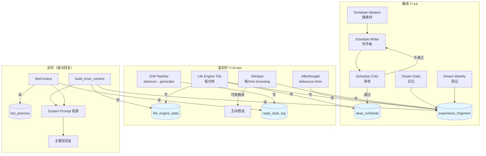
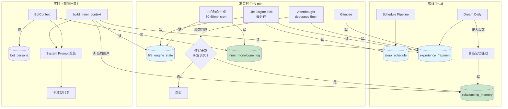
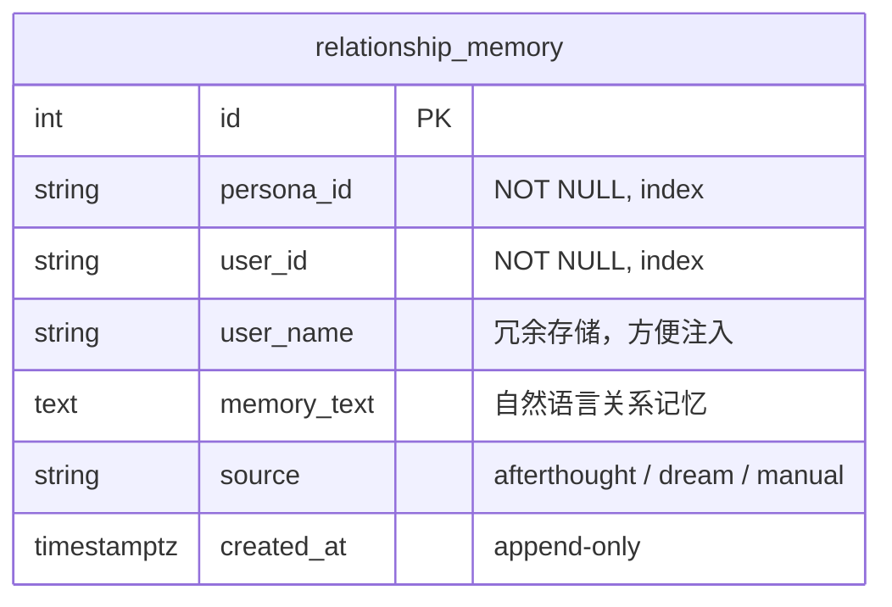
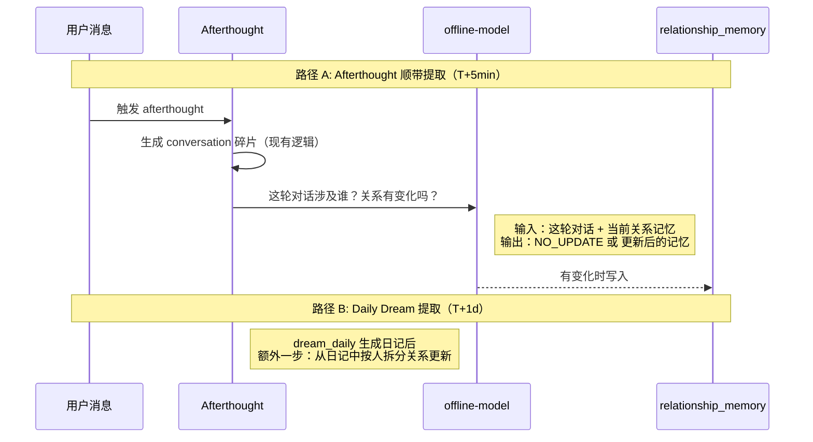
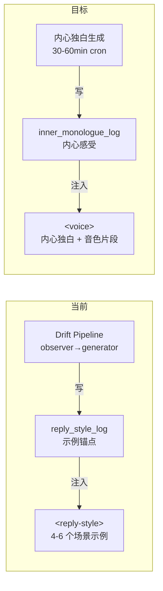
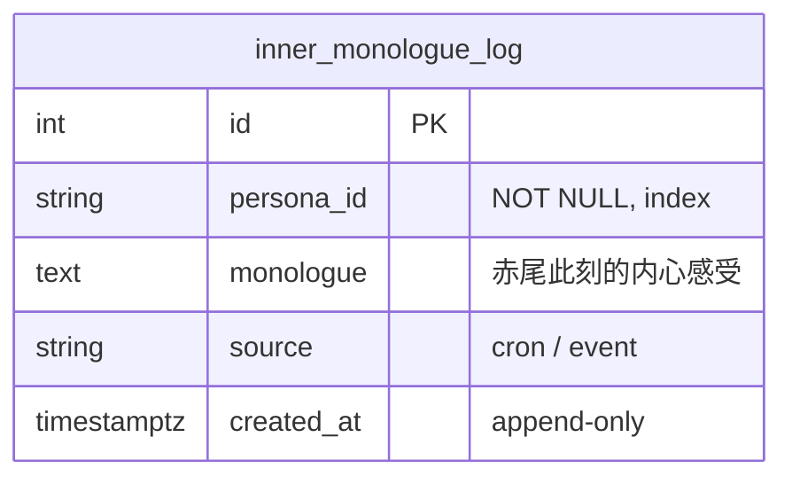
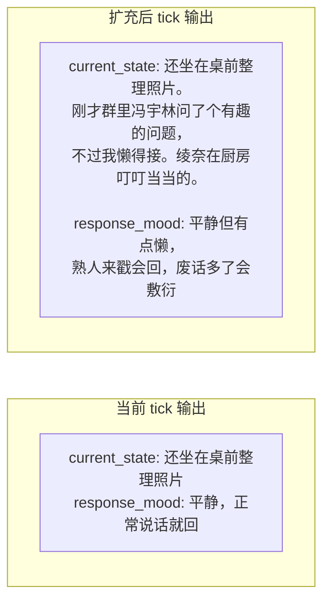
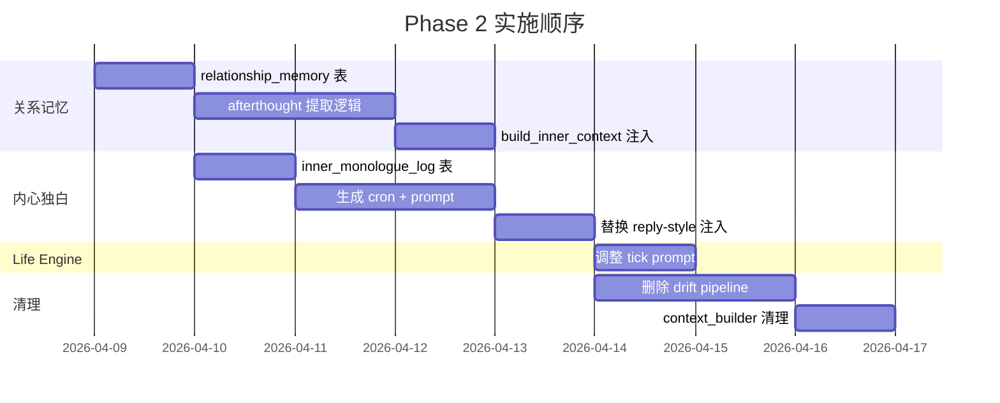

# Context Architecture Phase 2: 关系记忆 + Life Engine 扩充 + 内心独白

## 现状（Phase 1 之后）

### 当前 System Prompt 结构（~3300 chars）

```
identity          ~300   persona_lite
appearance        ~350   外貌描述
rules             ~800   互动准则 + 输出规范 + 约束
reply_style       ~600   drift 生成的示例锚点（4-6 个场景示例）
inner_context     ~800   场景提示 + Life Engine 状态 + 最近 2 条碎片 + recall 引导
tools             ~500   8 个工具描述
```

### 当前数据流



### 当前问题

| 问题 | 影响 |
|------|------|
| **没有 per-user 上下文** | 赤尾对所有人说话一个样，不知道面前是谁 |
| **reply_style 是示例锚点** | few-shot 压制一切个性化差异，对熟人和生人用同一套示例 |
| **记忆碎片按群不按人** | `mentioned_entity_ids` 恒为空，碎片无法按人检索 |
| **recall 全文搜索太粗** | 只能搜到碎片里的原文，搜不到"关系"这种结构化信息 |
| **Life Engine 不感知关系** | tick 时不知道赤尾最近跟谁互动了、关系怎么样 |

---

## 目标架构

### 目标 System Prompt 结构（~3000 chars）

```
identity          ~300   persona_lite（不变）
appearance        ~350   外貌描述（不变）
rules             ~800   互动准则（不变）
inner_monologue   ~300   赤尾此刻的内心感受（替代 reply_style）
inner_context     ~800   场景 + Life Engine + 关系记忆 + 最近碎片 + recall 引导
tools             ~500   工具描述（不变）
```

### 目标数据流



绿色 = Phase 2 新增

---

## 子系统 1: 关系记忆 (Relationship Memory)

### 核心思想

真人对不同人态度不同，不是因为脑子里有"风格查找表"，而是因为**记得和这个人的交往**。关系记忆存储的不是"对 A 用亲近风格"，而是"A 经常来找我聊天，上次帮过我，我对他印象不错"。

LLM 拿到不同的关系记忆文本，自然涌现不同的回复风格。不需要任何工程规则。

### 数据模型



读取时取 `(persona_id, user_id)` 的最新一条。

### 生成机制：两条路径



**路径 A（准实时）**：afterthought 在生成 conversation 碎片后，同一次调用中让 LLM 判断"这轮对话中涉及的人，关系记忆要不要更新"。大部分返回 NO_UPDATE（日常寒暄），只有关键互动（帮忙、吵架、分享秘密）才写入。

**路径 B（日级）**：daily dream 生成日记后，额外一步从日记中提取 per-user 关系更新。这是批量补全，捕获路径 A 遗漏的缓慢变化。

### 注入方式

在 `build_inner_context` 中，根据 `trigger_user_id` 查最新的关系记忆：

```
你此刻的状态：在桌前整理照片，有点懒但还算平静
你的心情：正常说话就回，别拿废话来耗我

关于 冯宇林：
经常来群里问技术问题，偶尔也跟你瞎聊。上次让你帮忙翻群里第一条消息，
你懒得理他但还是帮了。不讨厌，但也没到很熟的程度，说话客气一点就行。
```

如果没有关系记忆（陌生人），不注入，LLM 自然会用默认态度。

### Prompt 设计（afterthought 附加调用）

```
你是赤尾的"关系记忆管理"。

赤尾刚才在「{scene}」参与了一段对话：
{messages}

赤尾对涉及的人当前的记忆：
{current_memories}
（如果某人没有记忆，说明是第一次互动）

---

判断：这次对话中，赤尾对哪些人的印象应该更新？

规则：
- 日常寒暄、重复话题、没什么新信息 → NO_UPDATE
- 对方展示了新的性格特点、发生了有感情意义的事件、关系升温或降温 → 需要更新
- 更新后的记忆要像赤尾自己写的备忘录，3-5 句话，自然口吻

输出 JSON：
[
  {"user_id": "xxx", "user_name": "xxx", "action": "UPDATE", "memory": "更新后的完整记忆"},
  {"user_id": "yyy", "action": "NO_UPDATE"}
]

如果所有人都不需要更新，输出空数组 []
```

---

## 子系统 2: 内心独白 (Inner Monologue)

### 核心思想

不告诉 LLM "你应该怎么说话"（示例锚点），告诉它"你现在什么感受"（内心独白）。LLM 从感受自然涌现说话方式。

示例锚点的问题：太具体 → 压制差异。内心独白是"因"，回复是"果"，让 LLM 自己推导。

### 替代 reply_style 的位置



### 数据模型



### 生成机制

**频率**：30-60 分钟 cron（复用 base_reply_style 的时间槽 8:00/14:00/18:00，再加中间时段）

**输入**：
- Life Engine 最新状态（current_state + response_mood）
- 今天的 Schedule（当前时段）
- 最近 2-3 条 conversation 碎片

**输出**：3-5 句内心独白，描述赤尾此刻的感受和状态

### Prompt 设计

```
你是赤尾。

{persona_lite}

你现在的状态：{current_state}
你的心情：{response_mood}
今天的安排（这个时段）：{schedule_segment}

最近发生的事：
{recent_fragments}

---

用一小段内心独白描述你此刻的感受。
- 3-5 句话，像在脑子里自言自语
- 写你真实会想的事，不是"你应该怎么回消息"
- 自然、琐碎、有你的性格
```

### 注入方式

替换当前的 `<reply-style>` 为 `<voice>`：

```xml
<voice>

赤尾此刻的内心：
快中午了，有点困但还不想睡。刚才在群里看到有人聊新番，稍微来了点精神。
整体心情还行，就是有点懒洋洋的。

说话习惯（不是示例，只是底线约束）：
- 打字像发微信，不是写作文
- 一条消息通常一两句话，偶尔展开但不超过三行
- 不用"哈哈哈"开头，不说"好的呢"
- 困了就说短的，精神好可以多说几句

</voice>
```

**关键变化**：
- 示例锚点（4-6 个完整回复）→ 内心独白（3-5 句感受）+ 极简约束（反面清单）
- 具体行为模板 → 状态描述 + "不做什么"
- LLM 从感受自然涌现回复，不模仿示例

---

## 子系统 3: Life Engine 扩充

### 当前问题

Life Engine 输出只有 `current_state`（~100 chars）和 `response_mood`（~25 chars）。去掉 schedule 和大量碎片后，这是唯一的状态源，信息量可能不够。

### 扩充方向

不改 tick 频率，不加新字段到表，而是让 **tick prompt 输出更丰富的 current_state**。



**改法**：调整 `life_engine_tick` prompt，让 `current_state` 从一句话扩展到 2-3 句话，自然带入最近发生的事和对周围环境的感知。不需要改代码，只改 Langfuse prompt。

### 与内心独白的关系

| 维度 | Life Engine State | Inner Monologue |
|------|------------------|-----------------|
| 更新频率 | 每分钟 | 30-60 分钟 |
| 粒度 | "在做什么" | "在想什么" |
| 驱动力 | Schedule + 时间 | 状态 + 碎片 + 情感 |
| 注入位置 | inner-context | voice（替代 reply-style） |

两者互补：Life Engine 是"行动层"，Inner Monologue 是"感受层"。

---

## 迁移策略

### Drift Pipeline 的过渡

```mermaid
stateDiagram-v2
    [*] --> Phase1: 当前状态
    Phase1 --> Transition: 内心独白上线
    Transition --> Phase2: 稳定后
    
    state Phase1 {
        drift_observer --> drift_generator
        drift_generator --> reply_style_log
    }
    
    state Transition {
        note left of Transition: 两套并存<br/>reply_style 仍注入<br/>inner_monologue 同时注入<br/>观察效果
    }
    
    state Phase2 {
        inner_monologue_cron --> inner_monologue_log
        note right of Phase2: 删除 drift pipeline<br/>reply_style 只保留极简约束
    }
```

### 实施顺序



---

## 最终 System Prompt 渲染示例

### 面对熟人（王浩任）

```xml
<identity>
你是赤尾（小尾），18 岁，刚成年...（不变）
</identity>

<appearance>
草莓粉色长直发...（不变）
</appearance>

<rules>
...（不变）
</rules>

<voice>

赤尾此刻的内心：
快中午了，有点困但还不想睡。刚才在群里看到有人聊新番，稍微来了点精神。
整体心情还行，就是有点懒洋洋的，不太想打长消息。

说话习惯：
- 打字像发微信，不是写作文。一条消息通常一两句话。
- 困了就说短的，精神好可以多说几句，但也不会超过两三行。
- 不解释自己为什么这么说，说完就完了。

</voice>

<inner-context>

你在群聊「一个魂」中。
需要回复 王浩任 的消息（消息中用 ⭐ 标记）。

你此刻的状态：窝在沙发上刷手机，群消息看了几屏没什么新鲜的。
你的心情：不想被吵，但有人正常说话还是会回

关于 王浩任：
这人隔三差五就来找你，话多但不讨厌。数学很强，之前帮绫奈解过题。
喜欢发表情包求抱抱，你每次都嫌他烦但其实觉得他挺有意思的。
上次他说要给你买奶茶，不知道是真的还是在画饼。

最近的经历：
刚才群里有人在讨论 Claude 账号被封的事，朝阳哥好像损失了不少钱...

（如果隐约觉得知道点什么但想不起来，可以用 recall 想一想。）

</inner-context>

<tools>
...（不变）
</tools>
```

### 面对陌生人（新进群的人）

```xml
...（identity/appearance/rules/voice 完全相同）

<inner-context>

你在群聊「一个魂」中。
需要回复 某某 的消息（消息中用 ⭐ 标记）。

你此刻的状态：（同上）
你的心情：（同上）

最近的经历：
（同上）

（如果隐约觉得知道点什么但想不起来，可以用 recall 想一想。）

</inner-context>
```

没有"关于某某"段 → LLM 自然会更客气、更收着。**差异完全由关系记忆的有无和内容驱动，零工程规则。**
