# Agent Flow Runtime 设计

## 一句话

把 `HTTP/SSE`、`cron`、`MQ consumer`、`manual trigger` 统一看成不同的 `Source`，进入同一个 `Flow Runtime`。  
`Agent` 是叶子节点，`Flow` 才是编排抽象。

## 问题

今天系统已经统一了“单个 agent 调用”，但没有统一“多步编排体验”。

- 实时对话有自己的 streaming + pre-check race + post-actions
- 定时任务有自己的 cron wrapper + for_each_persona + 状态处理
- 异步任务有自己的 queue consumer + publish + retry + status tracking
- 每加一个新流程，都要重写一遍入口、上下文、重试、trace、并发、下游触发

本质上，当前是“节点统一了，图没有统一”。

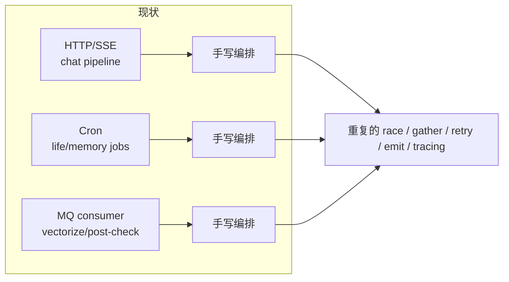

## 目标

目标不是再造一个大而全框架，而是提供一层极薄的统一编排内核：

1. 所有流程都用同一套组合语义表达
2. 运行时能力统一下沉：trace、retry、timeout、lane、idempotency、concurrency
3. 跨 flow 连接必须显式
4. 支持 streaming 和 temporal operator，但不把业务细节抽平

## 非目标

- 不重写 `Agent`
- 不强行把所有流程改成 DAG 可视化编辑器
- 不把 prompt、persona、DB schema 抽象成 flow DSL
- 不隐藏业务名词

## 核心判断

`Agent` 解决的是“怎么执行一次思考”。  
`Flow` 解决的是“怎么把多个 effectful step 组织成一个可运行、可观测、可组合的过程”。

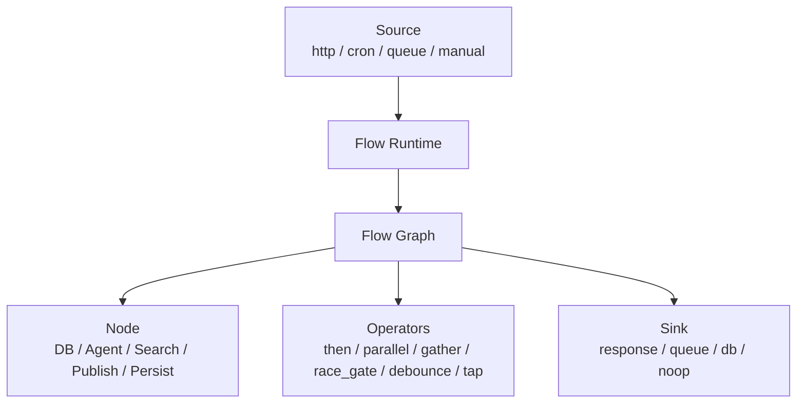

## 核心抽象

### 1. `RunCtx`

一次 flow run 的统一上下文。

建议最少包含：

- `flow_name`
- `run_id`
- `trigger_type`
- `lane`
- `session_id`
- `persona_id`
- `request_deadline`
- `metadata`

作用：

- trace 和 log 关联
- 跨节点透传 lane / session / persona
- 幂等键和超时策略统一

### 2. `Packet[T]`

flow 中流动的标准载体。

```python
Packet[T] = {
  "ctx": RunCtx,
  "data": T,
}
```

作用：

- 让“数据”与“运行上下文”始终一起传播
- 避免今天这种 `contextvars + function args + db lookup` 混合传递

### 3. `Node[I, O]`

最小 effectful 节点。

语义上就是：

`Packet[I] -> Effect[Packet[O]]`

这里的 `Effect` 可以是：

- 单值异步结果
- 流式结果
- temporal/stateful 结果

常见节点：

- `find_message`
- `build_chat_context`
- `run_pre_check`
- `Agent(main).stream`
- `search_web`
- `mq.publish`
- `upsert_schedule`

### 4. `Flow`

`Flow` 只做一件事：组合节点。

建议先支持这些 operator：

- `then`
- `parallel`
- `gather`
- `map_each`
- `race_gate`
- `tap`
- `debounce_by_key`
- `sink`

### 5. `Source` / `Sink`

`Source` 负责把外部触发变成初始 `Packet`。  
`Sink` 负责把 flow 结果落到外部世界。

Source 例子：

- HTTP request
- cron tick
- MQ message
- admin trigger

Sink 例子：

- SSE response
- DB write
- MQ publish
- log only

## 三类 flow 是同一个模型

### Request Flow

用于实时请求，通常有 streaming。

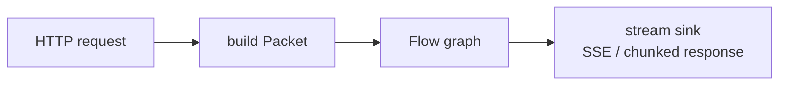

### Job Flow

用于 cron 或手动触发的批处理。

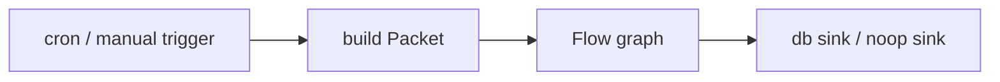

### Event Flow

用于 queue consumer。

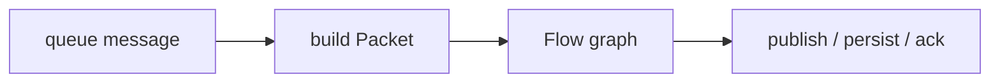

关键点：三者只有 `Source` 和 `Sink` 不同，组合语义不该不同。

## 跨 Flow 关系

不同 flow 在“定义”和“运行时上下文”上独立，但可以通过显式关系连接。

只允许三种关系：

1. `call`
2. `emit`
3. `read`

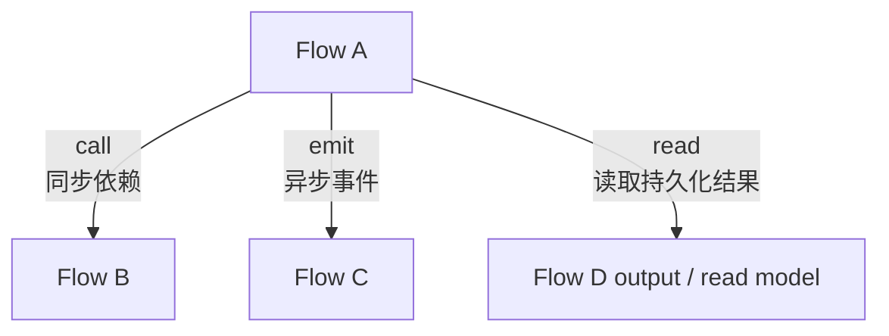

### `call`

同步子流程调用。

适用场景：

- 同一请求链路
- 父流程必须等待结果
- 共享 trace / deadline

不适合：

- 长任务
- fire-and-forget

### `emit`

发事件给另一个 flow。

适用场景：

- post actions
- MQ downstream
- 解耦长任务

要求：

- 目标 flow 自己处理重试和幂等
- 父 flow 不依赖子 flow 立即完成

### `read`

读取另一个 flow 已经产出的持久化结果。

适用场景：

- chat 读取 daily schedule
- life engine 读取 memory 聚合结果

要求：

- 接受最终一致性
- 不依赖对方内部状态机

### 当前系统中的具体关系

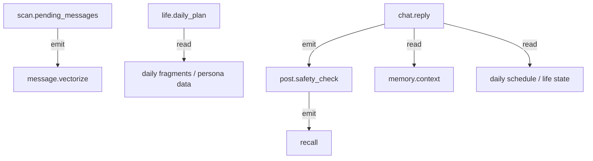

这张图表达的不是“共享一个大流程”，而是：

- 每条 flow 自己跑自己的控制流
- 但通过显式的 `emit` / `read` 形成系统级数据流

## 运行时职责

这些能力不该散落在业务 flow 里，而应由 runtime 统一提供：

- tracing
- retry policy
- timeout / cancellation
- lane propagation
- idempotency key
- concurrency limit
- backpressure
- metrics
- structured logging

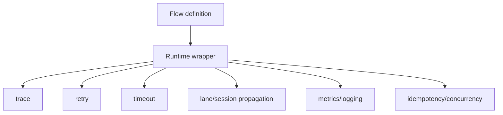

## 对当前系统的映射

### 1. `chat.reply`

今天是手写的 streaming orchestration。目标是保留 streaming 特性，但用统一 operator 表达。

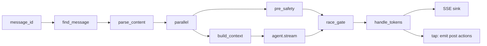

### 2. `life.daily_plan`

这是最标准的 dataflow DAG，最适合先迁。

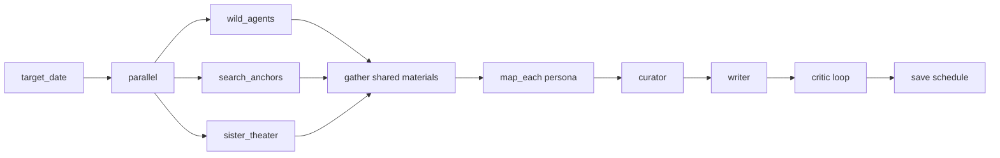

### 3. `message.vectorize`

这是最适合第一个落地的 flow。

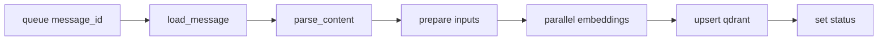

## 为什么不直接“万物皆 Agent”

因为问题不在叶子节点，而在连接方式。

- `Agent` 是 node，不是 graph
- `Agent` 无法表达 queue source、debounce、SSE sink、DB read model
- 把所有东西都包成 agent，只会把编排复杂度藏起来，不会消失

## 为什么不做一个很重的 DSL

因为 flow 抽象要服务业务，不是替代业务。

建议保留 Python 代码定义，只抽统一 operator：

```python
daily_plan = (
    Flow("life.daily_plan")
    .from_cron("0 3 * * *")
    .parallel(run_wild_agents, fetch_search_anchors, run_sister_theater)
    .then(build_shared_materials)
    .map_each(load_personas, run_persona_pipeline)
    .sink(save_schedule)
)
```

目标是统一“体验”，不是发明一门新语言。

## 范畴论视角

可以用，但只作为约束，不要直接暴露给业务代码。

- `Node` 是 effectful morphism
- `then` 是 composition
- `parallel` 是 monoidal product
- `race_gate` / `debounce` / `stream` 属于 stream-temporal operator，不是普通函数组合

这套视角的价值是：提醒我们把“组合律”先定义清楚，再写实现。

## 落地顺序

### Phase 0: 最小内核

新增 `app/flow/`

- `types.py`
- `runtime.py`
- `ops.py`
- `stream.py`
- `temporal.py`

### Phase 1: 先迁 `vectorize`

原因：

- 无 streaming UI
- 无复杂 race
- side effect 清晰
- 成功/失败状态明确

### Phase 2: 再迁 `life.daily_plan`

原因：

- 最像标准 DAG
- 对 operator 设计反馈很直接

### Phase 3: 迁 `post-check` / `recall`

原因：

- 验证跨 flow `emit`

### Phase 4: 最后迁 `chat.reply`

原因：

- 需要 stream + race_gate + tap
- 是最复杂也最敏感的在线路径

## 最小成功标准

如果这套设计成立，未来新增一个流程时，工程体验应该是：

1. 定义输入 `Packet`
2. 选 source
3. 组合几个 node 和 operator
4. 选 sink
5. 不再手写 tracing / retry / queue glue / context propagation

## 开放问题

1. `Packet` 是否需要分成 `ValuePacket` 和 `StreamPacket`
2. `call` 是否允许嵌套 streaming subflow
3. `debounce_by_key` 的状态是否放内存，还是统一可切 Redis
4. `chat.reply` 的 split marker 是否保留，还是改成显式 message boundary event

## 结论

当前最缺的不是更多 agent abstraction，而是一层统一的 flow runtime。

抽象边界应该是：

- `Agent` 负责思考
- `Node` 负责一步 effect
- `Flow` 负责组合
- `Runtime` 负责执行语义

这样实时对话、定时任务、异步任务才能从“三套手写编排”收敛到“一套统一的图运行模型”。
