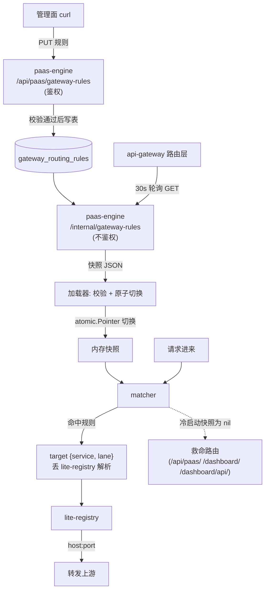
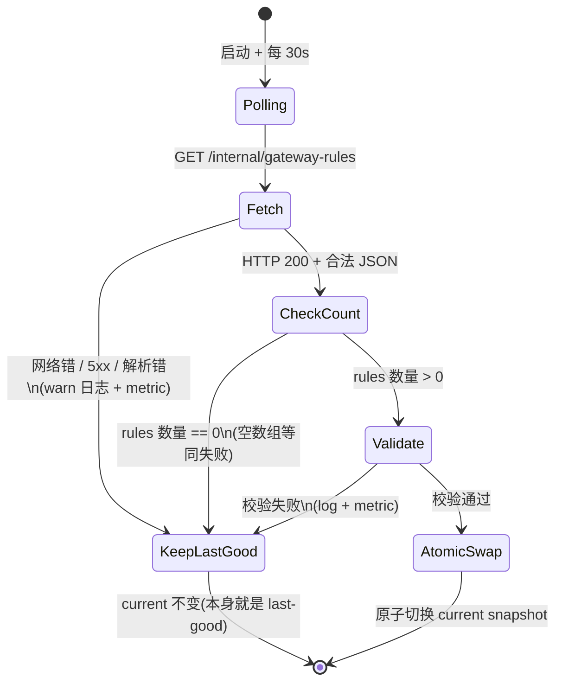
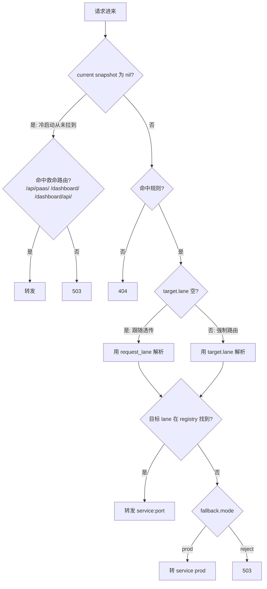

# api-gateway 动态路由升级

## 目标

把 api-gateway 的路由从写死在 `apps/api-gateway/config/routes.yaml` 的静态配置（启动时一次性加载、改规则要重新发版）改成由 paas-engine 持有、api-gateway 运行期轮询拉取的动态快照。改完之后改路由规则只需调 paas-engine 的管理 API，不再需要重新发版 api-gateway。

## 总体设计



三层兜底贯穿全程:**远端最新快照** → 校验失败或拉取失败时保**内存里上一份成功的 last-good** → 冷启动从未拉到任何快照时退到**写死在代码里的救命路由**。

这一刀的边界:

- **新增**(全在 paas-engine 侧):`gateway_routing_rules` 表、repository、service(含写入时的完整校验)、管理面 handler `/api/paas/gateway-rules`、内部 handler `/internal/gateway-rules`。
- **改**(全在 api-gateway 路由层):启动读 yaml 改成 30s 轮询 + 内存快照 + 三层兜底;规则模型和 matcher 随之改。
- **删**:`routes.yaml` 及其加载解析代码,一次性删干净,不留过渡版。
- **不动**:lite-registry、api-gateway 的 registry client、`x-lane` 现有透传、`/healthz` / `/readyz` / `/metrics` 进程本地端点。

## 模块改动

新增:

- **`gateway_routing_rules` 表** — paas-engine 持有,每行一条规则,match / targets / fallback 用 jsonb 列存。
- **repository** — 沿用现有 GORM repository 模式,提供规则的增删改查。
- **service(含完整校验)** — 写入前在 service 层内跑完整校验挡脏数据进表,组装 `/internal` 快照 payload。
- **管理面 handler `/api/paas/gateway-rules`** — REST 增删改查,走 `/api/paas/*` 现有鉴权链路。
- **内部 handler `/internal/gateway-rules`** — 只读返回快照,不鉴权,跟 `/internal/dynamic-config/resolved` 同约定。

修改:

- **api-gateway 路由层** — 启动读 yaml 改成 30s 轮询化;规则模型从静态 Route 换成 Rule + Snapshot;matcher 按新模型改造;加载器内含轻量防御性校验(空快照即 rules 数量为 0 视为失败保 last-good、关键字段非 nil、port 在合法范围),只防 panic 和兜底语义,不重跑 paas-engine 那套完整业务校验;`routes.yaml` 及其加载代码一次性删除。

不动:**lite-registry**(协议、handler、watch 逻辑零改动)、**api-gateway 的 registry client**(target 的 service + lane 仍丢给它解析 host:port)。

## 数据模型

**`gateway_routing_rules` 表**(paas-engine 持有,新增表):

| 字段 | 类型 | 可空 | 备注 |
|---|---|---|---|
| `name` | text | 否 | 业务主键 + 唯一约束,人类可读规则 ID(如 `default-agent-service-api`) |
| `enabled` | bool | 否,默认 true | 临时关闭规则用,关闭后匹配器跳过 |
| `priority` | int | 否,默认 100 | 同时命中时大的优先;同 priority 按 path_prefix 长度倒序兜底 |
| `path_prefix` | text | 否 | 提取到顶层列做索引、按"哪些规则覆盖了 /api/paas/"反查;同时在 `match` JSON 里冗余一份 |
| `request_lane` | text | 是 | 顶层列冗余,可空(path 通用规则不约束 lane) |
| `match` | jsonb | 否 | 完整 Match 对象,结构见下 |
| `targets` | jsonb | 否 | Target 数组;校验长度为 1 |
| `fallback` | jsonb | 否 | Fallback 对象;校验 mode ∈ {prod, reject} |
| `created_at` | timestamptz | 否 |  |
| `updated_at` | timestamptz | 否 | 更新时 bump |
| `version` | bigint | 否,默认 1 | 行级乐观锁,每次 PUT bump |

索引:`name` unique、`enabled, priority desc`、`path_prefix`。

**JSON 字段结构**:

```text
match:
  path_prefix: string         # 必填,跟顶层列同步
  request_lane: string?       # 可空
  # 以下字段允许出现在 schema 但校验器全部 reject
  method: string?
  headers: map<string,string>?
  query: map<string,string>?
  cookies: map<string,string>?

targets:
  - service: string           # 必填
    lane: string?             # 可空。空=跟随请求 x-lane 透传(现状行为);非空=强制路由到该 lane,且 "prod" 时 registry 解析不拼 lane 后缀
    port: int                 # 必填,上游服务监听端口,∈ [1, 65535]
    weight: int               # 必须 == 100;多 target 不允许
    strip_prefix: string?     # 兼容现有 routes.yaml 里 /api/agent/ 那条
    rewrite_prefix: string?

fallback:
  mode: "prod" | "reject"     # 不允许 "target"
```

> 关于 `strip_prefix`:现有 `routes.yaml` 里 `/api/agent/` 有 `strip_prefix: /api/agent`,是路径重写不是路由规则本身的属性,落在 target 上比落在 match 上更自然——`/api/agent/health` 去前缀后打到上游的 `/health`。一条规则可以让不同 target 有不同 strip 行为,schema 一次到位避免二期改。

**远端 API payload**(`GET /internal/gateway-rules` 返回,api-gateway 消费):

```text
{
  "version": "<snapshot version>",
  "updated_at": "<RFC3339>",
  "rules": [
    { "name": "...", "enabled": true, "priority": 100,
      "match": {...}, "targets": [...], "fallback": {...} }
  ]
}
```

`version` 是 snapshot 级的(不是单条规则的 version),由 paas-engine 在返回前生成(用 `max(rules.version)` 或 `max(updated_at)` 均可,实现时定)。api-gateway 拿到后只用来打日志 / metrics label,不做版本回退判断(不存历史快照)。

**校验规则**(**paas-engine 写入前**跑这一整套,挡脏数据进表):

- `name` 非空、长度 ≤ 64、`^[a-z0-9][a-z0-9-]*$`
- `path_prefix` 必须 `/` 开头
- `request_lane` 如果有,合法值只允许 `prod` / `ppe-*` / `coe-*` 三类(不含 `blue`)
- `targets` 长度 == 1、`weight` == 100、`service` 非空、`port` ∈ [1, 65535];`lane` 可空(为空表示透传请求 x-lane),非空时必须是合法泳道命名(`prod` / `ppe-*` / `coe-*`,拒 `blue`)
- `rules` 数组长度必须 ≥ 1,空数组视为非法快照、拒绝切换(合法状态下不会出现零规则,零条一定是种子没灌好 / 误删 / paas-engine bug)
- `fallback.mode` ∈ {`prod`, `reject`}
- `match` 里出现 `method` / `headers` / `query` / `cookies` 非空一律 reject,并明确告诉调用方"二期再开"

api-gateway 加载快照时不重跑上面这整套,只做轻量防御性校验:`rules` 数量 ≥ 1(否则视为非法快照保 last-good)、关键字段非 nil、`port` 在合法范围。够防 panic 和满足三层兜底语义即可,完整业务校验由 paas-engine 写入时一侧负责。

## lane 来源优先级

请求进来时 lane 信息有三个来源,作用各不同:

- **request_lane** — 从 HTTP 请求的 `x-lane` header(query / cookie 备选,沿用现有透传顺序)解析出来的 lane,标识"这个请求是从哪个泳道来的"。
- **`match.request_lane`** — 规则的匹配条件。填了则只有请求的 request_lane 等于它才命中;留空表示任何 request_lane 都命中。
- **`target.lane`** — 规则的转发目标 lane,**可空**,空与非空决定上游 lane 怎么来:
  - **空(跟随透传)** — 上游 lane 跟随 request_lane,就是现状行为:用 request_lane 去 registry 解析(`registry.Resolve(service, request_lane, port)`),request_lane 为空或 `prod` 就打 service prod 实例,带 `x-lane: ppe-xxx` 且 registry 有对应实例就打 service-ppe-xxx。6 条种子规则全部留空,跟现状完全一致。
  - **非空(强制路由)** — 无视请求的 request_lane,强制用 `target.lane` 去 registry 解析(留给二期按比例分流 / 强制路由);填 `prod` 时 registry 解析不拼 lane 后缀。
  - 两种情况下,若解析出的目标 lane 对应实例在 lite-registry 里找不到,都按 `fallback.mode` 兜底(`prod` 回退到 service prod 实例,`reject` 直接 503)。

## API / 接口变更

**管理面**(走 `/api/paas/*` 鉴权,跟 dynamic-config / config-bundles / apps 同约定):

- `GET /api/paas/gateway-rules` — 列全部
- `GET /api/paas/gateway-rules/{name}` — 取单条
- `PUT /api/paas/gateway-rules/{name}` — upsert,`name` 做幂等 key
- `DELETE /api/paas/gateway-rules/{name}` — 删除

**内部读取**:

- `GET /internal/gateway-rules` — 返回完整快照,**不鉴权**,跟 `/internal/dynamic-config/resolved` 同约定(内部服务调用)。

**api-gateway 行为变更**:启动读 `routes.yaml` 改成启动 + 30s 轮询拉 `/internal/gateway-rules`。

**`/healthz` / `/readyz` / `/metrics`**:是 api-gateway 进程本地 mux endpoint,启动时由进程直接挂在 HTTP server mux 上,任何时候直接由进程响应。它们不查规则、不走 fallback、不进 `gateway_routing_rules` 表、不进救命路由——**不是路由对象,别当路由处理**。

## 调用方与影响面

api-gateway 是所有 prod 外部流量的入口(`$PAAS_API` 反向代理就是它),"调用方"等于"所有外部访问 prod 的客户端"。现有 6 条路由全部 1:1 平迁、零改动:

| 路由 prefix | 上游 service:port | 调用方 / 流量来源 | 上线后行为 |
|---|---|---|---|
| `/api/paas/` | `paas-engine:8080` | monitor-dashboard 前端、`make` 命令、CI、`/ops` skill | 完全一致;同时在救命路由里 |
| `/api/lark/` | `channel-proxy:3003` | 飞书管理操作(绑 bot、查 lane_routing),从 dashboard 触发 | 完全一致 |
| `/webhook/` | `channel-proxy:3003` | 飞书 webhook(外部主动打) | 完全一致;**不**进救命路由(业务路径) |
| `/api/agent/` | `agent-service:8000`,strip_prefix `/api/agent` | 日记 / 周记调试入口、agent-service 管理 API 外部访问 | 完全一致;strip_prefix 通过 target 字段保留 |
| `/dashboard/api/` | `monitor-dashboard:3002` | dashboard 前端 SPA 调的后端 API | 完全一致;同时在救命路由里 |
| `/dashboard/` | `monitor-dashboard-web:80` | 浏览器访问 dashboard 静态资源 | 完全一致;同时在救命路由里 |

**上线后所有调用方零改动**——MVP 硬要求,任何调用方要改 client 才能工作都视为 spec 失败、必须回滚重写。

**部署顺序硬约束**:必须**先 paas-engine 建表上端点 → 灌 6 条种子并校验 `GET /internal/gateway-rules` 拿到 6 条 → 再发 api-gateway**。否则 api-gateway 上线时拉到空快照,救命路由不覆盖业务路径,`/webhook/` 和 `/api/agent/` 全 503。

**间接影响**:lite-registry 零改动。规则只决定"匹配哪条、选哪个 target",target 的 service + lane 最终还是丢给 registry client 解析 host:port。channel-proxy 内部用的 LaneRouter SDK 跟本次改动无关。

## 配置生效流程(三层兜底状态机)



请求匹配:



补充:`current snapshot` 用 `atomic.Pointer[Snapshot]` 原子切换,读写不互锁。**last-good 不单独存**——`current` 只在校验通过后才替换,校验失败时它本身就是 last-good。规则修复后最长 30s 收敛(一个轮询周期),不暗示秒级生效。

## 部署与验证

**泳道**:`coe-gateway-dynamic`(涉及新表、新协议,属"基建 / 破坏性改动",按 `e2e-testing.md` 用 `coe-*`)。

**NodePort 临时验证通道**:通过 paas-engine 给 coe 实例的 Service 加 NodePort,本地 `curl http://<NodeIP>:<NodePort>/...` 加自定义 path / `x-lane` header 触发规则。用完即关,不形成长期外部入口。**不通过 `$PAAS_API` 访问 coe 实例**——项目唯一外部出口 `$PAAS_API` 就是线上 api-gateway 自己,路由判断已被它做掉,进不了 coe 实例。

**coe 隔离前置**:coe 实例的 paas-engine 上游通过 ConfigBundle 的 `class_overrides[coe]` 切到 chiwei-test。验证前必须先在 chiwei-test 的 paas-engine 加这张表 + 灌同样 6 条种子,保住 coe 的隔离语义、跟生产同构。

**验证场景**:

- **场景 A:6 条规则全部命中 parity(含 strip_prefix)**。逐条 curl 触发,预期上游就是 routes.yaml 对应那条;agent-service 那条验 `/api/agent/health` 实际打到上游 `/health`。**这一条是验收基石,过不了别的不用看**。
- **场景 B:x-lane 透传不变**。命中 `target.lane` 留空的种子规则,请求加 `x-lane: prod` 预期上游 prod;加 `x-lane: ppe-xxx`(registry 里有的)预期上游 service-ppe-xxx——即 `target.lane` 空时跟随 request_lane 透传。
- **场景 C:target 不存在 + fallback=reject**。`target.lane` 填一个 registry 里不存在的非空 lane(走强制路由),预期 503,不回 prod。
- **场景 D:target 不存在 + fallback=prod**。同上但 fallback=prod,预期回 service prod。
- **场景 E:远端配置故障,保 last-good**。把 `/internal/gateway-rules` 临时弄成 5xx 或下掉 paas-engine 实例,等两个轮询周期,请求行为应完全不变。
- **场景 F:远端返回非法快照,保 last-good**。临时绕过 paas-engine 校验直接写一条非法规则(如 path_prefix 不带 `/`),预期 api-gateway 拒绝切换、保 last-good。绕校验较复杂,做尽力(best-effort)。
- **场景 G:冷启动且远端不可用,走救命路由**。停掉 coe 的 paas-engine,重启 coe-gateway-dynamic,验证 `/api/paas/` / `/dashboard/` / `/dashboard/api/` 能进(救命路由),`/api/agent/` / `/webhook/` 503,`/healthz` / `/readyz` / `/metrics` 始终响应。

**验收口径**:A 必须全过;B、C、D、E、G 必须全过;F 做尽力即可。

**上线**:验证全过后走 `/ship`,prod 部署顺序严格遵守上方硬约束——先 paas-engine,curl 一次 prod paas-engine 的 `/internal/gateway-rules` 确认 6 条都在,再发 api-gateway。

## 任务清单

**Task 1:paas-engine gateway-rules 全栈。**
- 目标:paas-engine 持有规则、提供管理面和内部读取端点,完整校验逻辑落在 paas-engine service 层内挡脏数据进表。
- 产出:`gateway_routing_rules` 表(DDL 走标准 schema 变更流程)、repository、service(含 service 层内的完整校验逻辑)、管理面端点 `/api/paas/gateway-rules`(含鉴权)、内部端点 `/internal/gateway-rules`(不鉴权)。
- 验收:单元测试覆盖 repository 增删改查、service 层校验每条 reject 条件、handler 路径响应;本地起 paas-engine 跑通 PUT → GET → DELETE;`/internal/gateway-rules` 返回结构跟"远端 API payload"完全一致。

**Task 2:6 条种子规则。**
- 目标:把 `routes.yaml` 现有 6 条改写成 gateway-rules 种子,在任意环境幂等可重跑。
- 产出:幂等种子(调 service 层不裸 SQL,避免绕校验),6 条规则命名 `default-{service}-{xxx}`:`default-paas-engine-api`、`default-channel-proxy-lark`、`default-channel-proxy-webhook`、`default-agent-service-api`、`default-monitor-dashboard-api`、`default-monitor-dashboard-web`,每条含正确端口和(agent 那条的)strip_prefix;**6 条 `target.lane` 全部留空(表示透传请求 x-lane),平迁现状,行为跟当前 routes.yaml 完全一致**。
- 验收:空表上跑写入 6 条且字段跟 routes.yaml 对得上(含 strip_prefix、`target.lane` 为空);已有 6 条的表上重跑幂等(不报错、不重复)。

**Task 3:api-gateway 路由层重写。**
- 目标:api-gateway 从读 yaml 改成轮询动态快照 + 三层兜底,一次性删 yaml。
- 产出:规则模型(Rule + Snapshot)、轮询加载器(30s + 轻量防御性校验 + 原子切换 + 三层兜底,校验在 api-gateway 自己 module 内写,只做 rules 数量 ≥ 1 / 关键字段非 nil / port 范围这套防御,不重跑 paas-engine 的完整业务校验)、matcher 改造、救命路由(只含 `/api/paas/` / `/dashboard/` / `/dashboard/api/`);一次性删 `routes.yaml` 及其加载解析代码,不拆过渡版;`/healthz` / `/readyz` / `/metrics` 维持进程本地 mux 不变。
- 验收:单元测试覆盖匹配优先级、fallback(reject vs prod)、原子切换、校验失败保 last-good、空 rules 保 last-good、冷启动救命路由;本地起 api-gateway 指向 mock `/internal/gateway-rules` 把验证场景的 happy / unhappy 路径在 unit + integration 级别跑过。

**Task 4:coe 端到端验证 + 上线 checklist。**
- 目标:在 coe-gateway-dynamic 跑完验证场景,产出可执行的上线方案。
- 产出:chiwei-test paas-engine 表 + 种子写入记录、NodePort 暴露记录、场景 A–G 逐条证据(命令 + 响应 / 日志)、一份 prod 上线 checklist(部署顺序、回滚顺序、关键 curl)。
- 验收:场景 A、B、C、D、E、G 全过(每条有证据);F 尽力;checklist 经用户确认;"风险与回滚"的回滚命令在 coe 上演练过一次。

## 不做什么 / 二期留白

- **权重分流**:`weight` 字段保留但校验强制单 target,二期独立 spec。
- **分片 key**:请求级稳定 hash / request_id 生成,二期。
- **decision log**:每次转发的命中记录表,二期。
- **/ops 配套命令**:`status` / `rules` / `explain` / `fallbacks` / `disable` / `rollback`,二期(依赖 decision log)。
- **Dashboard 规则编辑 UI**:规则列表页 / explain 页,二期。
- **`match` 扩展字段实际启用**:`method` / `headers` / `query` / `cookies`,schema 允许但校验 reject,二期需求驱动开启。
- **fallback `target` 模式**:fallback 到指定 service/lane,二期。
- **强制路由的实际启用**:`target.lane` 非空时强制路由的能力本版已具备(校验、解析、状态机都支持),但 MVP 6 条种子全部留空走透传,不实际启用强制路由;真正用它做按比例分流 / 强制切流是二期需求驱动。本版 `x-lane` 透传行为(`target.lane` 留空时)跟现状完全一致,不变。
- **配置版本回退 / 历史快照持久化**:只有 `version` 字段没有快照表,二期(含 last-good 持久化到磁盘撑过重启)。
- **registry client 显式 lane 存在性查询**:本版靠 `registry.Resolve` 返回的 host 反推 lane 是否存在(判断 `host == {service}-{lane}`),当前实现安全但强依赖 Resolve 永远返回 `{service}-{lane}` 这个 host 形态,host 形态一变 fallback=reject 语义会被击穿;二期让 registry client 暴露显式的"lane 是否存在"接口,二期独立 spec。

## 为什么这么选

- **独立表不复用 `dynamic_configs`**:后者是 key-value、面向业务参数读取;路由规则是有顺序、有 priority、有结构化嵌套的数据,塞进 key-value 既要序列化又丢了表级查询能力(按 enabled / priority 排序、按 service 反查),不如开新表。
- **30s 轮询不上 push**:30s 内的配置漂移对路由层完全可接受,引入 webhook / push 通道的复杂度不值;沿用现有 registry 客户端的 30s 节拍,代价就是规则修复最长 30s 收敛。
- **空快照 = 失败**:合法状态下不会出现零规则,出现零条一定是异常(种子没灌好 / 误删 / bug),当异常处理保 last-good,比 silently 接受导致全 404 安全。
- **救命路由只 2 类入口**:目标是"配置全坏时运维还能进 dashboard 排查",不是"业务永不断"。`/webhook/` 全坏时中断是显式取舍——救命路径塞业务路由反而掩盖 last-good 失效的告警。
- **一次性删 yaml**:回滚靠 `make release` 切老镜像,老镜像自带老 `routes.yaml`,新版留个 yaml 兜底反而多一层路径、徒增复杂度。
- **校验不共享一份代码**:两个 app 各自独立 Go module、仓库没 go.work,Kaniko 镜像构建上下文被砍到单个 `apps/<app>/`、`packages/` 进不去。真共享一份校验代码得把两个 prod 服务(含所有外部流量入口 api-gateway)的构建上下文扩到仓库根、引 go.work、重写两个 Dockerfile——为 DRY 一百多行校验函数动 prod 构建链路不划算。而且 api-gateway 本来就不需要重跑完整业务校验,它只要轻量防御挡 panic、保兜底语义。两边逻辑天然不同(一个挡脏数据进表、一个防御性确认快照可用),不存在"漂移"问题,各自在自己 module 内写自己的校验,零构建链路改动。
- **lane 合法值不含 `blue`**:`blue` 是 paas-engine 蓝绿自部署专用泳道,其他服务禁用,路由规则不该引用它,所以校验只放行 `prod` / `ppe-*` / `coe-*`。

## 风险与回滚

**爆炸半径**:api-gateway 是 prod 所有外部入口,路由层失误会让所有打 `$PAAS_API` 的流量受影响——dashboard 进不去、`make` 命令报错、飞书 webhook 失败、agent 调试入口断。

**失误形态**:

- 远端返回非法格式 / 5xx / 网络错 → 保 last-good;冷启动直接发版且远端就坏时 last-good 是空 → 救命路由 → 业务路径全 503。
- 远端返回空规则集 → 等同拉取失败、保 last-good,不会 silently 接受空快照导致全 404。
- api-gateway 校验 bug 误判合法规则为非法 → 永远保 last-good(空)→ 同上。
- matcher bug 选错 target → 流量打错 service,更隐蔽,可能不报错只是行为错。

**回滚路径**(代价从低到高):

1. **最快**:`PUT /api/paas/gateway-rules/{name}` 把出问题的规则改回正确值,api-gateway 30s 内自动拉到。适用于规则数据错了。
2. **中**:`make release APP=api-gateway LANE=prod VERSION=<上一个版本>` 切回改造前镜像。老镜像自带老代码 + 老 `routes.yaml`,回滚是换镜像不是改代码。
3. **最重**:`/internal/gateway-rules` 临时下线或返回 5xx,让 api-gateway 保 last-good;若 last-good 已被污染,再加一步切镜像(路径 2)。

**部署时机**:避开飞书消息高峰期(夜间或低活跃时段),降低 webhook 失败的可观察影响。

**回滚演练**:Task 4 验收要在 coe 上跑一次"PUT 一条错规则 → api-gateway 30s 内自动恢复",确认回滚路径 1 真能用。
